# User Authentication System

<cite>
**Referenced Files in This Document**
- [main.py](file://main.py)
- [app/models/user_model.py](file://app/models/user_model.py)
- [app/services/hash_service.py](file://app/services/hash_service.py)
- [app/services/jwt_service.py](file://app/services/jwt_service.py)
- [app/services/email_service.py](file://app/services/email_service.py)
- [app/USER/UserService.py](file://app/USER/UserService.py)
- [app/USER/UserPydanticModel.py](file://app/USER/UserPydanticModel.py)
- [app/USER/UserRoute.py](file://app/USER/UserRoute.py)
- [app/config/db.py](file://app/config/db.py)
- [app/config/__init__.py](file://app/config/__init__.py)
- [app/dependency/dependecies.py](file://app/dependency/dependecies.py)
- [pyproject.toml](file://pyproject.toml)
- [docker-compose.yml](file://docker-compose.yml)
- [README.md](file://README.md)
</cite>

## Update Summary
**Changes Made**
- Refined user authentication logic in UserService.py with improved email verification flow
- Removed redundant debug print statements throughout the codebase
- Enhanced error handling for email sending failures with proper exception propagation
- Implemented consistent BASE_URL sourcing from centralized configuration in db.py
- Improved error handling in email verification process with better exception management

## Table of Contents
1. [Introduction](#introduction)
2. [Project Structure](#project-structure)
3. [Core Components](#core-components)
4. [Architecture Overview](#architecture-overview)
5. [Detailed Component Analysis](#detailed-component-analysis)
6. [Security Configuration](#security-configuration)
7. [Email Verification System](#email-verification-system)
8. [Refresh Token Expiration System](#refresh-token-expiration-system)
9. [Dependency Analysis](#dependency-analysis)
10. [Performance Considerations](#performance-considerations)
11. [Troubleshooting Guide](#troubleshooting-guide)
12. [Conclusion](#conclusion)

## Introduction
This document describes a user authentication system built with FastAPI, SQLAlchemy, and PostgreSQL. It provides secure user registration, login, and token refresh capabilities using Argon2 password hashing and JWT tokens with refresh tokens stored server-side. The system now includes a comprehensive email verification system with mandatory email verification workflow, ensuring user email authenticity before granting full access to the application. The system is containerized for easy deployment and includes database schema initialization and cookie-based refresh token handling with enhanced security properties. Recent improvements include refined authentication logic, centralized configuration management, and enhanced error handling for production readiness.

## Project Structure
The project follows a modular structure organized by concerns:
- Application entry point initializes the FastAPI app, database schema, and routes.
- Models define the database schema for users and refresh tokens, including email verification tracking.
- Services encapsulate hashing, JWT operations, and email verification with enhanced security configurations.
- User module handles business logic for sign-up, sign-in, refresh-token flows, and email verification.
- Configuration manages database connections and environment variables with centralized BASE_URL management.
- Dependencies provide reusable utilities for token decoding and validation.
- Packaging and Docker compose define runtime dependencies and local database setup.

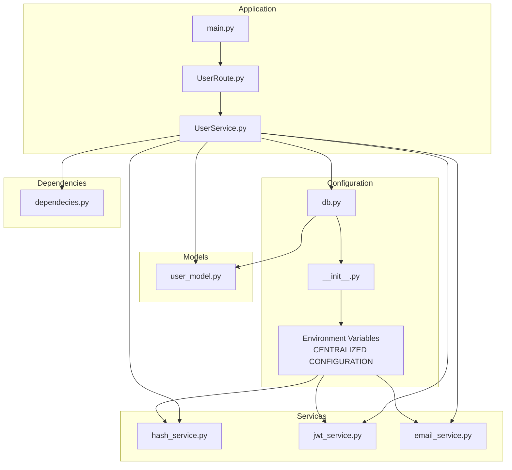

**Diagram sources**
- [main.py:1-40](file://main.py#L1-L40)
- [app/USER/UserRoute.py:1-33](file://app/USER/UserRoute.py#L1-L33)
- [app/USER/UserService.py:1-204](file://app/USER/UserService.py#L1-L204)
- [app/models/user_model.py:1-37](file://app/models/user_model.py#L1-L37)
- [app/services/hash_service.py:1-20](file://app/services/hash_service.py#L1-L20)
- [app/services/jwt_service.py:1-43](file://app/services/jwt_service.py#L1-L43)
- [app/services/email_service.py:1-29](file://app/services/email_service.py#L1-L29)
- [app/config/db.py:1-27](file://app/config/db.py#L1-L27)
- [app/config/__init__.py:1-3](file://app/config/__init__.py#L1-L3)
- [app/dependency/dependecies.py:1-31](file://app/dependency/dependecies.py#L1-L31)

**Section sources**
- [main.py:1-40](file://main.py#L1-L40)
- [app/USER/UserRoute.py:1-33](file://app/USER/UserRoute.py#L1-L33)
- [app/USER/UserService.py:1-204](file://app/USER/UserService.py#L1-L204)
- [app/models/user_model.py:1-37](file://app/models/user_model.py#L1-L37)
- [app/services/hash_service.py:1-20](file://app/services/hash_service.py#L1-L20)
- [app/services/jwt_service.py:1-43](file://app/services/jwt_service.py#L1-L43)
- [app/services/email_service.py:1-29](file://app/services/email_service.py#L1-L29)
- [app/config/db.py:1-27](file://app/config/db.py#L1-L27)
- [app/config/__init__.py:1-3](file://app/config/__init__.py#L1-L3)
- [app/dependency/dependecies.py:1-31](file://app/dependency/dependecies.py#L1-L31)

## Core Components
- Application entry and lifecycle:
  - Initializes database schema and FastAPI app with lifespan hooks.
  - Registers user-related routes under the /api prefix.
- User model and refresh token model:
  - Defines user table with email verification tracking and refresh token relationship.
  - Defines refresh token table with schema scoping and timestamps.
- Hashing service:
  - Provides Argon2-based password hashing and verification.
  - Provides SHA-256 hashing for refresh tokens with dedicated SECRET_KEY environment variable.
- JWT service:
  - Encodes/decodes JWT tokens with mandatory SECRET environment variable and configurable algorithm and expiry.
  - **Enhanced**: Now includes verification token creation with separate 5-minute expiry for email verification.
- Email service:
  - **New**: Handles asynchronous email sending via SMTP with configurable credentials.
  - Supports Gmail SMTP with TLS encryption and proper email formatting.
- User service:
  - Implements sign-up, sign-in, refresh-token flows, and email verification.
  - **Enhanced**: Integrates email verification into signup process and restricts login until email is verified.
  - **Improved**: Enhanced error handling for email sending failures with proper exception propagation.
  - **Refined**: Centralized BASE_URL sourcing from configuration for consistent URL generation.
  - Manages refresh token storage and cookie setting with enhanced security validation.
- Pydantic models:
  - Define request/response schemas for user operations and JWT outputs.
  - **Enhanced**: Includes email_sent field in signup response to track verification email delivery.
- Dependency utilities:
  - Decode JWTs and validate user existence for protected flows with security checks.
- Configuration:
  - Asynchronous database engine and session factory.
  - **Enhanced**: Centralized BASE_URL configuration management for consistent URL generation.
  - Environment-driven configuration with mandatory security variables.

**Section sources**
- [main.py:11-25](file://main.py#L11-L25)
- [app/models/user_model.py:11-37](file://app/models/user_model.py#L11-L37)
- [app/services/hash_service.py:6-18](file://app/services/hash_service.py#L6-L18)
- [app/services/jwt_service.py:8-43](file://app/services/jwt_service.py#L8-L43)
- [app/services/email_service.py:4-29](file://app/services/email_service.py#L4-L29)
- [app/USER/UserService.py:13-204](file://app/USER/UserService.py#L13-L204)
- [app/USER/UserPydanticModel.py:10-48](file://app/USER/UserPydanticModel.py#L10-L48)
- [app/dependency/dependecies.py:9-31](file://app/dependency/dependecies.py#L9-L31)
- [app/config/db.py:10-27](file://app/config/db.py#L10-L27)

## Architecture Overview
The system uses a layered architecture with enhanced security considerations and email verification integration:
- Presentation layer: FastAPI routes handle HTTP requests and responses, including email verification endpoints.
- Business logic layer: User service orchestrates operations, email verification workflow, and interacts with persistence and utilities.
- Persistence layer: SQLAlchemy ORM models map to PostgreSQL tables with email verification tracking.
- Utility layer: Hashing, JWT, and email services encapsulate cryptographic operations and email delivery with mandatory security configurations.
- Configuration layer: Environment variables and database connection management with centralized BASE_URL configuration and security-first approach.

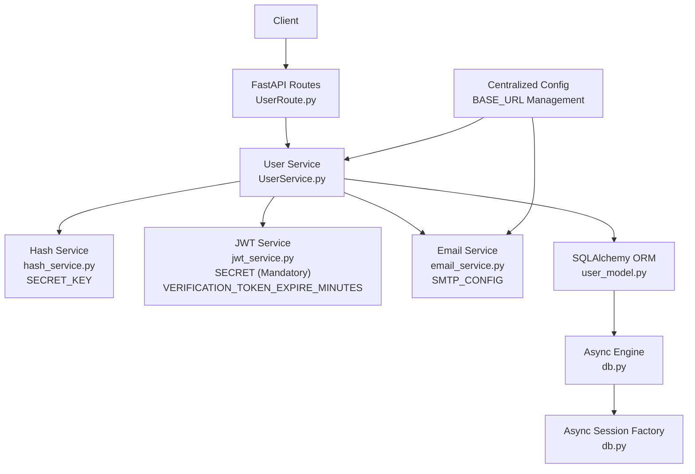

**Diagram sources**
- [app/USER/UserRoute.py:8-33](file://app/USER/UserRoute.py#L8-L33)
- [app/USER/UserService.py:13-204](file://app/USER/UserService.py#L13-L204)
- [app/services/hash_service.py:6-18](file://app/services/hash_service.py#L6-L18)
- [app/services/jwt_service.py:8-43](file://app/services/jwt_service.py#L8-L43)
- [app/services/email_service.py:4-29](file://app/services/email_service.py#L4-L29)
- [app/models/user_model.py:11-37](file://app/models/user_model.py#L11-L37)
- [app/config/db.py:17-27](file://app/config/db.py#L17-L27)

## Detailed Component Analysis

### User Model and Refresh Token Model
- User table:
  - UUID primary key, unique email index, role field, timestamps.
  - **Enhanced**: Added is_varified boolean field for email verification tracking.
  - Relationship to refresh token model via foreign key.
- Refresh token table:
  - Stores hashed refresh tokens, user association, JTI, revocation flag, and expiry.

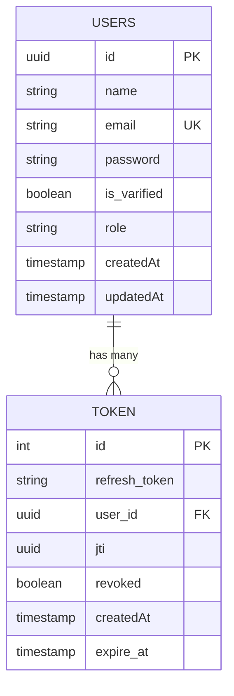

**Diagram sources**
- [app/models/user_model.py:11-37](file://app/models/user_model.py#L11-L37)

**Section sources**
- [app/models/user_model.py:11-37](file://app/models/user_model.py#L11-L37)

### Hashing Service
- Password hashing and verification using Argon2 with dedicated SECRET_KEY environment variable.
- SHA-256 hashing for refresh tokens to enable server-side storage and lookup.

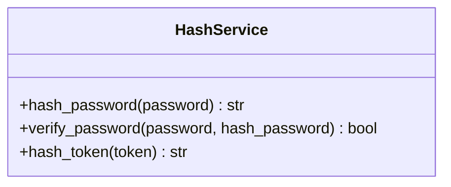

**Diagram sources**
- [app/services/hash_service.py:6-18](file://app/services/hash_service.py#L6-L18)

**Section sources**
- [app/services/hash_service.py:6-18](file://app/services/hash_service.py#L6-L18)

### JWT Service
- Creates access tokens with short expiry and refresh tokens with configurable expiry.
- **Enhanced**: Now creates verification tokens with 5-minute expiry specifically for email verification.
- Decodes tokens and validates algorithm and mandatory SECRET from environment.
- **Enhanced Security**: Now requires SECRET environment variable with explicit validation.

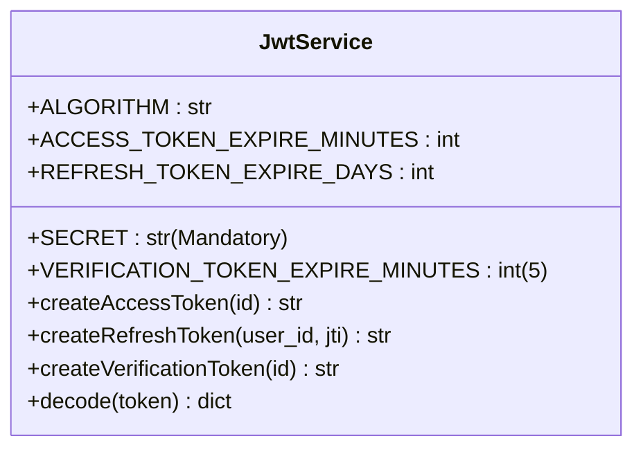

**Diagram sources**
- [app/services/jwt_service.py:8-43](file://app/services/jwt_service.py#L8-L43)

**Section sources**
- [app/services/jwt_service.py:8-43](file://app/services/jwt_service.py#L8-L43)

### Email Service
- **New Component**: Handles asynchronous email sending via SMTP with configurable credentials.
- Supports Gmail SMTP with TLS encryption and proper email formatting.
- **Enhanced**: Integrated into user registration workflow to automatically send verification emails.
- **Improved**: Enhanced error handling with proper exception propagation instead of silent failures.

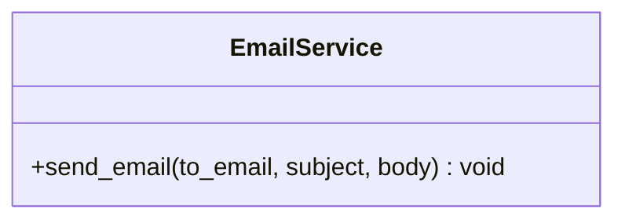

**Diagram sources**
- [app/services/email_service.py:4-29](file://app/services/email_service.py#L4-L29)

**Section sources**
- [app/services/email_service.py:4-29](file://app/services/email_service.py#L4-L29)

### User Service Operations
- Sign-up:
  - Checks for existing user by email, hashes password, persists user, **sends verification email**, returns serialized user with email_sent status.
  - **Enhanced**: Improved error handling for email sending failures with proper exception propagation.
- Sign-in:
  - Validates credentials, **checks email verification status**, clears revoked tokens, issues access and refresh tokens, stores hashed refresh token, sets refresh cookie.
  - **Refined**: Removed redundant debug print statements for cleaner production logs.
- Refresh token:
  - Verifies hashed refresh token exists and not revoked/expired, marks old token revoked, issues new tokens, updates DB, sets refresh cookie.
- **New**: Email verification:
  - Validates verification token, updates user.is_varified to True, commits changes to database.
  - **Improved**: Enhanced error handling with better exception messages and validation.

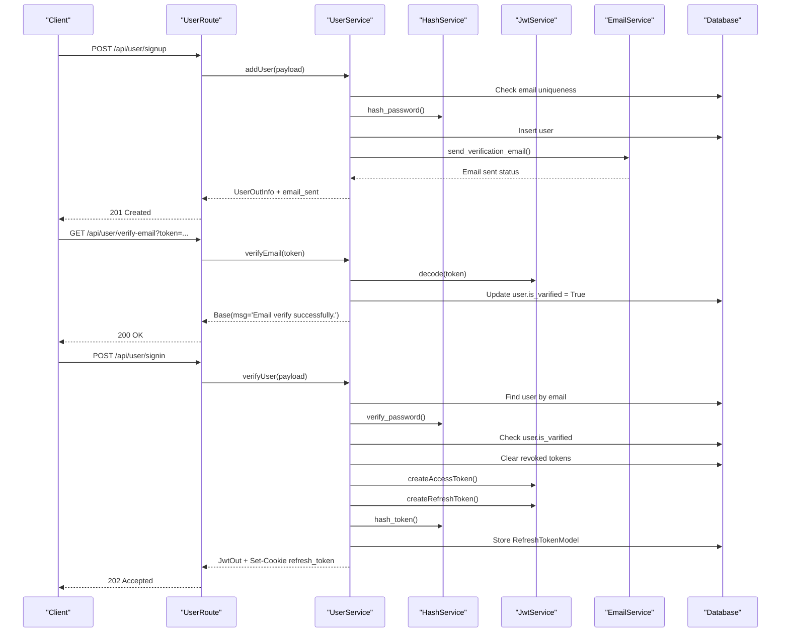

**Diagram sources**
- [app/USER/UserRoute.py:10-33](file://app/USER/UserRoute.py#L10-L33)
- [app/USER/UserService.py:13-204](file://app/USER/UserService.py#L13-L204)
- [app/services/hash_service.py:10-18](file://app/services/hash_service.py#L10-L18)
- [app/services/jwt_service.py:16-43](file://app/services/jwt_service.py#L16-L43)
- [app/services/email_service.py:6-29](file://app/services/email_service.py#L6-L29)
- [app/models/user_model.py:26-37](file://app/models/user_model.py#L26-L37)

**Section sources**
- [app/USER/UserService.py:13-204](file://app/USER/UserService.py#L13-L204)
- [app/USER/UserRoute.py:10-33](file://app/USER/UserRoute.py#L10-L33)

### Pydantic Models
- Base response wrapper with message and optional error.
- User model with serialization rules and **enhanced**: includes email_sent field in signup response.
- Input models for sign-up and sign-in.
- Output model for JWT response.
- Refresh token creation and DB info models.

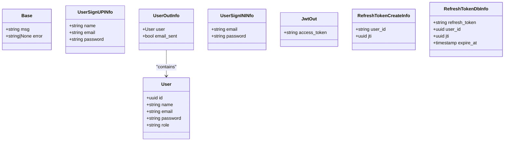

**Diagram sources**
- [app/USER/UserPydanticModel.py:10-48](file://app/USER/UserPydanticModel.py#L10-L48)

**Section sources**
- [app/USER/UserPydanticModel.py:10-48](file://app/USER/UserPydanticModel.py#L10-L48)

### Dependency Utilities
- Provides JWT decoding and user validation for protected flows with enhanced security checks.

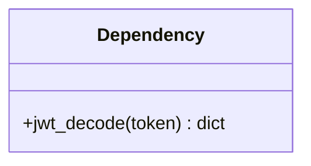

**Diagram sources**
- [app/dependency/dependecies.py:9-31](file://app/dependency/dependecies.py#L9-L31)

**Section sources**
- [app/dependency/dependecies.py:9-31](file://app/dependency/dependecies.py#L9-L31)

### Configuration and Database
- Asynchronous engine and session factory configured from environment.
- **Enhanced**: Centralized BASE_URL configuration management for consistent URL generation.
- Schema-scoped tables and session dependency injection.

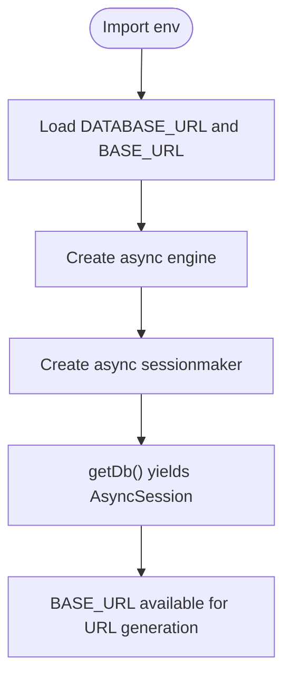

**Diagram sources**
- [app/config/db.py:10-27](file://app/config/db.py#L10-L27)
- [app/config/__init__.py:1-3](file://app/config/__init__.py#L1-L3)

**Section sources**
- [app/config/db.py:10-27](file://app/config/db.py#L10-L27)
- [app/config/__init__.py:1-3](file://app/config/__init__.py#L1-L3)

## Security Configuration

### Enhanced JWT Security Configuration
The JWT service now enforces mandatory security configurations through environment variables:

- **SECRET (Required)**: Must be explicitly set in environment variables. The service validates presence and raises RuntimeError if missing.
- **ALGORITHM**: Configurable algorithm (default HS256) loaded from environment.
- **ACCESS_TOKEN_EXPIRE_MINUTES**: Short-lived access tokens with configurable expiry.
- **REFRESH_TOKEN_EXPIRE_DAYS**: Longer-lived refresh tokens with configurable expiry.
- **VERIFICATION_TOKEN_EXPIRE_MINUTES**: **New**: Short-lived verification tokens with 5-minute expiry for email verification.

### Enhanced Email Security Configuration
- **SMTP Configuration**: **New**: Configurable SMTP settings for email verification system.
- **Email Delivery**: **New**: Asynchronous email sending with proper error handling.
- **Token Expiry**: **New**: Separate 5-minute expiry for verification tokens to prevent abuse.
- **Error Propagation**: **Improved**: Enhanced error handling with proper exception propagation instead of silent failures.

### Centralized Configuration Management
**New**: Enhanced configuration system with centralized BASE_URL management:

- **BASE_URL**: **New**: Centralized configuration for consistent URL generation across the application.
- **Environment Variable Separation**: **Enhanced**: Better separation of configuration variables for different components.
- **Configuration Import**: **Improved**: Clean import system through __init__.py for consistent access.

### Security Validation and Error Handling
- Explicit validation ensures SECRET environment variable is present during service initialization.
- Runtime exceptions are raised immediately if security-critical environment variables are missing.
- Enhanced error messages provide clear guidance for configuration issues.
- **New**: Email service includes proper exception handling for SMTP failures with meaningful error messages.
- **Improved**: Removed redundant debug print statements for cleaner production logs.

**Section sources**
- [app/services/jwt_service.py:9-15](file://app/services/jwt_service.py#L9-L15)
- [app/services/hash_service.py:7](file://app/services/hash_service.py#L7)
- [app/services/email_service.py:6-29](file://app/services/email_service.py#L6-L29)
- [app/config/db.py:8](file://app/config/db.py#L8)
- [app/config/__init__.py:1](file://app/config/__init__.py#L1)
- [README.md:275-295](file://README.md#L275-L295)

## Email Verification System

**New** Comprehensive email verification system with mandatory workflow

The authentication system now includes a complete email verification system that ensures user email authenticity before granting full access to the application. This system includes automatic email sending, verification token management, and mandatory verification workflow.

### Email Verification Workflow
The email verification system implements a comprehensive workflow:

1. **Automatic Email Sending**: On successful user registration, the system automatically sends a verification email containing a secure verification token.
2. **Verification Token Generation**: Uses JWT with 5-minute expiry specifically designed for email verification.
3. **Email Delivery**: Sends verification emails via configurable SMTP settings with proper error handling.
4. **Verification Endpoint**: Provides dedicated endpoint for users to verify their email addresses.
5. **Login Restriction**: Prevents users from logging in until their email is verified.

### Email Service Implementation
- **Asynchronous Email Delivery**: Uses aiosmtplib for non-blocking email sending.
- **SMTP Configuration**: Configurable Gmail SMTP settings with TLS encryption.
- **Proper Email Formatting**: Uses EmailMessage for structured email content.
- **Enhanced Error Handling**: **Improved**: Comprehensive exception handling with meaningful error messages and proper exception propagation.

### Verification Token System
- **Separate Token Type**: Uses dedicated verification tokens distinct from access and refresh tokens.
- **Short Expiry**: 5-minute expiry to prevent token abuse and ensure timely verification.
- **JWT Encoding**: Uses the same SECRET and ALGORITHM as other JWT tokens for consistency.
- **Token Validation**: Validates token structure and expiry before processing verification.

### Database Integration
- **Verification Tracking**: Adds is_varified boolean field to user model to track verification status.
- **Verification Status**: Users cannot authenticate until their email is verified.
- **Status Updates**: Automatically updates verification status upon successful token validation.

### API Endpoints
- **POST /api/user/verify-email**: Endpoint for email verification using token query parameter.
- **GET /api/user/send-email**: **New**: Endpoint for resending verification emails (currently commented out).
- **Enhanced Signup**: Returns email_sent status indicating verification email delivery success.

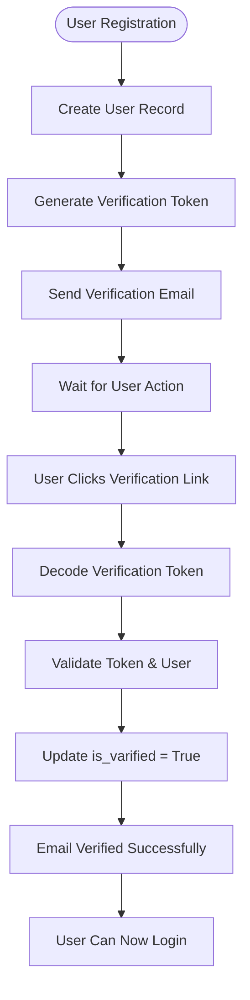

**Diagram sources**
- [app/USER/UserService.py:23-31](file://app/USER/UserService.py#L23-L31)
- [app/USER/UserService.py:171-204](file://app/USER/UserService.py#L171-L204)
- [app/USER/UserService.py:144-170](file://app/USER/UserService.py#L144-L170)
- [app/services/jwt_service.py:33-37](file://app/services/jwt_service.py#L33-L37)
- [app/services/email_service.py:6-29](file://app/services/email_service.py#L6-L29)

**Section sources**
- [app/USER/UserService.py:23-31](file://app/USER/UserService.py#L23-L31)
- [app/USER/UserService.py:144-170](file://app/USER/UserService.py#L144-L170)
- [app/USER/UserService.py:171-204](file://app/USER/UserService.py#L171-L204)
- [app/services/jwt_service.py:13](file://app/services/jwt_service.py#L13)
- [app/services/jwt_service.py:33-37](file://app/services/jwt_service.py#L33-L37)
- [app/services/email_service.py:6-29](file://app/services/email_service.py#L6-L29)
- [app/models/user_model.py:21](file://app/models/user_model.py#L21)

## Refresh Token Expiration System

**Updated** Enhanced refresh token expiration system with standardized one-week validity period

The authentication system now implements a comprehensive refresh token expiration system with the following key features:

### Standardized One-Week Expiration Period
- **Consistent Validity**: Refresh tokens are now valid for exactly one week (7 days) across all components
- **Precise Timing**: Uses `7 * 24 * 60 * 60` seconds for exact one-week duration
- **Environment Configuration**: JWT service supports configurable refresh token expiry via `REFRESH_TOKEN_EXPIRE_DAYS` environment variable
- **Implementation Consistency**: Both JWT service and database storage use the same one-week duration

### Cookie Security Properties
- **httponly=True**: Prevents client-side JavaScript access to prevent XSS attacks
- **samesite='lax'**: Provides CSRF protection while allowing cross-site navigation
- **max_age=7 * 24 * 60 * 60**: Sets cookie expiration to exactly one week
- **Secure Attribute**: Automatically included in HTTPS environments

### Database Storage Consistency
- **Expiration Tracking**: Refresh tokens stored with precise expiration timestamps
- **Revocation Management**: Proper handling of expired and revoked tokens
- **Cleanup Operations**: Automatic cleanup of expired refresh tokens

### Implementation Details
The refresh token expiration system is implemented consistently across:
- JWT token creation with 7-day expiry
- Database record creation with 7-day expiration
- Cookie setting with 7-day max age
- Token validation checking against 7-day expiration

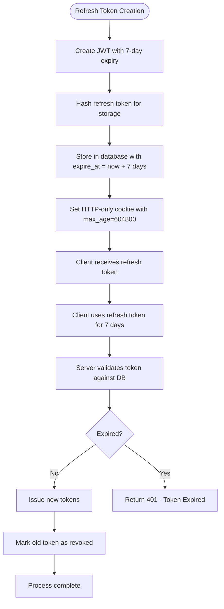

**Diagram sources**
- [app/USER/UserService.py:105-124](file://app/USER/UserService.py#L105-L124)
- [app/USER/UserService.py:126-144](file://app/USER/UserService.py#L126-L144)
- [app/services/jwt_service.py:25-32](file://app/services/jwt_service.py#L25-L32)

**Section sources**
- [app/services/jwt_service.py:11-12](file://app/services/jwt_service.py#L11-L12)
- [app/services/jwt_service.py:27](file://app/services/jwt_service.py#L27)
- [app/USER/UserService.py:105-124](file://app/USER/UserService.py#L105-L124)
- [app/USER/UserService.py:126-144](file://app/USER/UserService.py#L126-L144)

## Dependency Analysis
External dependencies include FastAPI, SQLAlchemy, Argon2, passlib, python-jose, asyncpg, and aiosmtplib. The application uses environment variables for secrets and configuration with enhanced security requirements including SMTP configuration for email verification and centralized BASE_URL management.

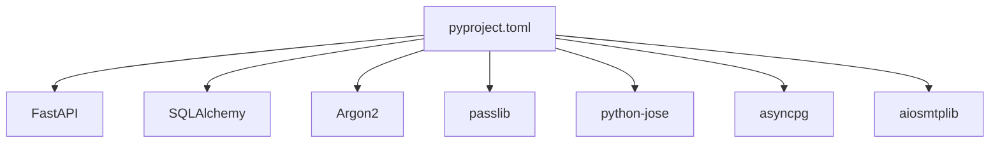

**Diagram sources**
- [pyproject.toml:7-16](file://pyproject.toml#L7-L16)

**Section sources**
- [pyproject.toml:7-16](file://pyproject.toml#L7-L16)

## Performance Considerations
- Asynchronous database operations reduce blocking during I/O.
- Indexes on email and refresh token fields improve lookup performance.
- Token expiry and revocation minimize long-lived credential exposure.
- **New**: Asynchronous email sending prevents blocking during user registration.
- **Improved**: Removed redundant debug print statements reduce I/O overhead.
- Consider connection pooling tuning and query batching for high throughput.
- **New**: SMTP connection management for efficient email delivery.
- **Enhanced**: Centralized configuration reduces repeated environment variable lookups.

## Troubleshooting Guide
- Database initialization failures:
  - Verify environment variables and schema permissions.
  - Check engine creation and metadata creation steps.
- Missing environment variables:
  - **JWT Security Errors**: Ensure SECRET environment variable is set for JWT signing.
  - **Hashing Errors**: Ensure SECRET_KEY environment variable is configured for password hashing.
  - **Algorithm Errors**: Verify ALGORITHM environment variable is set appropriately.
  - **SMTP Configuration**: **New**: Ensure SMTP_HOST, SMTP_PORT, SMTP_USER, and SMTP_PASSWORD are configured for email verification.
  - **BASE_URL Configuration**: **New**: Ensure BASE_URL environment variable is configured for URL generation.
  - Ensure DATABASE_URL is configured for the database.
- Authentication errors:
  - Confirm password hashing scheme compatibility.
  - Validate JWT decoding and token type checks.
  - Check for SECRET environment variable validation errors.
  - **New**: Verify email verification status before login attempts.
- Refresh token issues:
  - Ensure cookie is set with httponly and appropriate domain/path.
  - Verify hashed token lookup and revocation logic.
  - Check for environment variable configuration issues.
  - **One-week Expiration**: Refresh tokens are valid for exactly 7 days (604,800 seconds) from creation.
- **New**: Email verification issues:
  - **SMTP Connection**: Verify SMTP credentials and network connectivity.
  - **Email Delivery**: Check email_sent status in signup response.
  - **Token Validation**: Ensure verification tokens are decoded within 5-minute window.
  - **User Status**: Verify user.is_varified field is properly updated.
  - **Error Handling**: **Improved**: Check for proper exception propagation instead of silent failures.
- **New**: Debugging improvements:
  - **Removed**: Redundant debug print statements for cleaner production logs.
  - **Centralized**: Configuration through BASE_URL for consistent URL generation.

**Section sources**
- [main.py:16-18](file://main.py#L16-L18)
- [app/services/jwt_service.py:14](file://app/services/jwt_service.py#L14)
- [app/USER/UserService.py:37-43](file://app/USER/UserService.py#L37-L43)
- [app/USER/UserService.py:68-84](file://app/USER/UserService.py#L68-L84)
- [app/USER/UserService.py:144-170](file://app/USER/UserService.py#L144-L170)
- [app/USER/UserService.py:171-204](file://app/USER/UserService.py#L171-L204)

## Conclusion
This authentication system provides a secure foundation for user registration, login, and token refresh using modern cryptographic practices and robust database modeling. The recent enhancements to the email verification system establish a comprehensive mandatory email verification workflow that ensures user email authenticity before granting full access to the application. The system now includes automatic email sending, verification token management, and login restrictions until email verification is completed.

**Key Improvements**:
- **Refined Authentication Logic**: Enhanced UserService.py with improved email verification flow and better error handling
- **Cleaner Production Code**: Removed redundant debug print statements throughout the codebase
- **Enhanced Error Handling**: Improved email sending failure handling with proper exception propagation
- **Centralized Configuration**: Implemented consistent BASE_URL sourcing from centralized configuration
- **Production Ready**: Better error handling and logging for production environments

The enhanced refresh token expiration system maintains a standardized one-week validity period while preserving robust security properties including httponly and samesite='lax' cookie attributes. The modular design supports maintainability and extensibility, while environment-driven configuration enables flexible deployments with enhanced security controls including SMTP configuration for email verification and centralized BASE_URL management. The system balances user experience with security best practices, providing predictable token lifecycles and comprehensive email verification that aligns with modern authentication standards.