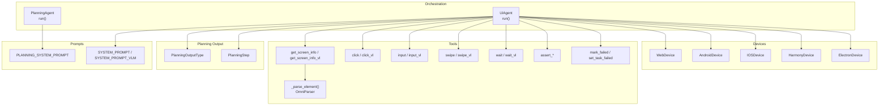
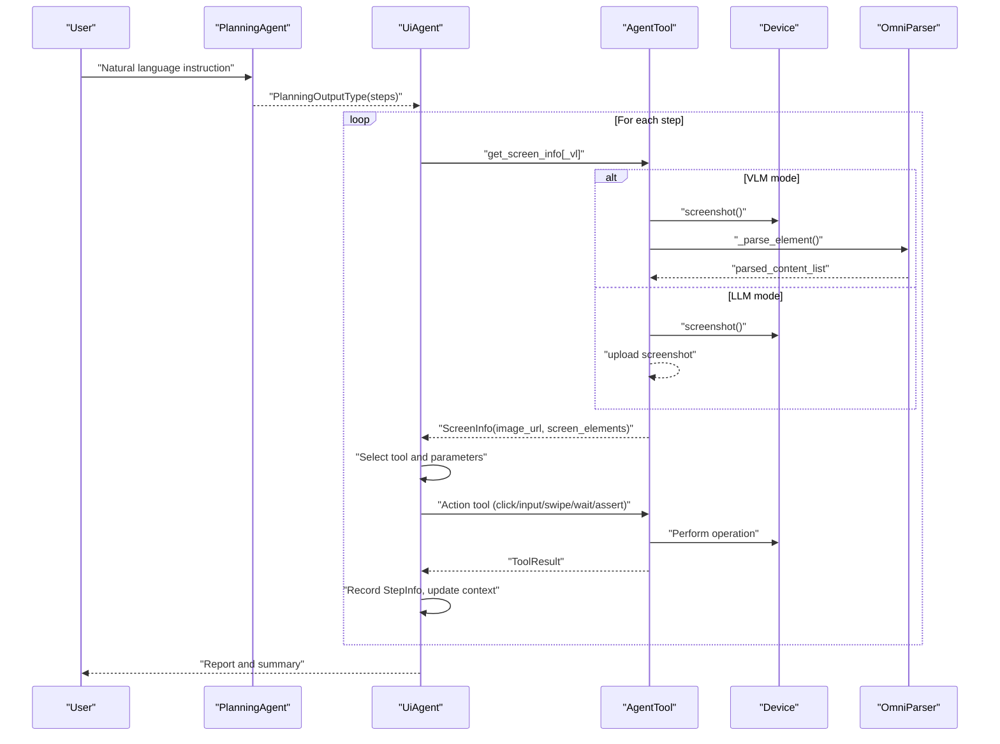
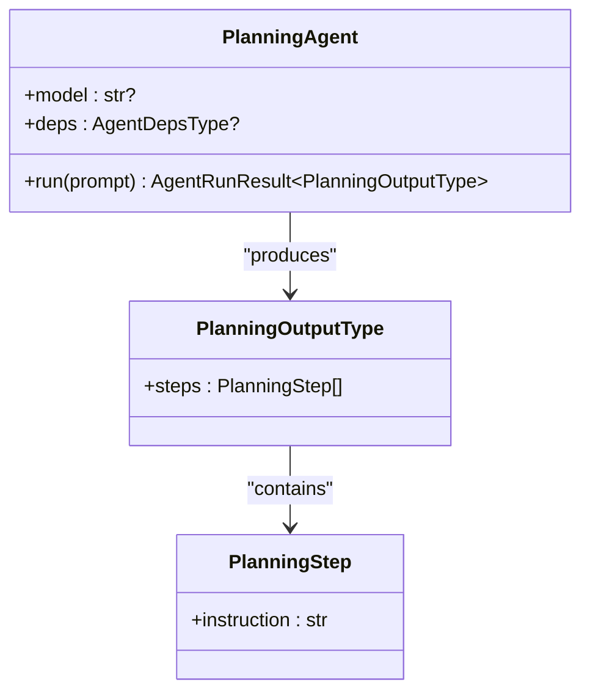
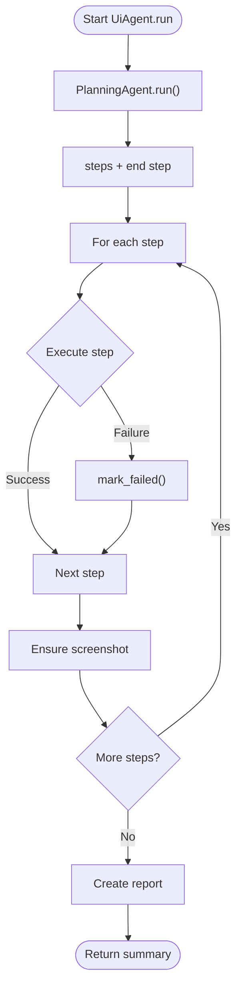
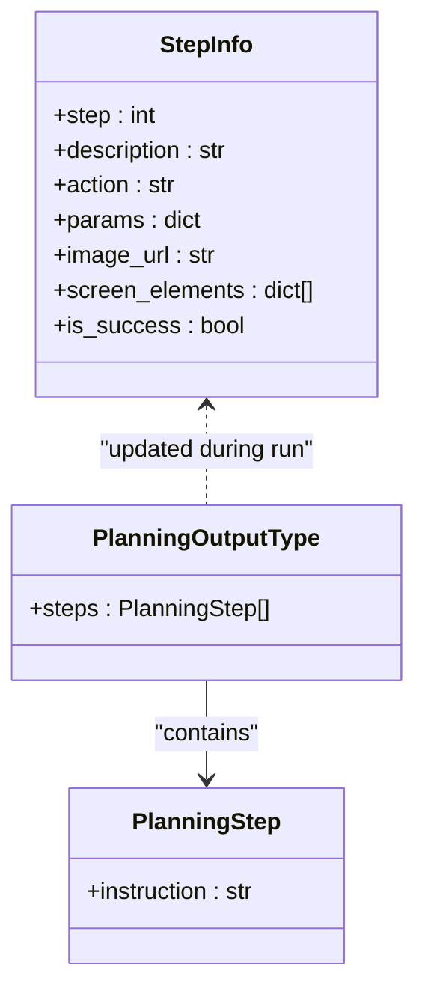
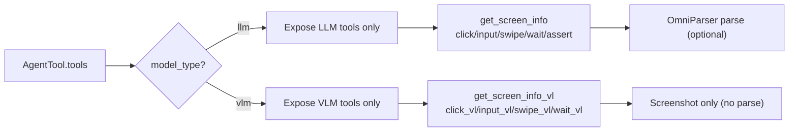
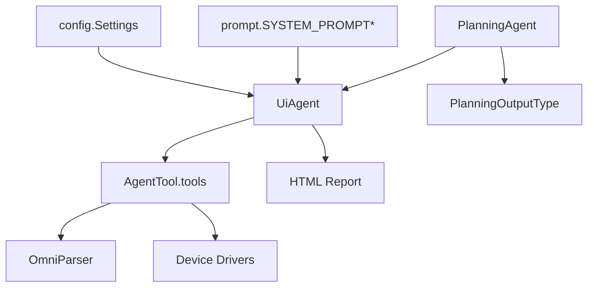
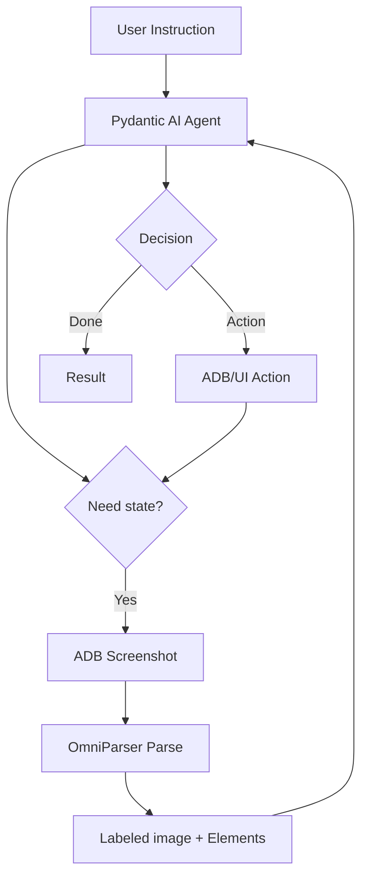

# AI Integration and Planning

<cite>
**Referenced Files in This Document**
- [agent.py](file://src/page_eyes/agent.py)
- [prompt.py](file://src/page_eyes/prompt.py)
- [config.py](file://src/page_eyes/config.py)
- [deps.py](file://src/page_eyes/deps.py)
- [tools/_base.py](file://src/page_eyes/tools/_base.py)
- [tools/web.py](file://src/page_eyes/tools/web.py)
- [tools/_mobile.py](file://src/page_eyes/tools/_mobile.py)
- [tools/android.py](file://src/page_eyes/tools/android.py)
- [device.py](file://src/page_eyes/device.py)
- [test_planning_agent.py](file://tests/test_planning_agent.py)
- [README.md](file://docs/article/LLM 下半场是“行动”：基于 Pydantic AI + OmniParser 从零打造 GUI Agent/README.md)
</cite>

## Table of Contents
1. [Introduction](#introduction)
2. [Project Structure](#project-structure)
3. [Core Components](#core-components)
4. [Architecture Overview](#architecture-overview)
5. [Detailed Component Analysis](#detailed-component-analysis)
6. [Dependency Analysis](#dependency-analysis)
7. [Performance Considerations](#performance-considerations)
8. [Troubleshooting Guide](#troubleshooting-guide)
9. [Conclusion](#conclusion)
10. [Appendices](#appendices)

## Introduction
This document explains the AI integration and planning capabilities built on the Pydantic AI framework. It covers how natural language instructions are transformed into executable UI operations via a two-stage pipeline: planning and execution. The PlanningAgent decomposes user intent into atomic steps, while the UiAgent orchestrates step execution using tools that leverage either a pure Language Model (LLM) or a Vision-Language Model (VLM) with OmniParser visual element recognition. The document also details prompt engineering strategies, model configuration options, the planning output schema, failure handling, retries, and fallbacks, and provides practical examples of complex task decomposition and end-to-end execution.

## Project Structure
The AI planning and execution system is organized around:
- Agent orchestration and run loop
- Prompt templates for planning and execution
- Configuration for model selection and settings
- Planning output data models
- Tools for screen capture, element parsing, and UI actions
- Device abstractions for different platforms
- Tests validating planning behavior

**Diagram sources**
- [agent.py:74-314](file://src/page_eyes/agent.py#L74-L314)
- [prompt.py:8-166](file://src/page_eyes/prompt.py#L8-L166)
- [deps.py:264-280](file://src/page_eyes/deps.py#L264-L280)
- [tools/_base.py:130-391](file://src/page_eyes/tools/_base.py#L130-L391)
- [device.py:54-390](file://src/page_eyes/device.py#L54-L390)

**Section sources**
- [agent.py:74-314](file://src/page_eyes/agent.py#L74-L314)
- [prompt.py:8-166](file://src/page_eyes/prompt.py#L8-L166)
- [config.py:54-73](file://src/page_eyes/config.py#L54-L73)
- [deps.py:252-280](file://src/page_eyes/deps.py#L252-L280)
- [tools/_base.py:130-391](file://src/page_eyes/tools/_base.py#L130-L391)
- [device.py:54-390](file://src/page_eyes/device.py#L54-L390)

## Core Components
- PlanningAgent: Builds a Pydantic AI Agent configured with a planning system prompt and returns a structured list of steps.
- UiAgent: Orchestrates planning, step execution, and reporting. Manages retries, error handling, and fallbacks.
- Prompt templates: Role-based, constraint-driven prompts for planning and execution, with separate variants for LLM and VLM.
- Planning output models: PlanningOutputType and PlanningStep define the structure of the plan.
- Tool ecosystem: Unified tool interface with decorators for pre/post hooks, delays, and model-type gating. Includes screen parsing via OmniParser and UI actions.
- Device abstractions: Cross-platform device drivers for web, Android, iOS, Harmony, and Electron.

**Section sources**
- [agent.py:74-314](file://src/page_eyes/agent.py#L74-L314)
- [prompt.py:8-166](file://src/page_eyes/prompt.py#L8-L166)
- [deps.py:264-280](file://src/page_eyes/deps.py#L264-L280)
- [tools/_base.py:88-128](file://src/page_eyes/tools/_base.py#L88-L128)
- [device.py:54-390](file://src/page_eyes/device.py#L54-L390)

## Architecture Overview
The system follows a dual-path pipeline:
- Planning stage: Natural language is parsed into atomic steps using a planning agent.
- Execution stage: Each step is executed against the target device using tools that optionally integrate OmniParser for visual understanding.

**Diagram sources**
- [agent.py:234-314](file://src/page_eyes/agent.py#L234-L314)
- [tools/_base.py:167-234](file://src/page_eyes/tools/_base.py#L167-L234)
- [tools/_base.py:156-165](file://src/page_eyes/tools/_base.py#L156-L165)
- [device.py:54-390](file://src/page_eyes/device.py#L54-L390)

## Detailed Component Analysis

### PlanningAgent
- Purpose: Convert natural language into a sequence of atomic UI steps.
- Behavior: Creates a Pydantic AI Agent with a planning system prompt and returns a typed PlanningOutputType containing steps.
- Integration: Used by UiAgent to obtain the step list before execution.

**Diagram sources**
- [agent.py:74-90](file://src/page_eyes/agent.py#L74-L90)
- [deps.py:264-273](file://src/page_eyes/deps.py#L264-L273)

**Section sources**
- [agent.py:74-90](file://src/page_eyes/agent.py#L74-L90)
- [deps.py:264-273](file://src/page_eyes/deps.py#L264-L273)

### UiAgent and Execution Loop
- Purpose: Execute planned steps against a device using tools, manage retries, and produce a final report.
- Key behaviors:
  - Builds a Pydantic AI Agent with a system prompt tailored to the selected model type (LLM or VLM).
  - Iterates over steps, invoking sub-agent runs per step.
  - Handles tool calls, logs thinking and tool usage, and updates StepInfo.
  - On UnexpectedModelBehavior, marks the step as failed and continues.
  - Ensures a final screenshot is captured for each step if missing.
  - Generates a structured HTML report summarizing success, device info, and steps.

**Diagram sources**
- [agent.py:234-314](file://src/page_eyes/agent.py#L234-L314)

**Section sources**
- [agent.py:234-314](file://src/page_eyes/agent.py#L234-L314)

### Prompt Engineering Strategies
- Planning prompt emphasizes:
  - Atomicity: One operation per step, preserving original intent.
  - Deterministic order: Steps must follow the user’s instruction sequence.
  - Examples: Clear decomposition patterns for clicks, scrolls, app opens, and file uploads.
- Execution prompts differentiate between LLM and VLM:
  - LLM variant focuses on structured element lists with IDs and spatial relations.
  - VLM variant focuses on raw screenshots and bounding box coordinates.
- Both include:
  - Workflows: get screen info → locate element → call tool → repeat until done.
  - Constraints: intent fidelity, state dependency, single-tool-at-a-time, element uniqueness.
  - Exceptions: element not found, pop-up occlusion, tool failures.

**Section sources**
- [prompt.py:8-28](file://src/page_eyes/prompt.py#L8-L28)
- [prompt.py:30-103](file://src/page_eyes/prompt.py#L30-L103)
- [prompt.py:105-163](file://src/page_eyes/prompt.py#L105-L163)

### Model Configuration Options
- Model selection and type:
  - model: LLM provider/model identifier.
  - model_type: "llm" or "vlm".
  - model_settings: Pydantic AI ModelSettings (e.g., max_tokens, temperature).
- OmniParser integration:
  - base_url: OmniParser service endpoint.
  - key: Optional API key for OmniParser.
- Browser simulation and headless modes supported via BrowserConfig.

**Section sources**
- [config.py:54-73](file://src/page_eyes/config.py#L54-L73)
- [config.py:47-52](file://src/page_eyes/config.py#L47-L52)

### Planning Output Structure
- PlanningOutputType: Root container holding a list of PlanningStep.
- PlanningStep: Single atomic instruction derived from the user’s intent.
- StepInfo: Runtime record of each step during execution, including action, params, image_url, screen_elements, and success flag.

**Diagram sources**
- [deps.py:264-280](file://src/page_eyes/deps.py#L264-L280)
- [deps.py:35-46](file://src/page_eyes/deps.py#L35-L46)

**Section sources**
- [deps.py:264-280](file://src/page_eyes/deps.py#L264-L280)
- [deps.py:35-46](file://src/page_eyes/deps.py#L35-L46)

### OmniParser VLM Integration and Dual-Model Approach
- VLM-only deployment:
  - get_screen_info_vl returns a screenshot URL as an image payload.
  - Tools like swipe_vl and wait_vl operate without structured element lists.
- Hybrid OmniParser+LLM deployment:
  - get_screen_info returns a labeled image URL and a filtered element list (IDs, content, adjacency).
  - Tools like click and input use element IDs and spatial relations.
- Tool gating:
  - Tools are decorated with llm/vlm flags; only compatible tools are exposed per model_type.
  - VLM tools strip the “_vl” suffix to keep consistent names.

**Diagram sources**
- [tools/_base.py:135-150](file://src/page_eyes/tools/_base.py#L135-L150)
- [tools/_base.py:204-234](file://src/page_eyes/tools/_base.py#L204-L234)
- [tools/_base.py:257-263](file://src/page_eyes/tools/_base.py#L257-L263)

**Section sources**
- [tools/_base.py:135-150](file://src/page_eyes/tools/_base.py#L135-L150)
- [tools/_base.py:204-234](file://src/page_eyes/tools/_base.py#L204-L234)
- [tools/_base.py:257-263](file://src/page_eyes/tools/_base.py#L257-L263)

### Tool Parameters and Action Schema
- ToolParams: Base for all tool invocations, including instruction and action.
- LocationToolParams: Shared logic for computing coordinates from element IDs (LLM) or bounding boxes (VLM).
- Specialized params:
  - ClickToolParams: position and offset relative to an element; optional file upload.
  - InputToolParams: text and optional Enter key.
  - SwipeToolParams and SwipeForKeywordsToolParams: direction, repeat count, and optional keyword expectations.
  - WaitToolParams and WaitForKeywordsToolParams: timeouts and keyword expectations.
  - Assert* params: positive/negative containment checks.
- ToolResult and ToolResultWithOutput: standardized success/failure and optional outputs.

**Section sources**
- [deps.py:85-100](file://src/page_eyes/deps.py#L85-L100)
- [deps.py:103-162](file://src/page_eyes/deps.py#L103-L162)
- [deps.py:165-234](file://src/page_eyes/deps.py#L165-L234)
- [deps.py:240-262](file://src/page_eyes/deps.py#L240-L262)

### Device Abstractions and Platform Support
- WebDevice: Playwright-backed browser automation with optional device emulation and headless mode.
- AndroidDevice: ADB-backed device automation with window size detection.
- HarmonyDevice: HDC-backed Harmony device automation.
- IOSDevice: WebDriverAgent-backed iOS automation with auto-start capability.
- ElectronDevice: Chromium CDP connection to Electron apps with page stack management.

**Section sources**
- [device.py:54-390](file://src/page_eyes/device.py#L54-L390)

### Practical Examples of Task Decomposition and Execution
- Example 1: Open a URL and click a button.
  - Planning: Two steps: open URL; click button.
  - Execution: UiAgent runs PlanningAgent, then executes each step with get_screen_info and click.
- Example 2: App open, close a popup if present, scroll until an element appears, click, wait, input text, scroll again.
  - Planning: Multiple steps including conditional skip, keyword-driven scrolling, input, and waits.
  - Execution: Uses swipe_with_keywords and assert_screen_contains to drive navigation.

These examples are validated by unit tests that assert the structure of the generated steps.

**Section sources**
- [test_planning_agent.py:12-28](file://tests/test_planning_agent.py#L12-L28)
- [test_planning_agent.py:30-49](file://tests/test_planning_agent.py#L30-L49)
- [test_planning_agent.py:52-61](file://tests/test_planning_agent.py#L52-L61)
- [test_planning_agent.py:64-73](file://tests/test_planning_agent.py#L64-L73)
- [test_planning_agent.py:76-86](file://tests/test_planning_agent.py#L76-L86)

## Dependency Analysis
- Agent orchestration depends on:
  - Prompt templates for planning and execution.
  - Configuration for model and tool settings.
  - Planning output models for typed plans.
  - Tools for screen parsing and UI actions.
  - Device drivers for cross-platform automation.
- Tools depend on:
  - OmniParser service for VLM-only or hybrid parsing.
  - Device drivers for taking screenshots and performing actions.
  - Decorators for retry and gating logic.

**Diagram sources**
- [config.py:54-73](file://src/page_eyes/config.py#L54-L73)
- [prompt.py:30-163](file://src/page_eyes/prompt.py#L30-L163)
- [agent.py:74-314](file://src/page_eyes/agent.py#L74-L314)
- [deps.py:264-273](file://src/page_eyes/deps.py#L264-L273)
- [tools/_base.py:135-150](file://src/page_eyes/tools/_base.py#L135-L150)
- [device.py:54-390](file://src/page_eyes/device.py#L54-L390)

**Section sources**
- [config.py:54-73](file://src/page_eyes/config.py#L54-L73)
- [prompt.py:30-163](file://src/page_eyes/prompt.py#L30-L163)
- [agent.py:74-314](file://src/page_eyes/agent.py#L74-L314)
- [deps.py:264-273](file://src/page_eyes/deps.py#L264-L273)
- [tools/_base.py:135-150](file://src/page_eyes/tools/_base.py#L135-L150)
- [device.py:54-390](file://src/page_eyes/device.py#L54-L390)

## Performance Considerations
- Token and temperature tuning: Adjust ModelSettings to balance accuracy and cost.
- Retry strategy: Built-in retries reduce transient model failures; consider exponential backoff for external services.
- Parsing overhead: OmniParser adds latency; disable parsing when unnecessary (e.g., open_url, wait) to optimize.
- Concurrency: Tools enforce single-tool-at-a-time execution to avoid race conditions and inconsistent UI states.
- Reporting: HTML report generation is lightweight but can be disabled in high-throughput scenarios.

[No sources needed since this section provides general guidance]

## Troubleshooting Guide
- Model failures and retries:
  - UiAgent catches UnexpectedModelBehavior and marks the step failed; the run continues to preserve robustness.
- Tool exceptions:
  - Tools wrap execution in try/catch and raise ModelRetry to signal transient failures; callers can retry.
- Explicit failure signaling:
  - mark_failed and set_task_failed allow immediate termination with a reason recorded in StepInfo.
- Pop-ups and overlays:
  - Execution prompts suggest loading pop-up handling skills and reattempting after re-parsing the screen.
- Element not found:
  - wait_for_keywords and assert_screen_contains help stabilize flows by waiting for elements to appear.

**Section sources**
- [agent.py:264-271](file://src/page_eyes/agent.py#L264-L271)
- [tools/_base.py:112-119](file://src/page_eyes/tools/_base.py#L112-L119)
- [tools/_base.py:323-346](file://src/page_eyes/tools/_base.py#L323-L346)
- [prompt.py:85-102](file://src/page_eyes/prompt.py#L85-L102)

## Conclusion
The AI integration leverages Pydantic AI to transform natural language into precise, atomic UI operations. PlanningAgent ensures faithful decomposition, while UiAgent orchestrates execution with robust retries and failure handling. The dual-mode design supports both VLM-only and hybrid OmniParser+LLM setups, enabling accurate visual element recognition and flexible tool availability. With structured planning outputs, consistent tool parameters, and clear prompt engineering, the system scales across web, Android, iOS, Harmony, and Electron environments.

[No sources needed since this section summarizes without analyzing specific files]

## Appendices

### Relationship Between LLM and VLM
- LLM mode:
  - Uses structured element lists (IDs, content, adjacency) from OmniParser.
  - Tools operate on element IDs and spatial relations.
- VLM mode:
  - Operates directly on screenshots; tools use bounding boxes or coordinates.
  - get_screen_info_vl returns an image payload for the model.

**Section sources**
- [prompt.py:105-163](file://src/page_eyes/prompt.py#L105-L163)
- [tools/_base.py:204-234](file://src/page_eyes/tools/_base.py#L204-L234)
- [tools/_base.py:257-263](file://src/page_eyes/tools/_base.py#L257-L263)

### OmniParser Architecture Reference
The Mobile Agent runtime flow integrates screenshot capture, OmniParser parsing, and iterative decision-making.

**Diagram sources**
- [README.md:146-170](file://docs/article/LLM 下半场是“行动”：基于 Pydantic AI + OmniParser 从零打造 GUI Agent/README.md#L146-L170)