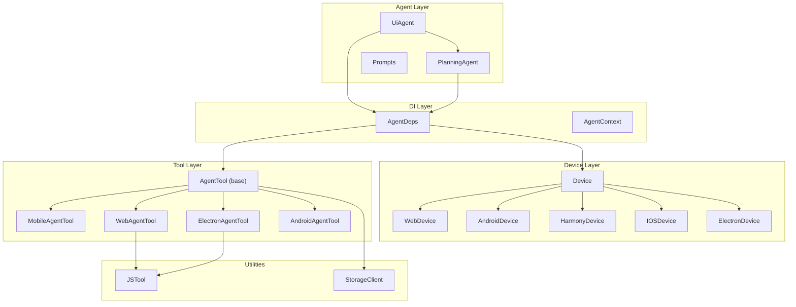
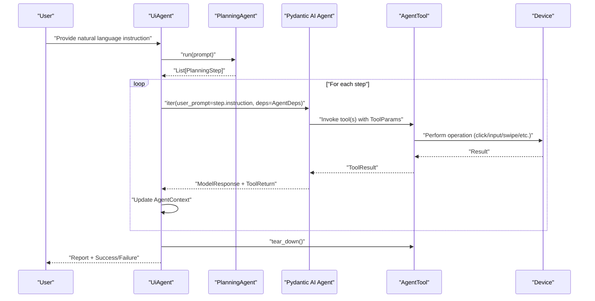
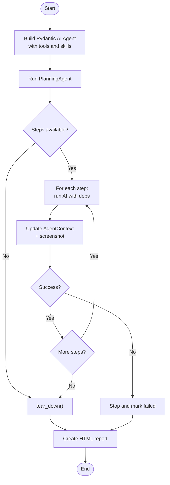
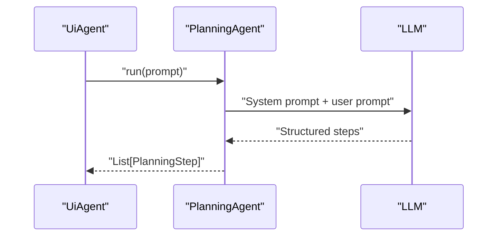
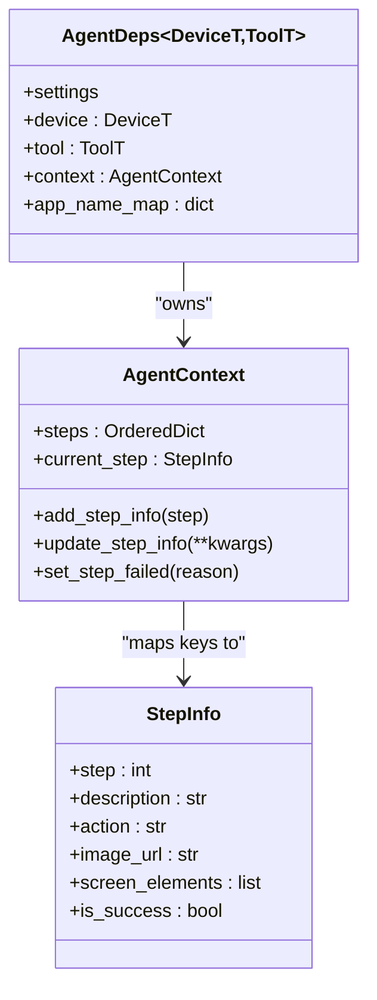
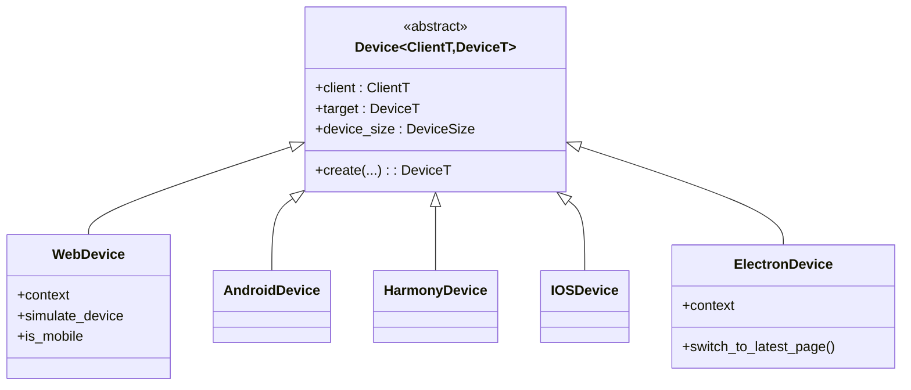
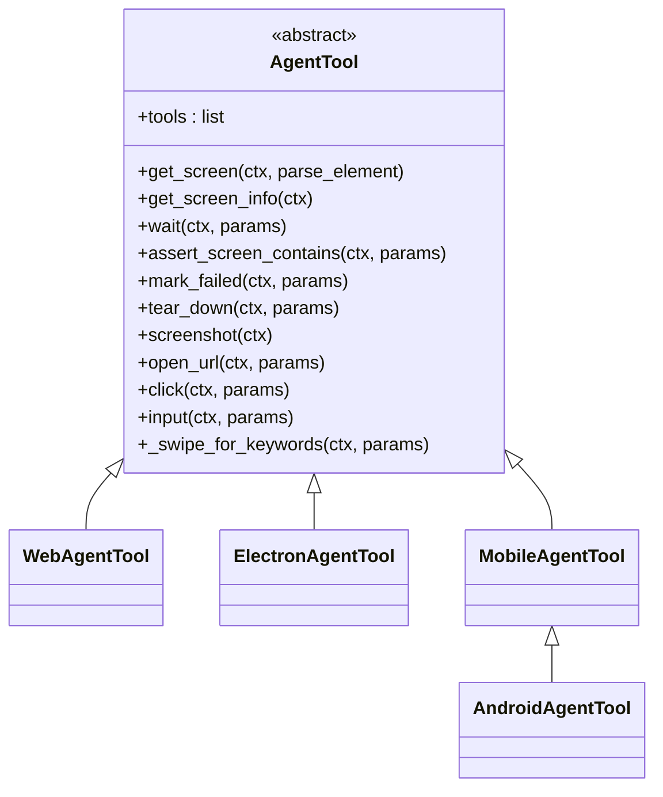
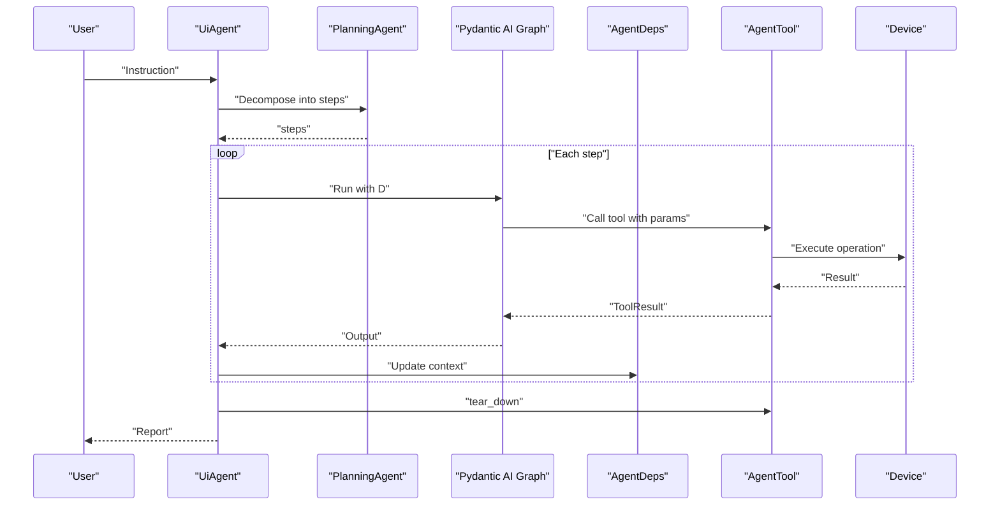
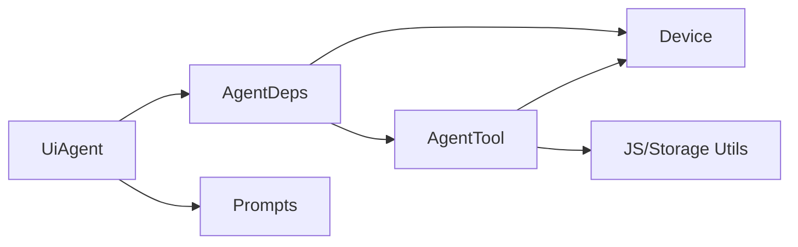

# Architecture Overview

<cite>
**Referenced Files in This Document**
- [src/page_eyes/agent.py](file://src/page_eyes/agent.py)
- [src/page_eyes/deps.py](file://src/page_eyes/deps.py)
- [src/page_eyes/device.py](file://src/page_eyes/device.py)
- [src/page_eyes/tools/_base.py](file://src/page_eyes/tools/_base.py)
- [src/page_eyes/tools/web.py](file://src/page_eyes/tools/web.py)
- [src/page_eyes/tools/electron.py](file://src/page_eyes/tools/electron.py)
- [src/page_eyes/tools/_mobile.py](file://src/page_eyes/tools/_mobile.py)
- [src/page_eyes/tools/android.py](file://src/page_eyes/tools/android.py)
- [src/page_eyes/prompt.py](file://src/page_eyes/prompt.py)
- [src/page_eyes/config.py](file://src/page_eyes/config.py)
- [src/page_eyes/util/js_tool/__init__.py](file://src/page_eyes/util/js_tool/__init__.py)
- [src/page_eyes/util/storage.py](file://src/page_eyes/util/storage.py)
</cite>

## Table of Contents
1. [Introduction](#introduction)
2. [Project Structure](#project-structure)
3. [Core Components](#core-components)
4. [Architecture Overview](#architecture-overview)
5. [Detailed Component Analysis](#detailed-component-analysis)
6. [Dependency Analysis](#dependency-analysis)
7. [Performance Considerations](#performance-considerations)
8. [Troubleshooting Guide](#troubleshooting-guide)
9. [Conclusion](#conclusion)

## Introduction
This document describes the PageEyes Agent framework architecture. It focuses on how UiAgent orchestrates PlanningAgent and Tool execution through AgentDeps dependency injection, and how the modular design separates concerns across device abstraction, tool system, and AI integration layers. It also documents the factory pattern for agent creation, strategy-like device implementations, and the template method for the execution flow. Finally, it explains how the dependency injection system enables platform-specific implementations and how the skill-based architecture supports extensibility for new platforms.

## Project Structure
The framework is organized around a layered architecture:
- Agent orchestration and prompts: UiAgent, PlanningAgent, and prompt templates
- Dependency injection: AgentDeps and related types
- Device abstraction: Device base class and platform-specific devices
- Tool system: Base tool interface and platform-specific tool implementations
- Utilities: JavaScript helpers and storage strategies

**Diagram sources**
- [src/page_eyes/agent.py:74-314](file://src/page_eyes/agent.py#L74-L314)
- [src/page_eyes/deps.py:76-82](file://src/page_eyes/deps.py#L76-L82)
- [src/page_eyes/device.py:43-322](file://src/page_eyes/device.py#L43-L322)
- [src/page_eyes/tools/_base.py:130-391](file://src/page_eyes/tools/_base.py#L130-L391)
- [src/page_eyes/tools/web.py:24-179](file://src/page_eyes/tools/web.py#L24-L179)
- [src/page_eyes/tools/electron.py:21-134](file://src/page_eyes/tools/electron.py#L21-L134)
- [src/page_eyes/tools/_mobile.py:27-165](file://src/page_eyes/tools/_mobile.py#L27-L165)
- [src/page_eyes/tools/android.py:18-23](file://src/page_eyes/tools/android.py#L18-L23)
- [src/page_eyes/util/js_tool/__init__.py:22-52](file://src/page_eyes/util/js_tool/__init__.py#L22-L52)
- [src/page_eyes/util/storage.py:154-193](file://src/page_eyes/util/storage.py#L154-L193)

**Section sources**
- [src/page_eyes/agent.py:74-314](file://src/page_eyes/agent.py#L74-L314)
- [src/page_eyes/deps.py:76-82](file://src/page_eyes/deps.py#L76-L82)
- [src/page_eyes/device.py:43-322](file://src/page_eyes/device.py#L43-L322)
- [src/page_eyes/tools/_base.py:130-391](file://src/page_eyes/tools/_base.py#L130-L391)
- [src/page_eyes/tools/web.py:24-179](file://src/page_eyes/tools/web.py#L24-L179)
- [src/page_eyes/tools/electron.py:21-134](file://src/page_eyes/tools/electron.py#L21-L134)
- [src/page_eyes/tools/_mobile.py:27-165](file://src/page_eyes/tools/_mobile.py#L27-L165)
- [src/page_eyes/tools/android.py:18-23](file://src/page_eyes/tools/android.py#L18-L23)
- [src/page_eyes/util/js_tool/__init__.py:22-52](file://src/page_eyes/util/js_tool/__init__.py#L22-L52)
- [src/page_eyes/util/storage.py:154-193](file://src/page_eyes/util/storage.py#L154-L193)

## Core Components
- UiAgent: Orchestrates planning and execution, builds the Pydantic AI agent with tools and skills, and manages step-by-step execution with logging and reporting.
- PlanningAgent: Uses a dedicated system prompt to decompose user intent into atomic steps.
- AgentDeps: Central DI container holding Settings, Device, Tool, and AgentContext; generic over device and tool types.
- Device abstractions: WebDevice, AndroidDevice, HarmonyDevice, IOSDevice, ElectronDevice; each encapsulates client/target and device size.
- Tool system: AgentTool defines the tool interface and shared utilities; platform-specific tools implement device operations.
- Prompts: Separate planning and execution prompts guide the model’s decomposition and execution strategies.
- Configuration: Settings and environment-driven configuration for model, browser, and storage.

**Section sources**
- [src/page_eyes/agent.py:74-314](file://src/page_eyes/agent.py#L74-L314)
- [src/page_eyes/deps.py:76-82](file://src/page_eyes/deps.py#L76-L82)
- [src/page_eyes/device.py:43-322](file://src/page_eyes/device.py#L43-L322)
- [src/page_eyes/tools/_base.py:130-391](file://src/page_eyes/tools/_base.py#L130-L391)
- [src/page_eyes/prompt.py:8-166](file://src/page_eyes/prompt.py#L8-L166)
- [src/page_eyes/config.py:54-73](file://src/page_eyes/config.py#L54-L73)

## Architecture Overview
The framework follows a layered, dependency-injected design:
- UiAgent composes PlanningAgent and the Pydantic AI agent configured with tools and skills.
- AgentDeps injects the device and tool implementations, plus runtime context, into the agent and tools.
- Tools call into Device abstractions to perform platform-specific actions.
- Prompts guide planning and execution, adapting to model type (LLM vs VLM).
- Utilities provide JS-based highlighting and storage strategies.

**Diagram sources**
- [src/page_eyes/agent.py:217-314](file://src/page_eyes/agent.py#L217-L314)
- [src/page_eyes/deps.py:76-82](file://src/page_eyes/deps.py#L76-L82)
- [src/page_eyes/tools/_base.py:130-391](file://src/page_eyes/tools/_base.py#L130-L391)
- [src/page_eyes/device.py:43-322](file://src/page_eyes/device.py#L43-L322)

## Detailed Component Analysis

### UiAgent Orchestration and Execution Flow
UiAgent implements a template-method-like execution:
- Builds a Pydantic AI agent with tools and skills via a factory method.
- Runs PlanningAgent to obtain a sequence of PlanningStep items.
- Iterates each step, invoking the AI agent with the step’s instruction and AgentDeps.
- Updates AgentContext with step outcomes and screenshots.
- On failure, marks the step failed and continues or stops depending on policy.
- Generates a final HTML report summarizing steps and success.

**Diagram sources**
- [src/page_eyes/agent.py:217-314](file://src/page_eyes/agent.py#L217-L314)
- [src/page_eyes/deps.py:48-73](file://src/page_eyes/deps.py#L48-L73)

**Section sources**
- [src/page_eyes/agent.py:146-314](file://src/page_eyes/agent.py#L146-L314)

### PlanningAgent and Prompting Strategy
PlanningAgent uses a fixed system prompt to convert user intent into atomic steps. The prompt enforces directness, single-operation per step, and preserves original intent.

**Diagram sources**
- [src/page_eyes/agent.py:80-89](file://src/page_eyes/agent.py#L80-L89)
- [src/page_eyes/prompt.py:8-28](file://src/page_eyes/prompt.py#L8-L28)

**Section sources**
- [src/page_eyes/agent.py:74-89](file://src/page_eyes/agent.py#L74-L89)
- [src/page_eyes/prompt.py:8-28](file://src/page_eyes/prompt.py#L8-L28)

### Dependency Injection via AgentDeps
AgentDeps is a generic container that carries:
- Settings: model, model settings, browser options, storage client
- Device: platform-specific device instance
- Tool: tool implementation bound to the device
- AgentContext: step tracking and current step info

This design allows UiAgent to remain agnostic of platform specifics while enabling polymorphic device and tool behavior.

**Diagram sources**
- [src/page_eyes/deps.py:76-82](file://src/page_eyes/deps.py#L76-L82)
- [src/page_eyes/deps.py:48-73](file://src/page_eyes/deps.py#L48-L73)
- [src/page_eyes/deps.py:35-46](file://src/page_eyes/deps.py#L35-L46)

**Section sources**
- [src/page_eyes/deps.py:76-82](file://src/page_eyes/deps.py#L76-L82)
- [src/page_eyes/deps.py:48-73](file://src/page_eyes/deps.py#L48-L73)
- [src/page_eyes/deps.py:35-46](file://src/page_eyes/deps.py#L35-L46)

### Device Abstraction and Strategy Pattern
Device is a generic base class capturing client, target, and device size. Concrete devices encapsulate platform-specific clients and lifecycle:
- WebDevice: Playwright-based persistent context and page
- AndroidDevice/HarmonyDevice: ADB/HDC-based device connections
- IOSDevice: WebDriverAgent-based session
- ElectronDevice: Chromium CDP connection with page stack management

This structure resembles a strategy pattern where Device subclasses provide different implementations for the same operations.

**Diagram sources**
- [src/page_eyes/device.py:43-322](file://src/page_eyes/device.py#L43-L322)

**Section sources**
- [src/page_eyes/device.py:43-322](file://src/page_eyes/device.py#L43-L322)

### Tool System and Factory Pattern for Agent Creation
The tool system defines a base AgentTool with shared utilities and platform-specific implementations:
- AgentTool: defines tool discovery, screen parsing, assertions, waits, and teardown
- WebAgentTool: Playwright-based operations for web
- ElectronAgentTool: extends WebAgentTool with Electron-specific behaviors
- MobileAgentTool: shared mobile operations; AndroidAgentTool specializes opening URLs

UiAgent subclasses (WebAgent, AndroidAgent, HarmonyAgent, IOSAgent, ElectronAgent) implement a factory method to construct Settings, Device, Tool, and AgentDeps, then build the Pydantic AI agent.

**Diagram sources**
- [src/page_eyes/tools/_base.py:130-391](file://src/page_eyes/tools/_base.py#L130-L391)
- [src/page_eyes/tools/web.py:24-179](file://src/page_eyes/tools/web.py#L24-L179)
- [src/page_eyes/tools/electron.py:21-134](file://src/page_eyes/tools/electron.py#L21-L134)
- [src/page_eyes/tools/_mobile.py:27-165](file://src/page_eyes/tools/_mobile.py#L27-L165)
- [src/page_eyes/tools/android.py:18-23](file://src/page_eyes/tools/android.py#L18-L23)

**Section sources**
- [src/page_eyes/tools/_base.py:130-391](file://src/page_eyes/tools/_base.py#L130-L391)
- [src/page_eyes/tools/web.py:24-179](file://src/page_eyes/tools/web.py#L24-L179)
- [src/page_eyes/tools/electron.py:21-134](file://src/page_eyes/tools/electron.py#L21-L134)
- [src/page_eyes/tools/_mobile.py:27-165](file://src/page_eyes/tools/_mobile.py#L27-L165)
- [src/page_eyes/tools/android.py:18-23](file://src/page_eyes/tools/android.py#L18-L23)

### Execution Flow: From Natural Language to Action
The end-to-end flow integrates planning, tool invocation, and device operations:

**Diagram sources**
- [src/page_eyes/agent.py:217-314](file://src/page_eyes/agent.py#L217-L314)
- [src/page_eyes/deps.py:76-82](file://src/page_eyes/deps.py#L76-L82)
- [src/page_eyes/tools/_base.py:130-391](file://src/page_eyes/tools/_base.py#L130-L391)
- [src/page_eyes/device.py:43-322](file://src/page_eyes/device.py#L43-L322)

## Dependency Analysis
The framework exhibits low coupling and high cohesion:
- UiAgent depends on AgentDeps and Pydantic AI; it delegates device and tool specifics to injected components.
- AgentDeps decouples device/tool implementations from the agent graph.
- Tools depend on Device abstractions; platform differences are isolated in Device subclasses.
- Prompts are externalized and selected based on model type.

**Diagram sources**
- [src/page_eyes/agent.py:146-314](file://src/page_eyes/agent.py#L146-L314)
- [src/page_eyes/deps.py:76-82](file://src/page_eyes/deps.py#L76-L82)
- [src/page_eyes/tools/_base.py:130-391](file://src/page_eyes/tools/_base.py#L130-L391)
- [src/page_eyes/util/js_tool/__init__.py:22-52](file://src/page_eyes/util/js_tool/__init__.py#L22-L52)
- [src/page_eyes/util/storage.py:154-193](file://src/page_eyes/util/storage.py#L154-L193)

**Section sources**
- [src/page_eyes/agent.py:146-314](file://src/page_eyes/agent.py#L146-L314)
- [src/page_eyes/deps.py:76-82](file://src/page_eyes/deps.py#L76-L82)
- [src/page_eyes/tools/_base.py:130-391](file://src/page_eyes/tools/_base.py#L130-L391)
- [src/page_eyes/util/js_tool/__init__.py:22-52](file://src/page_eyes/util/js_tool/__init__.py#L22-L52)
- [src/page_eyes/util/storage.py:154-193](file://src/page_eyes/util/storage.py#L154-L193)

## Performance Considerations
- Tool execution delays: Tools include optional before/after delays to accommodate rendering stability.
- Screen parsing: OmniParser integration adds latency; consider toggling parse_element to reduce overhead when only screenshots are needed.
- Device-specific optimizations: ElectronDevice switches to latest page automatically; WebDevice applies mobile emulation parameters to improve touch interactions.
- Storage uploads: Base64Strategy avoids network overhead for small images; COS/MinIO strategies compress images to WebP when appropriate.

[No sources needed since this section provides general guidance]

## Troubleshooting Guide
Common issues and diagnostics:
- Tool failures: Tools wrap exceptions and trigger ModelRetry; inspect logs for stack traces and use mark_failed to halt on unrecoverable conditions.
- Device connectivity: iOS requires WebDriverAgent; the device layer attempts startup and retries with backoff.
- Element detection: For LLM mode, highlight elements via JSTool in debug mode; for VLM mode, rely on parsed coordinates.
- Reporting: UiAgent generates an HTML report with step-by-step outcomes and device size metadata.

**Section sources**
- [src/page_eyes/tools/_base.py:88-127](file://src/page_eyes/tools/_base.py#L88-L127)
- [src/page_eyes/device.py:164-227](file://src/page_eyes/device.py#L164-L227)
- [src/page_eyes/agent.py:171-190](file://src/page_eyes/agent.py#L171-L190)

## Conclusion
PageEyes Agent employs a clean, dependency-injected architecture:
- UiAgent orchestrates planning and execution via a template method.
- AgentDeps centralizes platform-specific device and tool wiring.
- Device and tool layers isolate platform differences behind unified interfaces.
- The skill-based tool system and Pydantic AI agent enable extensibility and robust execution.
- Extending to new platforms involves implementing a Device subclass, a Tool subclass, and wiring them into the agent factory—no changes to core orchestration logic.