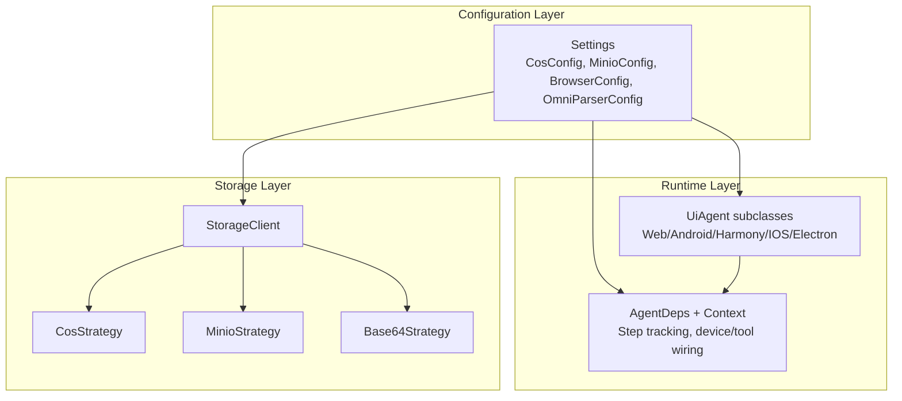
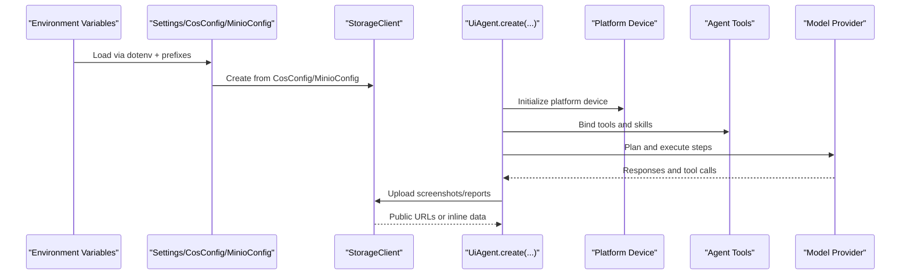
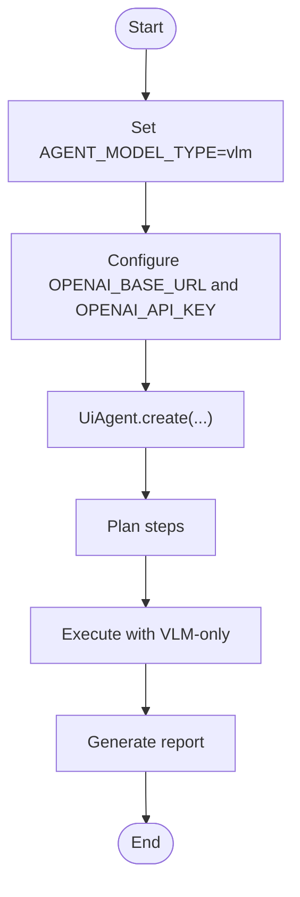
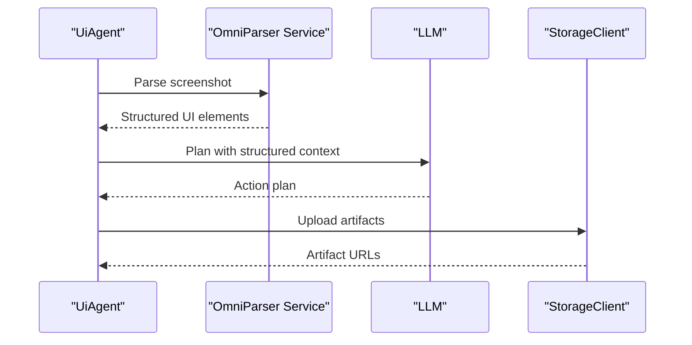
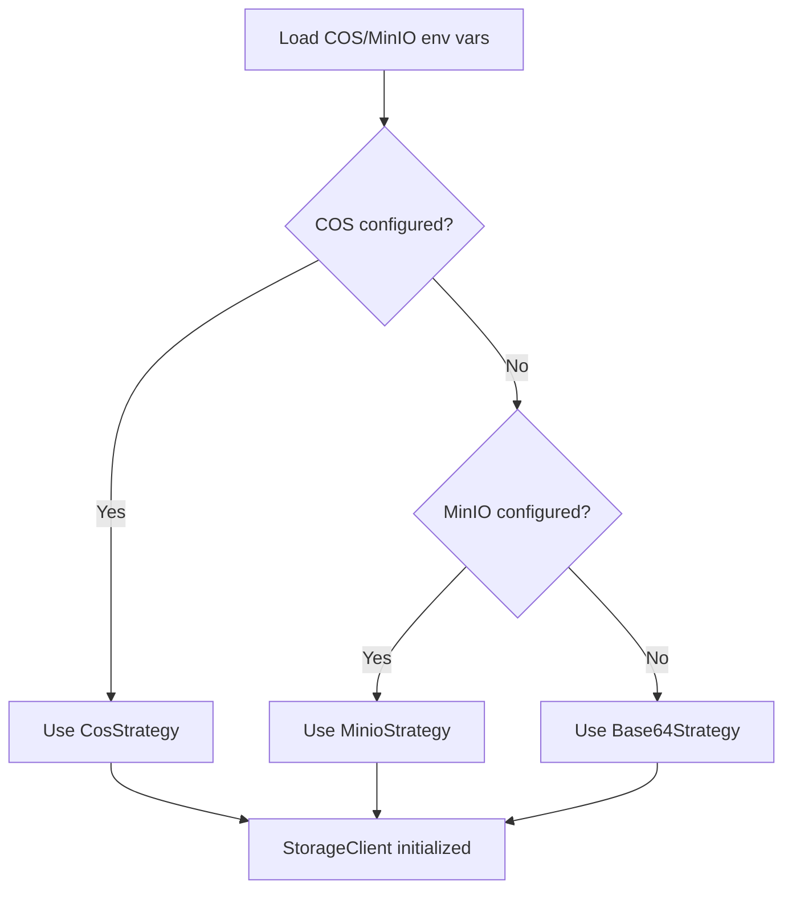
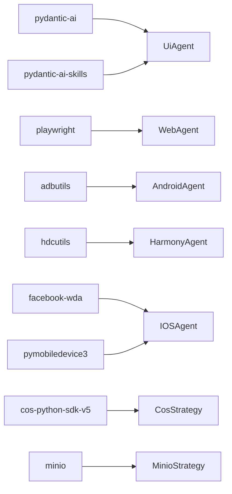

# Deployment Models and Configuration

<cite>
**Referenced Files in This Document**
- [README.md](file://README.md)
- [installation.md](file://docs/getting-started/installation.md)
- [config.py](file://src/page_eyes/config.py)
- [storage.py](file://src/page_eyes/util/storage.py)
- [agent.py](file://src/page_eyes/agent.py)
- [deps.py](file://src/page_eyes/deps.py)
- [pyproject.toml](file://pyproject.toml)
- [troubleshooting.md](file://docs/faq/troubleshooting.md)
</cite>

## Table of Contents
1. [Introduction](#introduction)
2. [Project Structure](#project-structure)
3. [Core Components](#core-components)
4. [Architecture Overview](#architecture-overview)
5. [Detailed Component Analysis](#detailed-component-analysis)
6. [Dependency Analysis](#dependency-analysis)
7. [Performance Considerations](#performance-considerations)
8. [Troubleshooting Guide](#troubleshooting-guide)
9. [Conclusion](#conclusion)
10. [Appendices](#appendices)

## Introduction
This document explains the three supported deployment models for PageEyes Agent and how to configure them effectively:
- Lightweight deployment with Vision-Language Model (VLM) only
- Multi-source fusion with OmniParser + LLM
- Enterprise cloud integration with optional object storage

It also documents the configuration system (environment variables, model selection criteria, platform-specific settings), trade-offs among the models, detailed configuration examples, optional cloud storage integration with Tencent COS and MinIO, step-by-step setup guides, and production-scale considerations.

## Project Structure
The deployment-relevant configuration and runtime behavior are primarily defined in:
- Configuration classes and environment variable parsing
- Storage client and strategy pattern for object storage
- Agent creation and model-type routing
- Platform/device-specific dependencies and capabilities

**Diagram sources**
- [config.py:54-72](file://src/page_eyes/config.py#L54-L72)
- [storage.py:154-193](file://src/page_eyes/util/storage.py#L154-L193)
- [agent.py:96-170](file://src/page_eyes/agent.py#L96-L170)
- [deps.py:75-100](file://src/page_eyes/deps.py#L75-L100)

**Section sources**
- [config.py:54-72](file://src/page_eyes/config.py#L54-L72)
- [storage.py:154-193](file://src/page_eyes/util/storage.py#L154-L193)
- [agent.py:96-170](file://src/page_eyes/agent.py#L96-L170)
- [deps.py:75-100](file://src/page_eyes/deps.py#L75-L100)

## Core Components
- Settings and environment variable mapping:
  - Centralized configuration with typed fields and environment prefixes
  - Supports model selection, model type (VLM vs LLM), browser/headless/simulation, OmniParser service endpoint, and storage client initialization
- Storage client and strategies:
  - Priority: Tencent COS > MinIO > Base64 fallback
  - Strategies encapsulate upload logic and URL generation
- Agent runtime:
  - UiAgent orchestrates planning and execution
  - Model type affects how screenshots and UI elements are handled
- Platform/device support:
  - Web, Android, HarmonyOS, iOS, Electron agents with platform-specific dependencies

**Section sources**
- [config.py:54-72](file://src/page_eyes/config.py#L54-L72)
- [storage.py:154-193](file://src/page_eyes/util/storage.py#L154-L193)
- [agent.py:96-170](file://src/page_eyes/agent.py#L96-L170)
- [deps.py:162-162](file://src/page_eyes/deps.py#L162-L162)

## Architecture Overview
The runtime architecture varies by deployment model but follows a consistent flow:
- Parse environment variables into Settings
- Initialize StorageClient based on COS/MinIO configuration
- Create platform-specific device and toolset
- Build Pydantic AI Agent with model and system prompts
- Execute planning and stepwise actions, capturing screenshots and UI elements

**Diagram sources**
- [config.py:54-72](file://src/page_eyes/config.py#L54-L72)
- [storage.py:161-186](file://src/page_eyes/util/storage.py#L161-L186)
- [agent.py:316-515](file://src/page_eyes/agent.py#L316-L515)

## Detailed Component Analysis

### Lightweight Deployment with VLM-only
- Purpose: Run with a VLM-capable model provider without requiring OmniParser
- Key configuration:
  - Set model type to VLM
  - Provide model identifier and credentials
  - Optionally configure browser/headless/simulation for Web scenarios
- Behavior:
  - Screenshots are captured and sent to the VLM for interpretation
  - Coordinates/element info may be inferred directly by the VLM
- Trade-offs:
  - Pros: Lower infrastructure cost, fewer moving parts
  - Cons: Accuracy depends on VLM quality; may require more precise instructions

**Diagram sources**
- [README.md:60-83](file://README.md#L60-L83)
- [config.py:58-59](file://src/page_eyes/config.py#L58-L59)
- [agent.py:118-139](file://src/page_eyes/agent.py#L118-L139)

**Section sources**
- [README.md:60-83](file://README.md#L60-L83)
- [config.py:58-59](file://src/page_eyes/config.py#L58-L59)
- [agent.py:118-139](file://src/page_eyes/agent.py#L118-L139)

### Multi-source Fusion with OmniParser + LLM
- Purpose: Combine OmniParser’s small UI parser with an LLM for robust, structured decisions
- Prerequisites:
  - Deploy OmniParser service (local or Docker)
  - Configure OmniParser base URL
- Key configuration:
  - Set model type to LLM
  - Provide LLM model identifier and credentials
  - Provide OmniParser base URL
- Behavior:
  - Screenshots are sent to OmniParser to produce structured UI element lists
  - LLM receives structured context and executes actions
- Trade-offs:
  - Pros: Higher accuracy for fine-grained UI interactions
  - Cons: Requires maintaining OmniParser service and network latency

**Diagram sources**
- [installation.md:53-102](file://docs/getting-started/installation.md#L53-L102)
- [config.py:65-67](file://src/page_eyes/config.py#L65-L67)
- [storage.py:161-186](file://src/page_eyes/util/storage.py#L161-L186)

**Section sources**
- [installation.md:53-102](file://docs/getting-started/installation.md#L53-L102)
- [config.py:65-67](file://src/page_eyes/config.py#L65-L67)

### Enterprise Cloud Integration
- Purpose: Store reports and artifacts in enterprise-grade object storage
- Options:
  - Tencent COS: Preferential priority when configured
  - MinIO: Alternative when COS is not configured
  - Base64 fallback: Used when neither COS nor MinIO is configured
- Configuration:
  - COS: COS_SECRET_ID, COS_SECRET_KEY, COS_ENDPOINT, COS_BUCKET
  - MinIO: MINIO_ACCESS_KEY, MINIO_SECRET_KEY, MINIO_ENDPOINT, MINIO_BUCKET, MINIO_REGION, MINIO_SECURE
- Behavior:
  - StorageClient selects strategy based on configuration precedence
  - Uploads are performed asynchronously when needed

**Diagram sources**
- [storage.py:161-186](file://src/page_eyes/util/storage.py#L161-L186)
- [config.py:67-67](file://src/page_eyes/config.py#L67-L67)

**Section sources**
- [storage.py:161-186](file://src/page_eyes/util/storage.py#L161-L186)
- [config.py:67-67](file://src/page_eyes/config.py#L67-L67)

### Configuration System
- Environment variable prefixes and scope:
  - agent_: central settings (model, model_type, debug)
  - browser_: browser/headless/simulate_device
  - omni_: OmniParser base_url/key
  - openai_/provider_: model provider base URL and API key
  - cos_/minio_: object storage credentials and endpoints
  - ios_wda_url: iOS WebDriverAgent URL
- Model selection criteria:
  - VLM-only: AGENT_MODEL_TYPE=vlm; AGENT_MODEL points to a VLM-capable provider/model
  - OmniParser+LLM: AGENT_MODEL_TYPE=llm; AGENT_MODEL points to an LLM; OMNI_BASE_URL points to deployed service
- Platform-specific settings:
  - Web: BROWSER_HEADLESS, BROWSER_SIMULATE_DEVICE
  - iOS: IOS_WDA_URL
  - Electron: CDP URL passed during agent creation

**Section sources**
- [README.md:97-131](file://README.md#L97-L131)
- [installation.md:314-422](file://docs/getting-started/installation.md#L314-L422)
- [config.py:54-72](file://src/page_eyes/config.py#L54-L72)

### Step-by-Step Setup Guides

#### Lightweight Deployment with VLM-only
- Prerequisites:
  - Python 3.12+, installed dependencies
  - VLM-capable provider account and API key
- Steps:
  1. Create .env with VLM model and credentials
  2. Initialize agent and run a simple task
- Verification:
  - Confirm screenshots are captured and processed
  - Validate report generation

**Section sources**
- [README.md:60-83](file://README.md#L60-L83)
- [installation.md:286-307](file://docs/getting-started/installation.md#L286-L307)

#### Multi-source Fusion with OmniParser + LLM
- Prerequisites:
  - OmniParser service running (local or Docker)
  - LLM provider account and API key
- Steps:
  1. Configure OmniParser base URL
  2. Configure LLM model and credentials
  3. Initialize agent and run a UI-heavy task
- Verification:
  - Confirm OmniParser parses screenshots and returns structured UI elements
  - Validate agent executes clicks/actions based on parsed elements

**Section sources**
- [installation.md:53-102](file://docs/getting-started/installation.md#L53-L102)
- [README.md:85-95](file://README.md#L85-L95)

#### Enterprise Cloud Integration
- Prerequisites:
  - COS or MinIO cluster available
- Steps:
  1. Configure COS or MinIO credentials and endpoints
  2. Initialize agent; uploads will be routed to selected storage
- Verification:
  - Confirm artifact URLs are returned and accessible

**Section sources**
- [storage.py:161-186](file://src/page_eyes/util/storage.py#L161-L186)
- [installation.md:394-422](file://docs/getting-started/installation.md#L394-L422)

### Detailed Configuration Examples
Note: Replace placeholders with your actual values.

- VLM-only example (.env):
  - OPENAI_BASE_URL=https://dashscope.aliyuncs.com/compatible-mode/v1
  - OPENAI_API_KEY=xxx-xxx-xxx-xxx-xxx
  - AGENT_MODEL_TYPE=vlm
  - AGENT_MODEL=openai:qwen3-vl-plus

- OmniParser + LLM example (.env):
  - OPENAI_BASE_URL=https://api.deepseek.com/v1
  - OPENAI_API_KEY=xxx-xxx-xxx-xxx-xxx
  - AGENT_MODEL=openai:deepseek-chat
  - OMNI_BASE_URL=http://127.0.0.1:8000

- COS storage example (.env):
  - COS_SECRET_ID=xxx
  - COS_SECRET_KEY=xxx
  - COS_ENDPOINT=cos-internal.ap-guangzhou.tencentcos.cn
  - COS_BUCKET=your-bucket

- MinIO storage example (.env):
  - MINIO_ACCESS_KEY=xxx
  - MINIO_SECRET_KEY=xxx
  - MINIO_ENDPOINT=minio.example.com:9000
  - MINIO_BUCKET=your-bucket
  - MINIO_SECURE=false

**Section sources**
- [README.md:60-95](file://README.md#L60-L95)
- [installation.md:394-422](file://docs/getting-started/installation.md#L394-L422)

### Optional Cloud Storage Integration: COS vs MinIO
- When to choose COS:
  - Enterprise-grade reliability and global CDN
  - Existing Tencent Cloud investment
- When to choose MinIO:
  - Self-hosted object storage with S3-compatible API
  - Cost-effective for internal deployments
- Selection logic:
  - COS configured → CosStrategy
  - Else if MinIO configured → MinioStrategy
  - Else Base64Strategy

**Section sources**
- [storage.py:161-186](file://src/page_eyes/util/storage.py#L161-L186)

### Scaling Considerations and Production Best Practices
- Horizontal scaling:
  - Run multiple agent instances behind a load balancer
  - Use separate queues for planning and execution tasks
- Resource sizing:
  - LLM memory: provision adequate CPU/RAM per concurrent agent
  - OmniParser: GPU recommended for throughput; monitor latency
- Observability:
  - Enable debug logging and graph node logging for tracing
  - Centralize logs and metrics
- Reliability:
  - Health checks for OmniParser and model providers
  - Circuit breaker patterns for external services
- Security:
  - Rotate API keys regularly
  - Restrict network access to object storage and OmniParser endpoints

[No sources needed since this section provides general guidance]

## Dependency Analysis
- External dependencies relevant to deployment:
  - pydantic-ai, skills, playwright, adbutils, hdcutils, facebook-wda, pymobiledevice3, cos-python-sdk-v5, minio
- These influence:
  - Agent runtime and tooling
  - Platform automation capabilities
  - Object storage integration

**Diagram sources**
- [pyproject.toml:20-32](file://pyproject.toml#L20-L32)
- [storage.py:20-21](file://src/page_eyes/util/storage.py#L20-L21)

**Section sources**
- [pyproject.toml:20-32](file://pyproject.toml#L20-L32)
- [storage.py:20-21](file://src/page_eyes/util/storage.py#L20-L21)

## Performance Considerations
- VLM-only:
  - Lower latency; fewer network hops
  - Accuracy depends on provider model quality
- OmniParser + LLM:
  - Structured UI parsing improves precision
  - Network latency to OmniParser and model provider matters
- Storage:
  - COS/MinIO uploads add overhead; consider async uploads and caching
- Concurrency:
  - Limit concurrent requests to model providers
  - Batch and cache frequently used assets

[No sources needed since this section provides general guidance]

## Troubleshooting Guide
- Environment variables not loading:
  - Verify .env file and prefixes; check configuration dump
- OmniParser connectivity:
  - Test health endpoint and parse request with a sample image
- Storage failures:
  - Validate COS/MinIO credentials and bucket permissions; test upload via script
- Debug logging:
  - Enable AGENT_DEBUG and graph node logging for detailed traces

**Section sources**
- [troubleshooting.md:6-25](file://docs/faq/troubleshooting.md#L6-L25)
- [troubleshooting.md:124-140](file://docs/faq/troubleshooting.md#L124-L140)
- [troubleshooting.md:145-181](file://docs/faq/troubleshooting.md#L145-L181)
- [troubleshooting.md:187-196](file://docs/faq/troubleshooting.md#L187-L196)

## Conclusion
PageEyes Agent supports flexible deployment models tailored to different needs:
- VLM-only for minimal infrastructure
- OmniParser + LLM for high-precision UI automation
- Enterprise-grade object storage for artifact management

By carefully selecting model types, configuring environment variables, and integrating appropriate storage, teams can balance performance, accuracy, and operational simplicity while scaling to production workloads.

## Appendices
- Additional platform notes:
  - Web: configure headless mode and simulated device
  - iOS: ensure WebDriverAgent is reachable and trusted
  - Electron: confirm CDP endpoint availability

**Section sources**
- [installation.md:104-254](file://docs/getting-started/installation.md#L104-L254)
- [agent.py:316-515](file://src/page_eyes/agent.py#L316-L515)