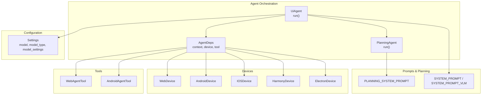
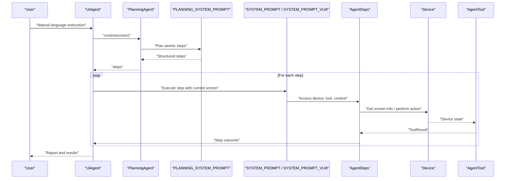
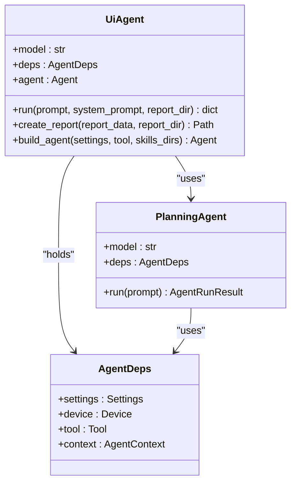
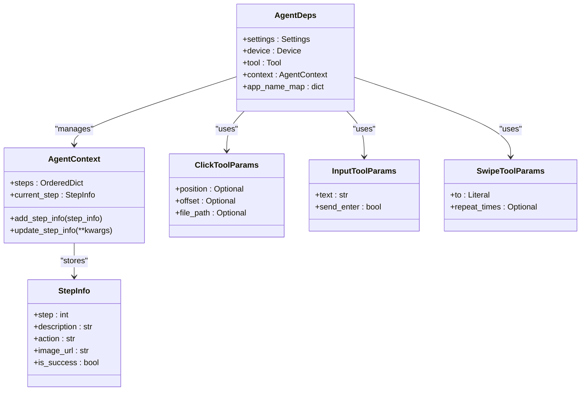
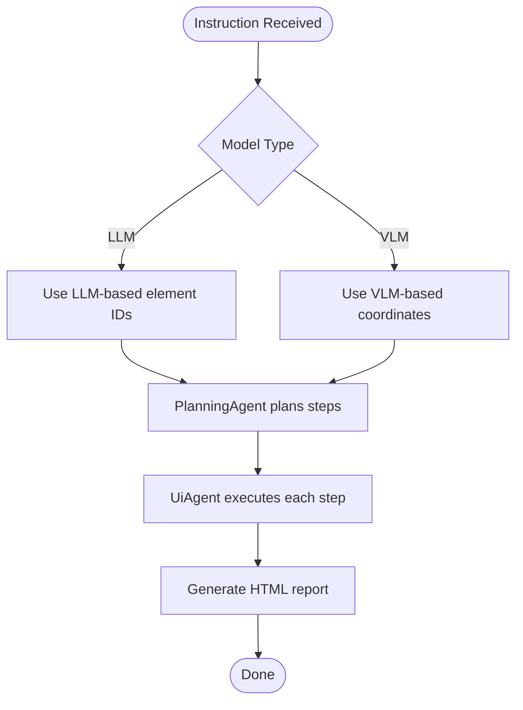
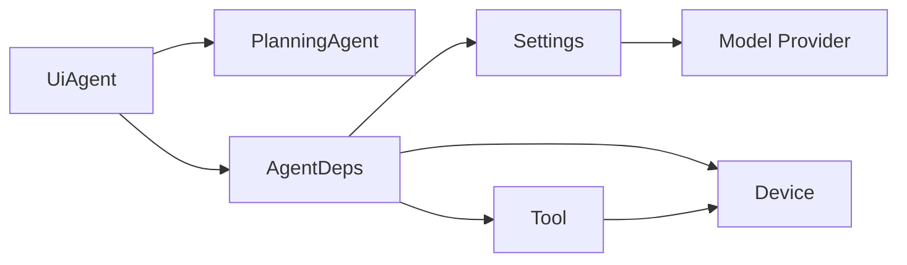

# Introduction and Core Concepts

<cite>
**Referenced Files in This Document**
- [README.md](file://README.md)
- [agent.py](file://src/page_eyes/agent.py)
- [deps.py](file://src/page_eyes/deps.py)
- [prompt.py](file://src/page_eyes/prompt.py)
- [config.py](file://src/page_eyes/config.py)
- [device.py](file://src/page_eyes/device.py)
- [web.py](file://src/page_eyes/tools/web.py)
- [android.py](file://src/page_eyes/tools/android.py)
- [demo.md](file://docs/getting-started/demo.md)
- [troubleshooting.md](file://docs/faq/troubleshooting.md)
- [core-concepts.md](file://docs/guides/core-concepts.md)
- [LLM 下半场是“行动”：基于 Pydantic AI + OmniParser 从零打造 GUI Agent/README.md](file://docs/article/LLM 下半场是“行动”：基于 Pydantic AI + OmniParser 从零打造 GUI Agent/README.md)
</cite>

## Table of Contents
1. [Introduction](#introduction)
2. [Project Structure](#project-structure)
3. [Core Components](#core-components)
4. [Architecture Overview](#architecture-overview)
5. [Detailed Component Analysis](#detailed-component-analysis)
6. [Dependency Analysis](#dependency-analysis)
7. [Performance Considerations](#performance-considerations)
8. [Troubleshooting Guide](#troubleshooting-guide)
9. [Conclusion](#conclusion)
10. [Appendices](#appendices)

## Introduction
PageEyes Agent represents a paradigm shift in automated testing and UI operation by replacing traditional brittle scripts with AI-powered natural language instructions. Instead of writing XPath selectors or platform-specific automation code, users describe what they want the system to do in everyday language. The Agent then plans atomic steps, executes them against real-time screen states, and reports outcomes—without requiring users to understand device APIs or UI frameworks.

Key value propositions:
- Natural language-first workflows eliminate the need to write scripts while maintaining cross-platform consistency.
- OmniParser VLM integration enables robust UI element parsing and precise element selection.
- Multi-model support allows flexible deployment across various LLM providers and configurations.
- Unified AgentDeps abstraction decouples planning, execution, and device/tooling concerns for portability.

This introduction explains the fundamental concept of AI-powered UI automation, contrasts it with legacy approaches, and outlines the core differences that make PageEyes Agent a practical solution for modern testing and productivity automation.

## Project Structure
The repository organizes the Agent around a clean separation of concerns:
- Agent orchestration and planning: UiAgent, PlanningAgent, AgentDeps
- System prompts and planning logic: prompt.py
- Configuration and environment: config.py
- Device abstractions: device.py
- Cross-platform tool implementations: tools/web.py, tools/android.py, and others
- Usage examples and demos: docs/getting-started/demo.md

**Diagram sources**
- [agent.py:74-314](file://src/page_eyes/agent.py#L74-L314)
- [prompt.py:8-166](file://src/page_eyes/prompt.py#L8-L166)
- [config.py:54-73](file://src/page_eyes/config.py#L54-L73)
- [device.py:54-390](file://src/page_eyes/device.py#L54-L390)
- [web.py:24-179](file://src/page_eyes/tools/web.py#L24-L179)
- [android.py:18-23](file://src/page_eyes/tools/android.py#L18-L23)

**Section sources**
- [README.md:27-36](file://README.md#L27-L36)
- [agent.py:74-314](file://src/page_eyes/agent.py#L74-L314)
- [prompt.py:8-166](file://src/page_eyes/prompt.py#L8-L166)
- [config.py:54-73](file://src/page_eyes/config.py#L54-L73)
- [device.py:54-390](file://src/page_eyes/device.py#L54-L390)
- [web.py:24-179](file://src/page_eyes/tools/web.py#L24-L179)
- [android.py:18-23](file://src/page_eyes/tools/android.py#L18-L23)

## Core Components
- UiAgent: Orchestrates planning and execution loops, manages step-by-step execution, and generates reports. It builds a Pydantic AI Agent with system prompts, tools, and skills, and iterates through steps while logging and tracking progress.
- PlanningAgent: Decomposes user instructions into atomic steps using a dedicated planning system prompt, returning a structured sequence for UiAgent to execute.
- AgentDeps: Central dependency container holding Settings, Device, Tool, and AgentContext. Provides typed tool parameters and step tracking for reliable execution.
- System Prompts: Two specialized prompts guide planning and execution. SYSTEM_PROMPT_VLM adapts execution for VLM-based element coordinates; SYSTEM_PROMPT supports LLM-based element IDs.
- Configuration: Settings encapsulates model selection, model type (llm/vlm), model settings, browser options, OmniParser service, and storage clients.
- Devices: Abstractions for Web, Android, HarmonyOS, iOS, and Electron enable unified tooling across platforms.
- Tools: Platform-specific implementations for opening URLs, clicking, input, swiping, assertions, and teardown.

Practical examples:
- Natural language command: “Open QQ Music, click ‘Rank’ tab, scroll up until ‘By You’ appears, click it.”
- Traditional script equivalent would require brittle selectors and platform-specific drivers; PageEyes Agent translates the instruction into atomic steps and executes them against real-time screen states.

Key differentiators:
- OmniParser VLM integration for robust UI parsing and precise element selection.
- Multi-model support enabling flexible provider choices.
- Deployment flexibility via environment-driven configuration and modular device/tool layers.

**Section sources**
- [agent.py:74-314](file://src/page_eyes/agent.py#L74-L314)
- [agent.py:316-515](file://src/page_eyes/agent.py#L316-L515)
- [deps.py:48-280](file://src/page_eyes/deps.py#L48-L280)
- [prompt.py:8-166](file://src/page_eyes/prompt.py#L8-L166)
- [config.py:54-73](file://src/page_eyes/config.py#L54-L73)
- [device.py:54-390](file://src/page_eyes/device.py#L54-L390)
- [web.py:24-179](file://src/page_eyes/tools/web.py#L24-L179)
- [android.py:18-23](file://src/page_eyes/tools/android.py#L18-L23)
- [demo.md:6-29](file://docs/getting-started/demo.md#L6-L29)

## Architecture Overview
PageEyes Agent follows a two-stage pipeline:
1. Planning: The PlanningAgent parses user instructions and produces a deterministic sequence of atomic steps.
2. Execution: UiAgent runs each step, leveraging AgentDeps to access device, tool, and context. Tools interact with devices and return structured results. The Agent logs progress, handles failures, and generates a final report.

**Diagram sources**
- [agent.py:74-314](file://src/page_eyes/agent.py#L74-L314)
- [prompt.py:8-166](file://src/page_eyes/prompt.py#L8-L166)
- [deps.py:48-280](file://src/page_eyes/deps.py#L48-L280)
- [device.py:54-390](file://src/page_eyes/device.py#L54-L390)
- [web.py:24-179](file://src/page_eyes/tools/web.py#L24-L179)
- [android.py:18-23](file://src/page_eyes/tools/android.py#L18-L23)

## Detailed Component Analysis

### UiAgent and PlanningAgent
UiAgent orchestrates the end-to-end workflow:
- Builds a Pydantic AI Agent with system prompts and tools.
- Uses PlanningAgent to decompose instructions into atomic steps.
- Iterates through steps, logs tool calls and thinking, updates context, and generates a final HTML report.

**Diagram sources**
- [agent.py:74-314](file://src/page_eyes/agent.py#L74-L314)
- [agent.py:73-90](file://src/page_eyes/agent.py#L73-L90)
- [deps.py:75-82](file://src/page_eyes/deps.py#L75-L82)

**Section sources**
- [agent.py:74-314](file://src/page_eyes/agent.py#L74-L314)

### AgentDeps and Typed Tool Parameters
AgentDeps centralizes dependencies and context:
- Holds Settings, Device, Tool, and AgentContext.
- Provides typed parameter models for tools (e.g., ClickToolParams, InputToolParams, SwipeToolParams).
- Supports both LLM and VLM modes with distinct parameter types.

**Diagram sources**
- [deps.py:48-280](file://src/page_eyes/deps.py#L48-L280)

**Section sources**
- [deps.py:48-280](file://src/page_eyes/deps.py#L48-L280)

### System Prompts and Model Modes
Two system prompts guide the Agent:
- PLANNING_SYSTEM_PROMPT: Decomposes instructions into atomic steps.
- SYSTEM_PROMPT or SYSTEM_PROMPT_VLM: Executes steps against real-time screen states, with VLM adapting to coordinate-based element selection.

**Diagram sources**
- [prompt.py:8-166](file://src/page_eyes/prompt.py#L8-L166)
- [config.py:58-61](file://src/page_eyes/config.py#L58-L61)

**Section sources**
- [prompt.py:8-166](file://src/page_eyes/prompt.py#L8-L166)
- [config.py:58-61](file://src/page_eyes/config.py#L58-L61)

### Practical Examples: Natural Language vs. Scripts
- Natural language: “Open the app, tap the search icon, enter the query, tap the first result.”
- Traditional script: Requires brittle selectors and platform-specific drivers; fragile across UI changes.
- PageEyes Agent: Understands intent, retrieves current screen state, selects elements, executes actions, and validates outcomes.

Examples in the repository demonstrate cross-platform usage:
- Android, HarmonyOS, iOS, Electron, and Web agents show consistent behavior with natural language instructions.

**Section sources**
- [demo.md:6-29](file://docs/getting-started/demo.md#L6-L29)
- [demo.md:33-56](file://docs/getting-started/demo.md#L33-L56)
- [demo.md:61-82](file://docs/getting-started/demo.md#L61-L82)
- [demo.md:87-111](file://docs/getting-started/demo.md#L87-L111)
- [demo.md:116-137](file://docs/getting-started/demo.md#L116-L137)

## Dependency Analysis
The Agent’s dependencies are intentionally decoupled:
- UiAgent depends on PlanningAgent, AgentDeps, and system prompts.
- AgentDeps depends on Settings, Device, and Tool implementations.
- Tools depend on Device abstractions and return ToolResult types.
- Configuration drives model selection and runtime behavior.

**Diagram sources**
- [agent.py:74-314](file://src/page_eyes/agent.py#L74-L314)
- [deps.py:75-82](file://src/page_eyes/deps.py#L75-L82)
- [config.py:54-73](file://src/page_eyes/config.py#L54-L73)
- [device.py:54-390](file://src/page_eyes/device.py#L54-L390)
- [web.py:24-179](file://src/page_eyes/tools/web.py#L24-L179)
- [android.py:18-23](file://src/page_eyes/tools/android.py#L18-L23)

**Section sources**
- [agent.py:74-314](file://src/page_eyes/agent.py#L74-L314)
- [deps.py:75-82](file://src/page_eyes/deps.py#L75-L82)
- [config.py:54-73](file://src/page_eyes/config.py#L54-L73)
- [device.py:54-390](file://src/page_eyes/device.py#L54-L390)
- [web.py:24-179](file://src/page_eyes/tools/web.py#L24-L179)
- [android.py:18-23](file://src/page_eyes/tools/android.py#L18-L23)

## Performance Considerations
- Multi-modal fusion: Using OmniParser with LLM reduces reliance on VLM-only inference, lowering latency and resource usage.
- Retry and robustness: The Agent catches unexpected model behavior and marks failures, enabling controlled recovery.
- Logging and reporting: Structured logs and HTML reports help diagnose bottlenecks and validate outcomes.
- Environment-driven tuning: Adjust model settings, headless mode, and storage backends to balance speed and reliability.

[No sources needed since this section provides general guidance]

## Troubleshooting Guide
Common issues and resolutions:
- Environment configuration: Verify .env settings and prefixes; confirm loading via Settings.
- Dependencies: Use uv to manage virtual environments and resolve conflicts.
- Device connectivity: Install Playwright browsers, ensure permissions, and validate device connections.
- Element parsing: Confirm OmniParser service availability and network connectivity.
- Storage: Configure COS or MinIO credentials and test uploads.

**Section sources**
- [troubleshooting.md:6-25](file://docs/faq/troubleshooting.md#L6-L25)
- [troubleshooting.md:26-91](file://docs/faq/troubleshooting.md#L26-L91)
- [troubleshooting.md:96-120](file://docs/faq/troubleshooting.md#L96-L120)
- [troubleshooting.md:124-140](file://docs/faq/troubleshooting.md#L124-L140)
- [troubleshooting.md:145-181](file://docs/faq/troubleshooting.md#L145-L181)

## Conclusion
PageEyes Agent transforms UI automation by replacing brittle scripts with AI-powered natural language instructions. Its dual-stage planning and execution pipeline, combined with OmniParser VLM integration, multi-model support, and cross-platform device abstractions, delivers a practical, scalable solution for automated testing and productivity tasks. By focusing on intent rather than implementation details, it lowers the barrier to automation while preserving reliability and consistency across platforms.

[No sources needed since this section summarizes without analyzing specific files]

## Appendices

### Beginner-Friendly Conceptual Overview
- Traditional automation requires writing scripts with brittle selectors and platform-specific drivers.
- AI-powered UI automation interprets natural language, plans atomic steps, and executes them against real-time screen states.
- Benefits: reduced maintenance, improved adaptability to UI changes, and simplified workflows for testers and power users.

**Section sources**
- [LLM 下半场是“行动”：基于 Pydantic AI + OmniParser 从零打造 GUI Agent/README.md:7-27](file://docs/article/LLM 下半场是“行动”：基于 Pydantic AI + OmniParser 从零打造 GUI Agent/README.md#L7-L27)

### Technical Deep Dive for Experienced Developers
- PlanningAgent uses a planning system prompt to produce ordered steps.
- UiAgent runs each step, logs tool calls and thinking, and updates context.
- AgentDeps encapsulates typed tool parameters and context for robust execution.
- Configuration supports llm/vlm modes and multi-provider model selection.

**Section sources**
- [agent.py:74-314](file://src/page_eyes/agent.py#L74-L314)
- [prompt.py:8-166](file://src/page_eyes/prompt.py#L8-L166)
- [deps.py:48-280](file://src/page_eyes/deps.py#L48-L280)
- [config.py:58-61](file://src/page_eyes/config.py#L58-L61)