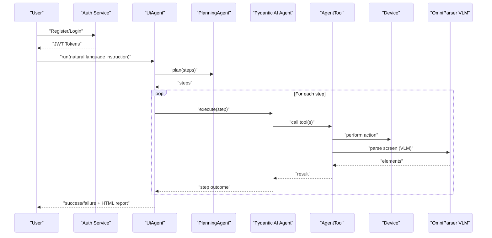
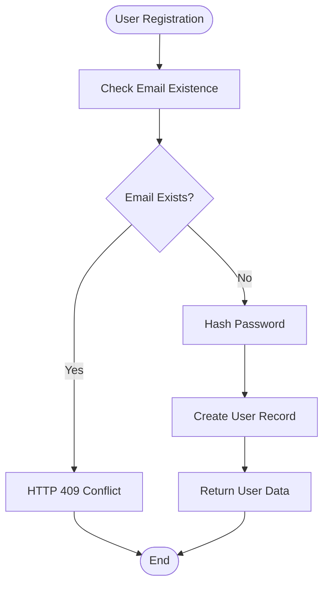
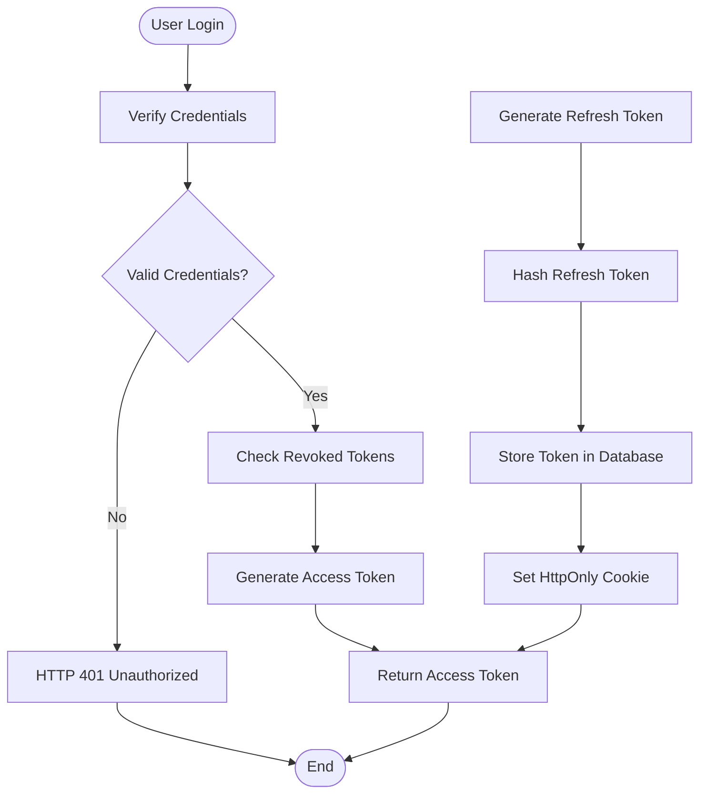
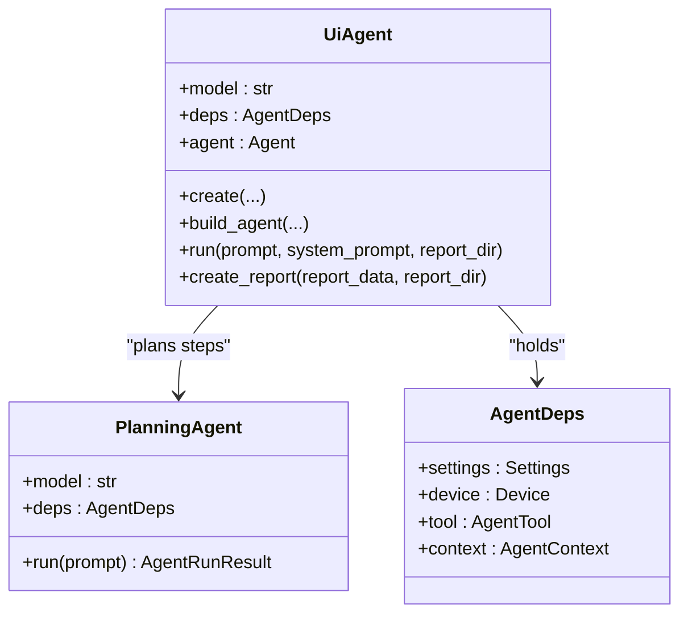
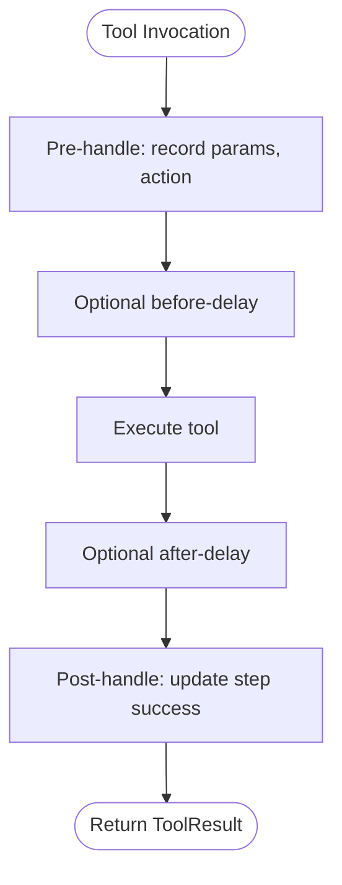
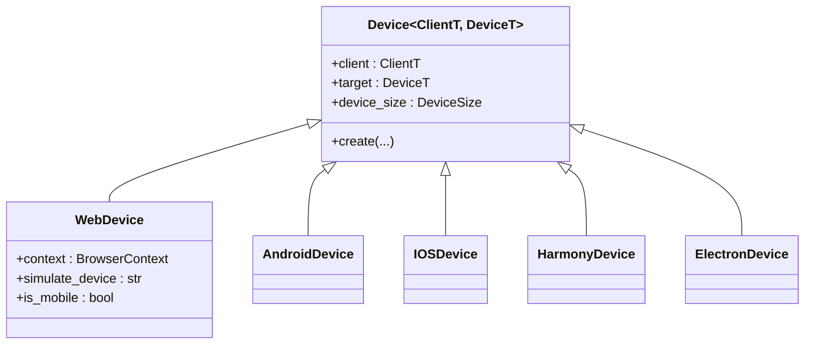
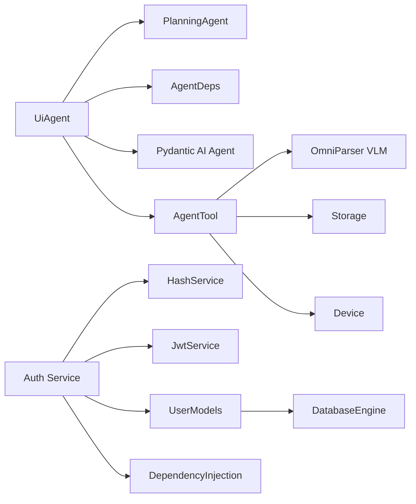

# Project Overview

<cite>
**Referenced Files in This Document**
- [README.md](file://README.md)
- [agent.py](file://src/page_eyes/agent.py)
- [deps.py](file://src/page_eyes/deps.py)
- [config.py](file://src/page_eyes/config.py)
- [_base.py](file://src/page_eyes/tools/_base.py)
- [web.py](file://src/page_eyes/tools/web.py)
- [device.py](file://src/page_eyes/device.py)
- [prompt.py](file://src/page_eyes/prompt.py)
- [installation.md](file://docs/getting-started/installation.md)
- [test_web_agent.py](file://tests/test_web_agent.py)
- [test_android_agent.py](file://tests/test_android_agent.py)
- [main.py](file://main.py)
- [pyproject.toml](file://pyproject.toml)
- [UserService.py](file://app/USER/UserService.py)
- [UserRoute.py](file://app/USER/UserRoute.py)
- [UserPydanticModel.py](file://app/USER/UserPydanticModel.py)
- [dependecies.py](file://app/dependency/dependecies.py)
- [hash_service.py](file://app/services/hash_service.py)
- [jwt_service.py](file://app/services/jwt_service.py)
- [user_model.py](file://app/models/user_model.py)
- [db.py](file://app/config/db.py)
- [docker-compose.yml](file://docker-compose.yml)
</cite>

## Update Summary
**Changes Made**
- Added comprehensive authentication system documentation for the auth-service implementation
- Documented modern Python architecture with dependency injection patterns
- Added authentication service components including JWT, password hashing, and database models
- Included practical examples of authentication flows and security implementations
- Updated architecture diagrams to reflect authentication service integration

## Table of Contents
1. [Introduction](#introduction)
2. [Project Structure](#project-structure)
3. [Core Components](#core-components)
4. [Architecture Overview](#architecture-overview)
5. [Authentication Service Implementation](#authentication-service-implementation)
6. [Detailed Component Analysis](#detailed-component-analysis)
7. [Dependency Analysis](#dependency-analysis)
8. [Performance Considerations](#performance-considerations)
9. [Troubleshooting Guide](#troubleshooting-guide)
10. [Conclusion](#conclusion)

## Introduction
PageEyes Agent is a lightweight UI automation framework powered by Pydantic AI. It enables cross-platform automation through natural language instructions, removing the need for traditional scripting. The framework integrates OmniParser VLM for element recognition and supports multiple platforms: Web, Android, iOS, HarmonyOS, and Electron desktop apps. It emphasizes AI-driven planning and execution, delivering consistent automation experiences across diverse environments.

**Updated** Enhanced with comprehensive authentication service implementation featuring modern Python architecture, dependency injection patterns, and secure authentication mechanisms.

Key value propositions:
- No-script automation: Users express intent in plain language; the system plans and executes actions automatically.
- Multi-source fusion deployment: Supports both LLM-centric and VLM-centric pipelines, enabling flexible model choices and hybrid workflows.
- Cross-platform consistency: Unified UiAgent abstraction with platform-specific tools and devices ensures predictable behavior across Web, Android, iOS, HarmonyOS, and Electron.
- Secure authentication: Built-in authentication service with JWT tokens, password hashing, and database persistence for enterprise-grade security.

## Project Structure
At a high level, the project is organized around a core agent layer, platform abstractions, tooling for device interaction, configuration and prompts, utilities for platform-specific drivers and storage, and a comprehensive authentication service.

```mermaid
graph TB
subgraph "Core Automation Framework"
A["UiAgent<br/>AgentDeps"]
P["Prompts<br/>Planning/Execution"]
C["Settings<br/>Model/Storage"]
end
subgraph "Authentication Service"
AS["Auth Service"]
US["UserService"]
UR["UserRoutes"]
UM["User Models"]
end
subgraph "Devices"
D1["WebDevice"]
D2["AndroidDevice"]
D3["IOSDevice"]
D4["HarmonyDevice"]
D5["ElectronDevice"]
end
subgraph "Tools"
T["_base.AgentTool"]
TW["web.WebAgentTool"]
end
subgraph "Security Layer"
HS["HashService"]
JS["JwtService"]
DEP["Dependency Injection"]
end
subgraph "Integration"
O["OmniParser VLM"]
S["Storage Clients"]
DB["Database Engine"]
END
A --> P
A --> C
A --> D1
A --> D2
A --> D3
A --> D4
A --> D5
A --> T
T --> TW
T --> O
T --> S
AS --> US
AS --> UR
AS --> UM
US --> HS
US --> JS
US --> DEP
UM --> DB
```

**Diagram sources**
- [agent.py:97-314](file://src/page_eyes/agent.py#L97-L314)
- [deps.py:76-100](file://src/page_eyes/deps.py#L76-L100)
- [prompt.py:8-166](file://src/page_eyes/prompt.py#L8-L166)
- [config.py:54-73](file://src/page_eyes/config.py#L54-L73)
- [_base.py:130-151](file://src/page_eyes/tools/_base.py#L130-L151)
- [web.py:24-53](file://src/page_eyes/tools/web.py#L24-L53)
- [device.py:54-100](file://src/page_eyes/device.py#L54-L100)
- [UserService.py:13-105](file://app/USER/UserService.py#L13-L105)
- [UserRoute.py:10-22](file://app/USER/UserRoute.py#L10-L22)
- [hash_service.py:6-18](file://app/services/hash_service.py#L6-L18)
- [jwt_service.py:8-38](file://app/services/jwt_service.py#L8-L38)
- [user_model.py:8-34](file://app/models/user_model.py#L8-L34)
- [db.py:14-27](file://app/config/db.py#L14-L27)

**Section sources**
- [README.md:27-36](file://README.md#L27-L36)
- [agent.py:97-314](file://src/page_eyes/agent.py#L97-L314)
- [device.py:54-100](file://src/page_eyes/device.py#L54-L100)
- [config.py:54-73](file://src/page_eyes/config.py#L54-L73)
- [UserService.py:13-105](file://app/USER/UserService.py#L13-L105)
- [UserRoute.py:10-22](file://app/USER/UserRoute.py#L10-L22)

## Core Components
- UiAgent: The primary orchestrator that builds a Pydantic AI Agent with a system prompt, tools, and capabilities. It runs a planning phase, iterates through steps, and generates a structured HTML report.
- PlanningAgent: Decomposes user intent into atomic steps using a dedicated system prompt and output schema.
- AgentDeps: Holds shared runtime state (settings, device, tool, context) and defines typed tool parameters and outputs.
- Tools: Platform-agnostic tool interface with platform-specific implementations (e.g., WebAgentTool). Includes element parsing via OmniParser VLM, assertions, waits, swipes, screenshots, and teardown.
- Devices: Abstractions for Web, Android, iOS, HarmonyOS, and Electron, encapsulating driver connections and viewport/device sizes.
- Prompts: Role-based system prompts guiding planning and execution, with separate variants for LLM and VLM modes.
- Configuration: Centralized settings for model selection, model type (LLM/VLM), browser/headless mode, OmniParser service, storage clients, and debug flags.
- **Authentication Service**: Complete authentication system with user registration, login, JWT token management, password hashing, and database persistence.

Practical examples (natural language vs. traditional scripting):
- Natural language: "Open QQ Music, click 'Discover', click 'Rankings', click 'QQ Music Chart', check the current page contains 'By You Chart'."
- Traditional scripting: Requires explicit selectors, waits, and handlers for popups and dynamic content—PageEyes eliminates this complexity by interpreting intent and adapting to UI changes.

**Section sources**
- [agent.py:74-314](file://src/page_eyes/agent.py#L74-L314)
- [deps.py:25-280](file://src/page_eyes/deps.py#L25-L280)
- [_base.py:130-151](file://src/page_eyes/tools/_base.py#L130-L151)
- [web.py:24-53](file://src/page_eyes/tools/web.py#L24-L53)
- [prompt.py:8-166](file://src/page_eyes/prompt.py#L8-L166)
- [config.py:54-73](file://src/page_eyes/config.py#L54-L73)
- [UserService.py:13-105](file://app/USER/UserService.py#L13-L105)

## Architecture Overview
The framework follows a layered design with integrated authentication:
- Prompt layer: Defines planning and execution roles.
- Agent layer: Composes a Pydantic AI Agent with tools and skills.
- Tool layer: Implements device interactions and element parsing.
- Device layer: Manages platform-specific drivers and sessions.
- Configuration and storage: Provides model settings, OmniParser endpoints, and artifact storage.
- Authentication layer: Handles user registration, login, JWT token lifecycle, and database persistence.



**Diagram sources**
- [agent.py:74-314](file://src/page_eyes/agent.py#L74-L314)
- [_base.py:167-234](file://src/page_eyes/tools/_base.py#L167-L234)
- [device.py:54-100](file://src/page_eyes/device.py#L54-L100)
- [prompt.py:8-166](file://src/page_eyes/prompt.py#L8-L166)
- [UserService.py:25-62](file://app/USER/UserService.py#L25-L62)

## Authentication Service Implementation

### Modern Python Architecture
The authentication service implements a clean, modern Python architecture with:
- **FastAPI Framework**: Asynchronous web framework with automatic OpenAPI documentation
- **SQLAlchemy ORM**: Type-safe database operations with async support
- **Dependency Injection**: Structured dependency management through FastAPI's dependency system
- **Environment-Based Configuration**: Flexible configuration through environment variables
- **Modular Design**: Clear separation of concerns across services, models, routes, and dependencies

### Security Features
- **Password Hashing**: Argon2-based password hashing with salt generation
- **JWT Token Management**: Access and refresh token lifecycle with expiration handling
- **Database Persistence**: Secure token storage with revocation tracking
- **Cookie Security**: HttpOnly refresh tokens with SameSite protection
- **Input Validation**: Pydantic models for comprehensive request validation

### Core Authentication Components

#### User Registration Flow


#### Login and Token Generation


**Diagram sources**
- [UserService.py:13-24](file://app/USER/UserService.py#L13-L24)
- [UserService.py:25-62](file://app/USER/UserService.py#L25-L62)
- [UserService.py:65-105](file://app/USER/UserService.py#L65-L105)

**Section sources**
- [UserService.py:13-105](file://app/USER/UserService.py#L13-L105)
- [UserRoute.py:10-22](file://app/USER/UserRoute.py#L10-L22)
- [UserPydanticModel.py:23-47](file://app/USER/UserPydanticModel.py#L23-L47)
- [hash_service.py:6-18](file://app/services/hash_service.py#L6-L18)
- [jwt_service.py:8-38](file://app/services/jwt_service.py#L8-L38)
- [user_model.py:8-34](file://app/models/user_model.py#L8-L34)

## Detailed Component Analysis

### UiAgent and PlanningAgent
UiAgent composes a Pydantic AI Agent with:
- System prompt tailored to UI execution
- Tools and skills capability
- AgentDeps for shared state
- Iterative run loop that logs graph nodes and aggregates usage metrics
- Step-wise execution with failure marking and teardown

PlanningAgent decomposes user intent into ordered steps using a planning system prompt and a strongly-typed output schema.



**Diagram sources**
- [agent.py:74-314](file://src/page_eyes/agent.py#L74-L314)
- [deps.py:76-82](file://src/page_eyes/deps.py#L76-L82)

**Section sources**
- [agent.py:74-314](file://src/page_eyes/agent.py#L74-L314)
- [prompt.py:8-28](file://src/page_eyes/prompt.py#L8-L28)

### AgentTool and OmniParser Integration
AgentTool defines:
- Tool registry filtered by model type (LLM/VLM)
- Screen capture and element parsing via OmniParser VLM
- Assertions, waits, swipes, clicks, input, and teardown
- Storage integration for artifacts



**Diagram sources**
- [_base.py:88-127](file://src/page_eyes/tools/_base.py#L88-L127)

**Section sources**
- [_base.py:130-234](file://src/page_eyes/tools/_base.py#L130-L234)

### Device Abstractions
Unified device interfaces for:
- Web: Playwright-backed persistent context, viewport size, simulated devices
- Android: ADB client/device, window size
- iOS: WebDriverAgent connection, session, window size
- HarmonyOS: HDC client/device, window size
- Electron: Chromium CDP connection, page stack, window switching



**Diagram sources**
- [device.py:42-100](file://src/page_eyes/device.py#L42-L100)
- [device.py:102-156](file://src/page_eyes/device.py#L102-L156)
- [device.py:158-228](file://src/page_eyes/device.py#L158-L228)
- [device.py:229-292](file://src/page_eyes/device.py#L229-L292)

**Section sources**
- [device.py:54-100](file://src/page_eyes/device.py#L54-L100)
- [device.py:102-156](file://src/page_eyes/device.py#L102-L156)
- [device.py:158-228](file://src/page_eyes/device.py#L158-L228)
- [device.py:229-292](file://src/page_eyes/device.py#L229-L292)

### Multi-Platform Support and Execution
- Web: URL navigation, clicks, input, swipes, back navigation, and element assertions.
- Android/iOS/HarmonyOS: App launching, gestures, and element interactions via respective drivers.
- Electron: CDP-based page switching and window management.

Examples in tests demonstrate:
- Web: Navigation, sliding until elements appear, input with optional Enter, relative clicks, and batch assertions.
- Android: App switching, H5 navigation, popup handling, and swipe-to-find patterns.

**Section sources**
- [web.py:24-179](file://src/page_eyes/tools/web.py#L24-L179)
- [test_web_agent.py:11-209](file://tests/test_web_agent.py#L11-L209)
- [test_android_agent.py:11-70](file://tests/test_android_agent.py#L11-L70)

### Authentication Service Architecture
The authentication service implements a comprehensive security framework:

#### Database Models
- **UserModel**: Core user entity with UUID primary keys, email uniqueness, password hashing, and role-based access
- **RefreshTokenModel**: Secure token storage with hash verification, revocation tracking, and expiration management

#### Security Services
- **HashService**: Argon2-based password hashing with salt generation and token hashing for secure storage
- **JwtService**: JWT token creation and validation with configurable expiration times and algorithm selection
- **Dependency Class**: Centralized token validation and user verification logic

#### Route Endpoints
- **Signup Endpoint**: User registration with duplicate email prevention and secure password storage
- **Signin Endpoint**: Credential verification with JWT token generation and refresh token cookie setting
- **Refresh Endpoint**: Secure token refresh with database validation and rotation

**Section sources**
- [user_model.py:8-34](file://app/models/user_model.py#L8-L34)
- [hash_service.py:6-18](file://app/services/hash_service.py#L6-L18)
- [jwt_service.py:8-38](file://app/services/jwt_service.py#L8-L38)
- [dependecies.py:9-31](file://app/dependency/dependecies.py#L9-L31)
- [UserRoute.py:10-22](file://app/USER/UserRoute.py#L10-L22)

## Dependency Analysis
- UiAgent depends on:
  - PlanningAgent for decomposition
  - AgentDeps for shared state and typed tool parameters
  - Pydantic AI Agent runtime for planning and tool invocation
  - Tools for device interaction
  - Devices for driver connections
  - Prompts for role-based behavior
  - Configuration for model/service endpoints and storage

- Tools depend on:
  - OmniParser VLM for element parsing
  - Storage clients for artifact uploads
  - Device-specific drivers for actions

- Authentication service depends on:
  - HashService for password and token hashing
  - JwtService for token management
  - Database models for user and token persistence
  - Dependency injection for centralized validation
  - Pydantic models for request/response validation



**Diagram sources**
- [agent.py:74-314](file://src/page_eyes/agent.py#L74-L314)
- [_base.py:130-151](file://src/page_eyes/tools/_base.py#L130-L151)
- [config.py:54-73](file://src/page_eyes/config.py#L54-L73)
- [UserService.py:13-105](file://app/USER/UserService.py#L13-L105)
- [hash_service.py:6-18](file://app/services/hash_service.py#L6-L18)
- [jwt_service.py:8-38](file://app/services/jwt_service.py#L8-L38)
- [user_model.py:8-34](file://app/models/user_model.py#L8-L34)
- [db.py:14-27](file://app/config/db.py#L14-L27)

**Section sources**
- [agent.py:74-314](file://src/page_eyes/agent.py#L74-L314)
- [_base.py:130-151](file://src/page_eyes/tools/_base.py#L130-L151)
- [config.py:54-73](file://src/page_eyes/config.py#L54-L73)
- [UserService.py:13-105](file://app/USER/UserService.py#L13-L105)
- [hash_service.py:6-18](file://app/services/hash_service.py#L6-L18)
- [jwt_service.py:8-38](file://app/services/jwt_service.py#L8-L38)
- [user_model.py:8-34](file://app/models/user_model.py#L8-L34)
- [db.py:14-27](file://app/config/db.py#L14-L27)

## Performance Considerations
- Model type selection: LLM mode reduces parsing overhead but requires OmniParser service; VLM mode embeds parsing via base64 images, simplifying deployment.
- Delays: Tools include configurable before/after delays to accommodate rendering and transitions.
- Parallel tool calls: Enforced single-tool execution per step to avoid race conditions.
- Storage: Artifact uploads to cloud storage or base64 fallback to balance performance and reliability.
- **Authentication Performance**: JWT token caching, efficient database queries, and optimized password hashing algorithms ensure minimal latency for authentication operations.

## Troubleshooting Guide
Common issues and resolutions:
- OmniParser connectivity: Verify service health and endpoint configuration when using LLM mode.
- ADB device recognition: Ensure adb is installed and devices are visible; restart adb server if needed.
- WebDriverAgent (iOS): Confirm WDA is running, device trust is configured, and port forwarding is set up.
- Electron CDP: Validate remote debugging port and that the app is launched with the appropriate flag.
- Debug logging: Enable debug mode to inspect agent graph nodes and step outcomes.
- **Authentication Issues**: Verify database connectivity, JWT secret configuration, password hashing settings, and token expiration values.

**Section sources**
- [installation.md:424-494](file://docs/getting-started/installation.md#L424-L494)
- [config.py:54-73](file://src/page_eyes/config.py#L54-L73)
- [_base.py:167-189](file://src/page_eyes/tools/_base.py#L167-L189)
- [db.py:14-27](file://app/config/db.py#L14-L27)
- [jwt_service.py:13-14](file://app/services/jwt_service.py#L13-L14)

## Conclusion
PageEyes Agent delivers a unified, AI-first approach to cross-platform UI automation. By combining Pydantic AI's planning with OmniParser VLM for robust element recognition, it enables natural language-driven workflows across Web, Android, iOS, HarmonyOS, and Electron. Its modular design, strong typing, and extensible tooling make it suitable for both beginners seeking no-script automation and advanced practitioners requiring precise control and observability.

**Updated** The framework now includes a comprehensive authentication service built with modern Python architecture, implementing secure JWT token management, password hashing, and database persistence. The authentication system follows dependency injection patterns, provides robust security features, and integrates seamlessly with the automation framework for enterprise-grade deployments.

The authentication service features:
- **Secure Password Handling**: Argon2-based hashing with salt generation
- **JWT Token Lifecycle**: Access and refresh token management with expiration
- **Database Persistence**: Secure token storage with revocation tracking
- **Dependency Injection**: Clean architecture with centralized validation logic
- **Comprehensive Error Handling**: HTTP status codes and detailed error messages
- **Cookie Security**: HttpOnly refresh tokens with SameSite protection

This integration ensures that organizations can deploy PageEyes Agent with enterprise-grade security while maintaining the framework's commitment to simplicity and cross-platform compatibility.