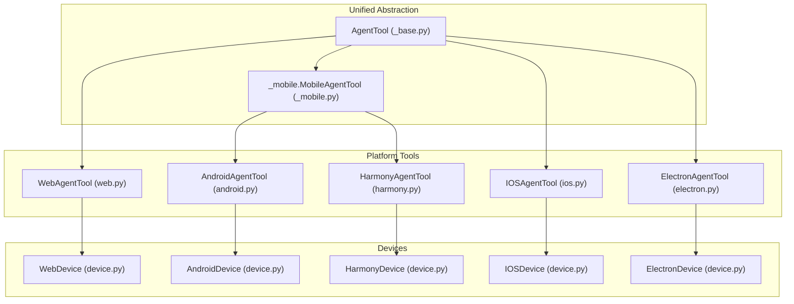
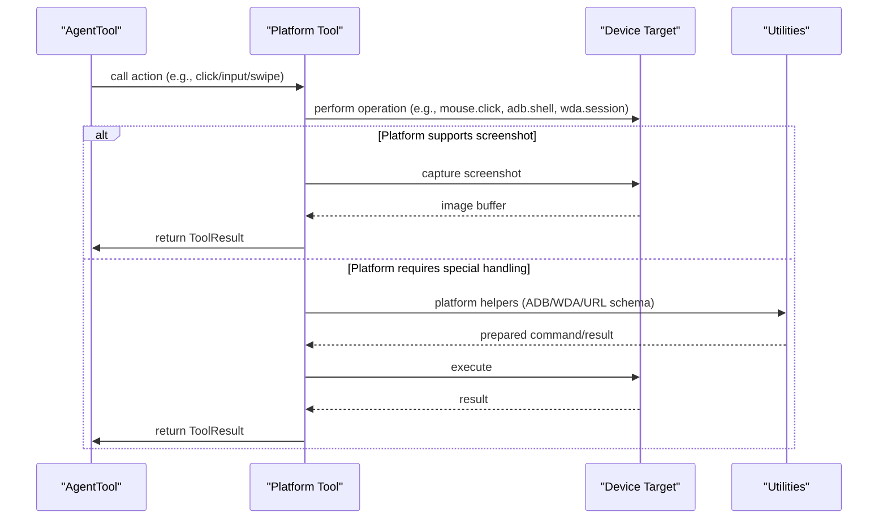
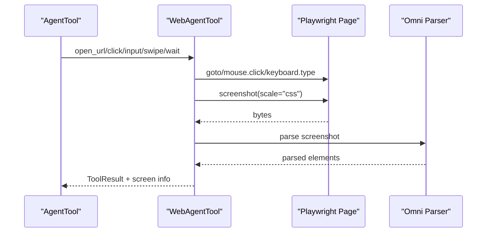
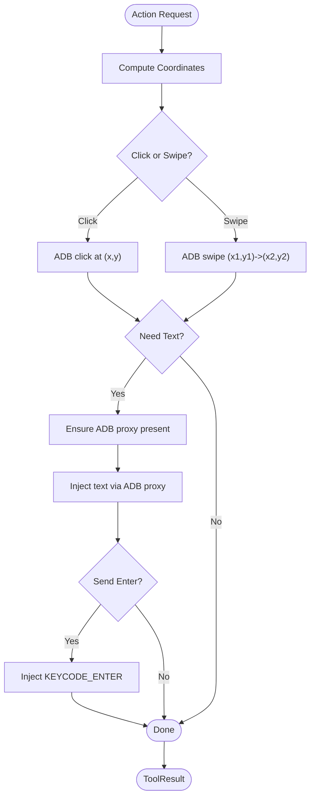
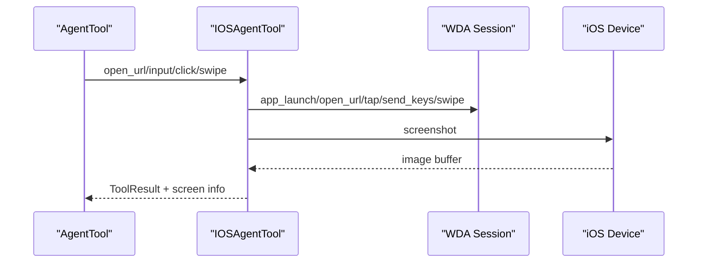
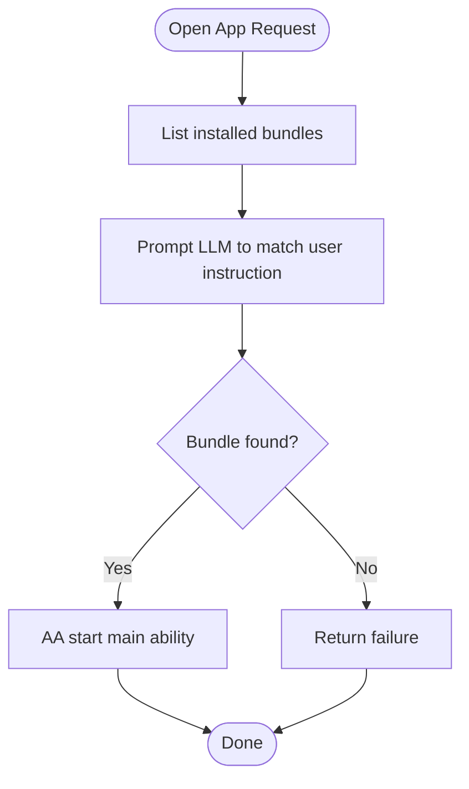
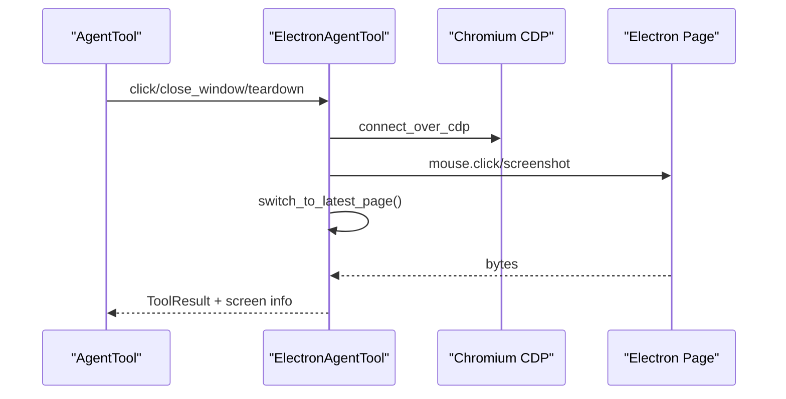
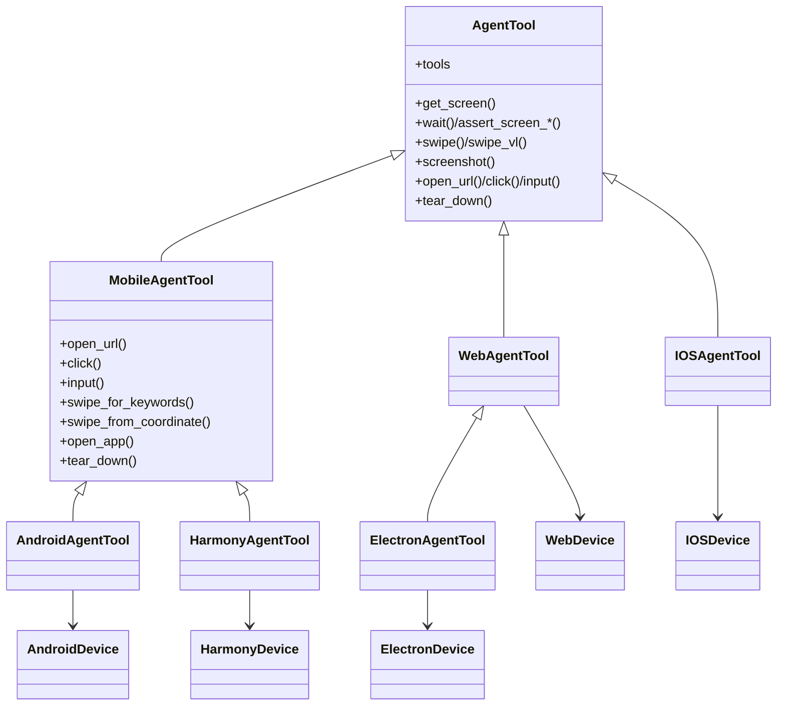

# Supported Platforms and Capabilities

<cite>
**Referenced Files in This Document**
- [device.py](file://src/page_eyes/device.py)
- [web.py](file://src/page_eyes/tools/web.py)
- [android.py](file://src/page_eyes/tools/android.py)
- [ios.py](file://src/page_eyes/tools/ios.py)
- [electron.py](file://src/page_eyes/tools/electron.py)
- [harmony.py](file://src/page_eyes/tools/harmony.py)
- [_base.py](file://src/page_eyes/tools/_base.py)
- [_mobile.py](file://src/page_eyes/tools/_mobile.py)
- [platform.py](file://src/page_eyes/util/platform.py)
- [adb_tool.py](file://src/page_eyes/util/adb_tool.py)
- [config.py](file://src/page_eyes/config.py)
- [test_web_agent.py](file://tests/test_web_agent.py)
- [test_android_agent.py](file://tests/test_android_agent.py)
- [test_ios_agent.py](file://tests/test_ios_agent.py)
- [test_electron_agent.py](file://tests/test_electron_agent.py)
- [test_harmony_agent.py](file://tests/test_harmony_agent.py)
</cite>

## Table of Contents
1. [Introduction](#introduction)
2. [Project Structure](#project-structure)
3. [Core Components](#core-components)
4. [Architecture Overview](#architecture-overview)
5. [Detailed Component Analysis](#detailed-component-analysis)
6. [Dependency Analysis](#dependency-analysis)
7. [Performance Considerations](#performance-considerations)
8. [Troubleshooting Guide](#troubleshooting-guide)
9. [Conclusion](#conclusion)
10. [Appendices](#appendices)

## Introduction
This document explains the supported platforms and capabilities across Web, Android, iOS, HarmonyOS, and Electron. It covers:
- Unified API abstractions enabling consistent automation across platforms
- Platform-specific requirements and integrations
- Capability matrices for UI interactions
- Configuration options and environment variables
- Cross-platform consistency and differences in element recognition, gestures, and screenshots

## Project Structure
The automation stack is organized around a shared AgentTool abstraction with platform-specific implementations and devices:
- Unified tool base: AgentTool defines common actions (click, input, swipe, wait/assert, screen parsing) and screenshot behavior
- Platform-specific tools: WebAgentTool, AndroidAgentTool, IOSAgentTool, ElectronAgentTool, HarmonyAgentTool
- Device abstractions: WebDevice, AndroidDevice, IOSDevice, ElectronDevice, HarmonyDevice
- Utilities: ADB proxy for Android text input, platform URL schema helpers, and configuration

**Diagram sources**
- [_base.py:130-391](file://src/page_eyes/tools/_base.py#L130-L391)
- [_mobile.py:27-165](file://src/page_eyes/tools/_mobile.py#L27-L165)
- [web.py:24-179](file://src/page_eyes/tools/web.py#L24-L179)
- [android.py:18-23](file://src/page_eyes/tools/android.py#L18-L23)
- [ios.py:24-293](file://src/page_eyes/tools/ios.py#L24-L293)
- [electron.py:21-134](file://src/page_eyes/tools/electron.py#L21-L134)
- [harmony.py:20-68](file://src/page_eyes/tools/harmony.py#L20-L68)
- [device.py:54-390](file://src/page_eyes/device.py#L54-L390)

**Section sources**
- [_base.py:130-391](file://src/page_eyes/tools/_base.py#L130-L391)
- [_mobile.py:27-165](file://src/page_eyes/tools/_mobile.py#L27-L165)
- [device.py:54-390](file://src/page_eyes/device.py#L54-L390)

## Core Components
- AgentTool: Defines the unified tool interface and shared behaviors (screenshot, screen parsing, wait/assert, swipe, teardown). It also exposes a tools property that enumerates callable tools dynamically.
- MobileAgentTool: Provides shared mobile behaviors (click, input, swipe, open_url, open_app) and delegates URL schema handling to platform helpers.
- Platform-specific tools:
  - WebAgentTool: Implements Web interactions using Playwright (mouse/keyboard, file chooser, new page handling, screenshot).
  - AndroidAgentTool: Extends mobile behavior and opens URLs via ADB shell intent.
  - IOSAgentTool: Uses WebDriverAgent (WDA) for tap/input/swipe/back/home and app launching.
  - ElectronAgentTool: Extends WebAgentTool for Electron via CDP, with window switching and cleanup.
  - HarmonyAgentTool: Uses HDC/AA for app launching and text input via uitest/keyevent.

**Section sources**
- [_base.py:130-391](file://src/page_eyes/tools/_base.py#L130-L391)
- [_mobile.py:27-165](file://src/page_eyes/tools/_mobile.py#L27-L165)
- [web.py:24-179](file://src/page_eyes/tools/web.py#L24-L179)
- [android.py:18-23](file://src/page_eyes/tools/android.py#L18-L23)
- [ios.py:24-293](file://src/page_eyes/tools/ios.py#L24-L293)
- [electron.py:21-134](file://src/page_eyes/tools/electron.py#L21-L134)
- [harmony.py:20-68](file://src/page_eyes/tools/harmony.py#L20-L68)

## Architecture Overview
The system uses a layered architecture:
- Device layer: Encapsulates platform clients and targets (Playwright, ADB/HDC, WDA, CDP)
- Tool layer: Implements platform-specific actions built on top of devices
- Orchestration: Unified tool enumeration and step handling via AgentTool

**Diagram sources**
- [_base.py:130-391](file://src/page_eyes/tools/_base.py#L130-L391)
- [device.py:54-390](file://src/page_eyes/device.py#L54-L390)
- [web.py:24-179](file://src/page_eyes/tools/web.py#L24-L179)
- [android.py:18-23](file://src/page_eyes/tools/android.py#L18-L23)
- [ios.py:24-293](file://src/page_eyes/tools/ios.py#L24-L293)
- [electron.py:21-134](file://src/page_eyes/tools/electron.py#L21-L134)
- [harmony.py:20-68](file://src/page_eyes/tools/harmony.py#L20-L68)
- [adb_tool.py:12-37](file://src/page_eyes/util/adb_tool.py#L12-L37)
- [platform.py:48-66](file://src/page_eyes/util/platform.py#L48-L66)

## Detailed Component Analysis

### Web (Chromium/Chrome via Playwright)
- Capabilities:
  - Open URL, click, input, swipe/scroll, go back, wait/assert, screenshot
  - File upload via file chooser expectation
  - New page handling and switching
  - Mobile emulation via device profiles
- Limitations:
  - Requires Chromium/Chrome channel and persistent context
  - Screenshot resolution normalization via CSS scaling for pixel-accurate clicks
- Configuration:
  - Headless mode and device emulation via BrowserConfig
  - Omni parser integration for element parsing
- Environment variables:
  - Model selection and temperature via model settings
  - Omni parser base URL and key
  - Debug flag for enhanced logging

**Diagram sources**
- [web.py:24-179](file://src/page_eyes/tools/web.py#L24-L179)
- [_base.py:167-203](file://src/page_eyes/tools/_base.py#L167-L203)
- [config.py:40-73](file://src/page_eyes/config.py#L40-L73)

**Section sources**
- [web.py:24-179](file://src/page_eyes/tools/web.py#L24-L179)
- [device.py:54-100](file://src/page_eyes/device.py#L54-L100)
- [config.py:40-73](file://src/page_eyes/config.py#L40-L73)

### Android (ADB/HDC)
- Capabilities:
  - Open URL via ADB shell intent
  - Click, input, swipe, coordinate-based swipe, open app
  - Text input via ADB proxy (pushes local binary to device)
  - Enter key injection
- Limitations:
  - Requires ADB connectivity and device permissions
  - Input method depends on ADB proxy presence
- Configuration:
  - Device selection by serial or auto-selection
  - Platform type selection
- Environment variables:
  - Not required for basic operations

**Diagram sources**
- [_mobile.py:62-165](file://src/page_eyes/tools/_mobile.py#L62-L165)
- [android.py:18-23](file://src/page_eyes/tools/android.py#L18-L23)
- [adb_tool.py:12-37](file://src/page_eyes/util/adb_tool.py#L12-L37)

**Section sources**
- [_mobile.py:27-165](file://src/page_eyes/tools/_mobile.py#L27-L165)
- [android.py:18-23](file://src/page_eyes/tools/android.py#L18-L23)
- [adb_tool.py:12-37](file://src/page_eyes/util/adb_tool.py#L12-L37)
- [device.py:102-127](file://src/page_eyes/device.py#L102-L127)

### iOS (WebDriverAgent)
- Capabilities:
  - Open URL via Safari, open app by bundle ID, back/home gestures
  - Tap, send keys, swipe, coordinate-based swipe
  - Intelligent app name matching via LLM assistance
- Limitations:
  - Requires WebDriverAgent running on-device or MAC host with Xcode
  - Auto-start attempts require environment variables for UDID and project path
- Configuration:
  - WDA URL, auto-start toggle, platform type
- Environment variables:
  - IOS_UDID, IOS_WDA_PROJECT_PATH (optional, for auto-start)

**Diagram sources**
- [ios.py:24-293](file://src/page_eyes/tools/ios.py#L24-L293)
- [device.py:158-228](file://src/page_eyes/device.py#L158-L228)

**Section sources**
- [ios.py:24-293](file://src/page_eyes/tools/ios.py#L24-L293)
- [device.py:158-228](file://src/page_eyes/device.py#L158-L228)

### HarmonyOS (HDC/AA)
- Capabilities:
  - Open URL via AA want action
  - Input text via uitest, inject ENTER key
  - Open app by resolving bundle name via LLM-assisted matching
- Limitations:
  - Requires HDC connectivity and installed AA toolchain
- Configuration:
  - Connect key selection and platform type
- Environment variables:
  - Not required for basic operations

**Diagram sources**
- [harmony.py:40-68](file://src/page_eyes/tools/harmony.py#L40-L68)
- [device.py:129-156](file://src/page_eyes/device.py#L129-L156)

**Section sources**
- [harmony.py:20-68](file://src/page_eyes/tools/harmony.py#L20-L68)
- [device.py:129-156](file://src/page_eyes/device.py#L129-L156)

### Electron (CDP)
- Capabilities:
  - Extends Web interactions with CDP-connected Electron app
  - Window switching to latest page, close current window, cleanup without closing browser
  - Screenshot with CSS scaling normalization
- Limitations:
  - Requires Electron app launched with remote-debugging-port and CDP reachable
- Configuration:
  - CDP URL defaults to localhost; adjust per environment
- Environment variables:
  - Not required for basic operations

**Diagram sources**
- [electron.py:21-134](file://src/page_eyes/tools/electron.py#L21-L134)
- [device.py:230-293](file://src/page_eyes/device.py#L230-L293)

**Section sources**
- [electron.py:21-134](file://src/page_eyes/tools/electron.py#L21-L134)
- [device.py:230-293](file://src/page_eyes/device.py#L230-L293)

## Dependency Analysis
- Unified tooling: All platform tools inherit from AgentTool, ensuring consistent tool enumeration and step handling
- Shared mobile behaviors: Android and Harmony reuse MobileAgentTool for common actions
- Device abstractions: Each platform encapsulates its client/target and device size
- Utilities: ADB proxy and platform URL schema helpers bridge gaps between tools and platform clients

**Diagram sources**
- [_base.py:130-391](file://src/page_eyes/tools/_base.py#L130-L391)
- [_mobile.py:27-165](file://src/page_eyes/tools/_mobile.py#L27-L165)
- [web.py:24-179](file://src/page_eyes/tools/web.py#L24-L179)
- [android.py:18-23](file://src/page_eyes/tools/android.py#L18-L23)
- [ios.py:24-293](file://src/page_eyes/tools/ios.py#L24-L293)
- [electron.py:21-134](file://src/page_eyes/tools/electron.py#L21-L134)
- [harmony.py:20-68](file://src/page_eyes/tools/harmony.py#L20-L68)
- [device.py:54-390](file://src/page_eyes/device.py#L54-L390)

**Section sources**
- [_base.py:130-391](file://src/page_eyes/tools/_base.py#L130-L391)
- [_mobile.py:27-165](file://src/page_eyes/tools/_mobile.py#L27-L165)
- [device.py:54-390](file://src/page_eyes/device.py#L54-L390)

## Performance Considerations
- Unified delays: Tools use configurable before/after delays to accommodate rendering and animations
- Screenshot normalization:
  - Web/Electron: CSS scaling ensures pixel-perfect click coordinates
  - iOS: Flexible screenshot handling for different return types
- Parsing pipeline: Screenshots are uploaded to Omni parser for element extraction; ensure network stability and parser availability
- Concurrency: Tools enforce single-tool-at-a-time execution to avoid race conditions

[No sources needed since this section provides general guidance]

## Troubleshooting Guide
- Web
  - Ensure Chromium/Chrome channel and persistent context are available
  - Use device emulation when testing responsive layouts
- Android
  - Verify ADB connectivity and device permissions
  - Confirm ADB proxy binary is pushed to device
- iOS
  - Confirm WebDriverAgent is reachable at configured URL
  - For auto-start, set IOS_UDID and IOS_WDA_PROJECT_PATH
- HarmonyOS
  - Confirm HDC connectivity and AA toolchain presence
- Electron
  - Launch Electron with --remote-debugging-port and verify CDP endpoint

**Section sources**
- [device.py:54-100](file://src/page_eyes/device.py#L54-L100)
- [device.py:102-127](file://src/page_eyes/device.py#L102-L127)
- [device.py:158-228](file://src/page_eyes/device.py#L158-L228)
- [device.py:129-156](file://src/page_eyes/device.py#L129-L156)
- [device.py:230-293](file://src/page_eyes/device.py#L230-L293)
- [device.py:324-390](file://src/page_eyes/device.py#L324-L390)

## Conclusion
The system achieves cross-platform consistency by exposing a unified tool interface while leveraging platform-specific clients and utilities. Each platform’s strengths and constraints are integrated through dedicated device and tool implementations, enabling reliable automation across Web, Android, iOS, HarmonyOS, and Electron.

[No sources needed since this section summarizes without analyzing specific files]

## Appendices

### Capability Matrix
- Element recognition: All platforms parse screenshots via Omni parser; Web/Harmony also support LLM-assisted app/package name matching
- Gestures: Web (mouse wheel/scroll), Android/iOS/Harmony (swipe), iOS (coordinate-based swipe), Electron (Web swipe semantics)
- Screenshot: All platforms support screenshots; Web/Electron normalize resolution; iOS handles variable return types

**Section sources**
- [_base.py:167-203](file://src/page_eyes/tools/_base.py#L167-L203)
- [web.py:27-31](file://src/page_eyes/tools/web.py#L27-L31)
- [electron.py:25-45](file://src/page_eyes/tools/electron.py#L25-L45)
- [ios.py:29-44](file://src/page_eyes/tools/ios.py#L29-L44)
- [_mobile.py:86-117](file://src/page_eyes/tools/_mobile.py#L86-L117)

### Platform-Specific Configuration Options
- Web
  - BrowserConfig: headless, simulate_device
  - Omni parser: base_url, key
- iOS
  - WDA URL, auto-start WDA (requires IOS_UDID, IOS_WDA_PROJECT_PATH)
- Electron
  - CDP URL (default localhost)
- Android/Harmony
  - Device selection/connectivity handled automatically

**Section sources**
- [config.py:40-73](file://src/page_eyes/config.py#L40-L73)
- [device.py:158-228](file://src/page_eyes/device.py#L158-L228)
- [device.py:230-293](file://src/page_eyes/device.py#L230-L293)
- [device.py:102-127](file://src/page_eyes/device.py#L102-L127)
- [device.py:129-156](file://src/page_eyes/device.py#L129-L156)

### Example Usage References
- Web: [test_web_agent.py:11-22](file://tests/test_web_agent.py#L11-L22), [test_web_agent.py:126-137](file://tests/test_web_agent.py#L126-L137)
- Android: [test_android_agent.py:11-21](file://tests/test_android_agent.py#L11-L21), [test_android_agent.py:23-34](file://tests/test_android_agent.py#L23-L34)
- iOS: [test_ios_agent.py:11-21](file://tests/test_ios_agent.py#L11-L21), [test_ios_agent.py:23-34](file://tests/test_ios_agent.py#L23-L34)
- HarmonyOS: [test_harmony_agent.py:11-21](file://tests/test_harmony_agent.py#L11-L21), [test_harmony_agent.py:23-34](file://tests/test_harmony_agent.py#L23-L34)
- Electron: [test_electron_agent.py:8-19](file://tests/test_electron_agent.py#L8-L19)