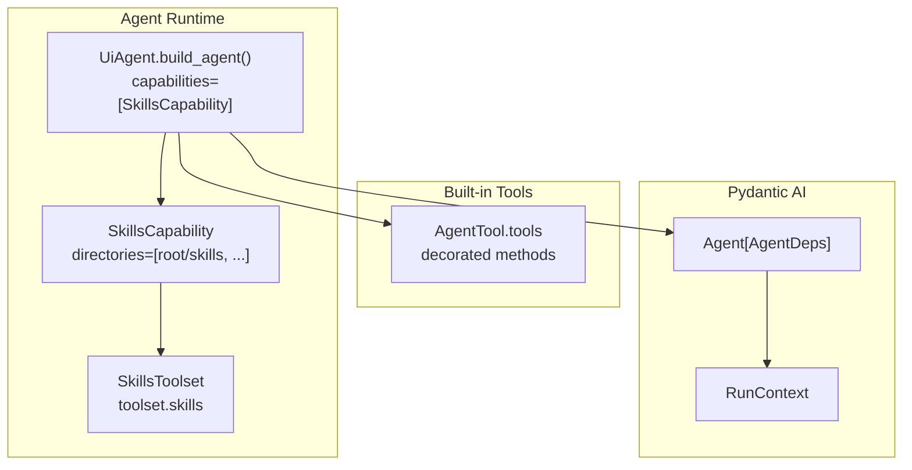
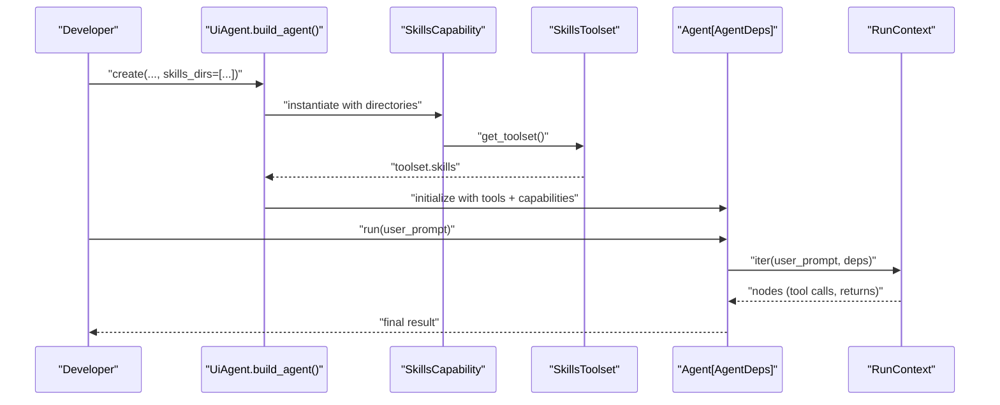
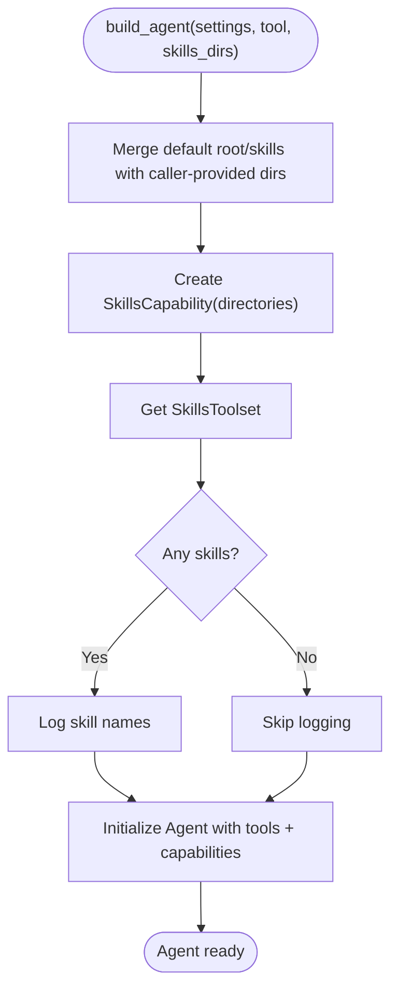
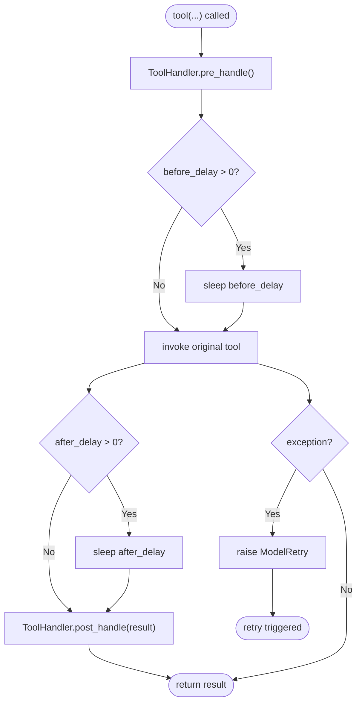
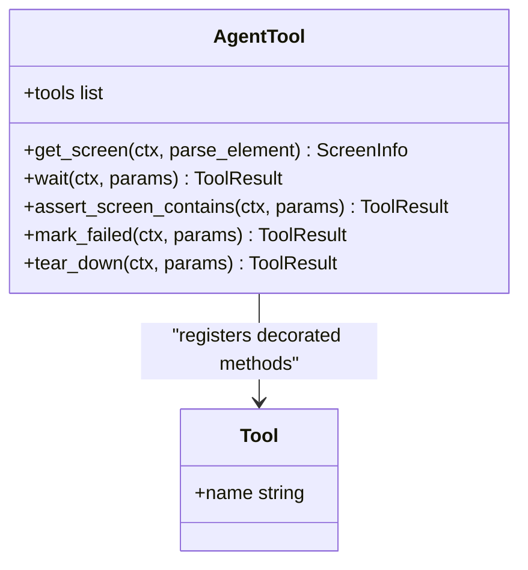
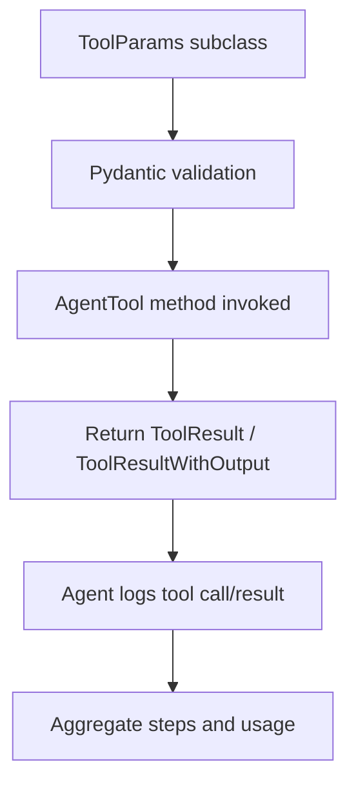
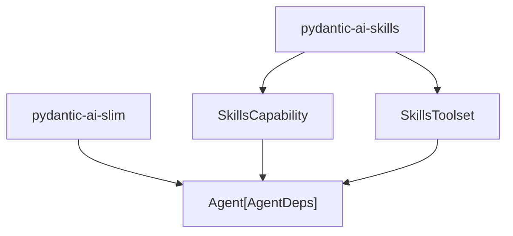

# Skill System and Extensions

<cite>
**Referenced Files in This Document**
- [agent.py](file://src/page_eyes/agent.py)
- [tools/_base.py](file://src/page_eyes/tools/_base.py)
- [tools/__init__.py](file://src/page_eyes/tools/__init__.py)
- [deps.py](file://src/page_eyes/deps.py)
- [config.py](file://src/page_eyes/config.py)
- [test_web_agent.py](file://tests/test_web_agent.py)
- [uv.lock](file://uv.lock)
</cite>

## Table of Contents
1. [Introduction](#introduction)
2. [Project Structure](#project-structure)
3. [Core Components](#core-components)
4. [Architecture Overview](#architecture-overview)
5. [Detailed Component Analysis](#detailed-component-analysis)
6. [Dependency Analysis](#dependency-analysis)
7. [Performance Considerations](#performance-considerations)
8. [Troubleshooting Guide](#troubleshooting-guide)
9. [Conclusion](#conclusion)
10. [Appendices](#appendices)

## Introduction
This document explains the PageEyes Agent skill system and its extensibility architecture centered on the skill-based plugin mechanism for custom actions. It covers how skills are discovered and loaded, the directory structure, Pydantic AI integration patterns, and how to develop custom skills using the provided templates. It also documents skill parameter validation, return value handling, discovery/loading order, conflict resolution, testing and debugging techniques, and performance considerations.

## Project Structure
The skill system is integrated into the agent creation pipeline and augments the built-in toolset with user-defined skills. The key areas are:
- Agent construction and capability injection for skills
- Tool base classes and decorators for consistent behavior
- Parameter models and result types for validation and return handling
- Configuration for model selection and environment settings
- Tests demonstrating usage patterns and concurrency constraints

**Diagram sources**
- [agent.py:147-169](file://src/page_eyes/agent.py#L147-L169)
- [tools/_base.py:130-150](file://src/page_eyes/tools/_base.py#L130-L150)

**Section sources**
- [agent.py:147-169](file://src/page_eyes/agent.py#L147-L169)
- [tools/_base.py:130-150](file://src/page_eyes/tools/_base.py#L130-L150)

## Core Components
- Skills discovery and loading via SkillsCapability and SkillsToolset
- Tool registration and decoration for consistent pre/post handling and concurrency control
- Parameter models and result types for validation and structured outputs
- Configuration for model selection and environment settings

Key responsibilities:
- SkillsCapability builds a toolset from configured directories and exposes it to the Agent runtime
- AgentTool scans its methods for decorated tool functions and converts them into Tool instances
- Tool decorator enforces single-tool execution in sequence and records step metadata
- Parameter models define inputs and outputs; ToolResult/ToolResultWithOutput standardize return semantics

**Section sources**
- [agent.py:147-169](file://src/page_eyes/agent.py#L147-L169)
- [tools/_base.py:88-127](file://src/page_eyes/tools/_base.py#L88-L127)
- [tools/_base.py:130-150](file://src/page_eyes/tools/_base.py#L130-L150)
- [deps.py:85-280](file://src/page_eyes/deps.py#L85-L280)
- [config.py:54-73](file://src/page_eyes/config.py#L54-L73)

## Architecture Overview
The agent integrates skills as a capability alongside built-in tools. Skills are discovered from configured directories and exposed as tools to the LLM. The agent’s run loop logs tool calls and results, and handles failures gracefully.

**Diagram sources**
- [agent.py:147-169](file://src/page_eyes/agent.py#L147-L169)
- [agent.py:217-224](file://src/page_eyes/agent.py#L217-L224)

## Detailed Component Analysis

### Skills Discovery and Loading
- Skills directories are passed to SkillsCapability; the default includes a root-relative skills folder plus any caller-provided paths
- SkillsToolset enumerates available skills and exposes them as tools
- The agent is initialized with both built-in tools and skills tools

**Diagram sources**
- [agent.py:147-169](file://src/page_eyes/agent.py#L147-L169)

**Section sources**
- [agent.py:147-169](file://src/page_eyes/agent.py#L147-L169)

### Tool Decorator and Handler
- The tool decorator wraps tool functions to enforce single concurrent tool execution and record step metadata
- Pre-handle captures parameters and action name, and optionally highlights elements in debug mode
- Post-handle updates step success status
- Exceptions trigger a retry signal to the LLM runtime

**Diagram sources**
- [tools/_base.py:88-127](file://src/page_eyes/tools/_base.py#L88-L127)
- [tools/_base.py:39-86](file://src/page_eyes/tools/_base.py#L39-L86)

**Section sources**
- [tools/_base.py:88-127](file://src/page_eyes/tools/_base.py#L88-L127)
- [tools/_base.py:39-86](file://src/page_eyes/tools/_base.py#L39-L86)

### Built-in Tool Registration
- AgentTool dynamically discovers methods marked as tools and converts them into Tool instances
- Name normalization removes a VLM suffix variant to keep consistent names across LLM/VLM modes
- Filtering respects model type flags to expose only applicable tools per mode

**Diagram sources**
- [tools/_base.py:130-150](file://src/page_eyes/tools/_base.py#L130-L150)

**Section sources**
- [tools/_base.py:130-150](file://src/page_eyes/tools/_base.py#L130-L150)

### Parameter Validation and Return Handling
- Parameter models define strict inputs for each tool (e.g., ClickToolParams, InputToolParams, SwipeForKeywordsToolParams)
- ToolResult and ToolResultWithOutput standardize success flags and optional outputs
- The agent’s run loop logs tool calls and results, and aggregates step outcomes

**Diagram sources**
- [deps.py:85-280](file://src/page_eyes/deps.py#L85-L280)
- [agent.py:217-224](file://src/page_eyes/agent.py#L217-L224)

**Section sources**
- [deps.py:85-280](file://src/page_eyes/deps.py#L85-L280)
- [agent.py:217-224](file://src/page_eyes/agent.py#L217-L224)

### Practical Example: Web Agent Usage Patterns
- Tests demonstrate typical flows: opening URLs, sliding until elements appear, clicking with positional offsets, uploading files, and asserting presence/absence
- These patterns illustrate how skills integrate seamlessly with built-in tools

**Section sources**
- [test_web_agent.py:11-200](file://tests/test_web_agent.py#L11-L200)

## Dependency Analysis
External dependencies relevant to the skill system:
- pydantic-ai-skills: Provides SkillsCapability and SkillsToolset used to discover and load skills
- pydantic-ai-slim: Core runtime for Agent and related types

**Diagram sources**
- [uv.lock:2709-2739](file://uv.lock#L2709-L2739)

**Section sources**
- [uv.lock:2709-2739](file://uv.lock#L2709-L2739)

## Performance Considerations
- Concurrency control: The tool decorator enforces single tool execution to avoid race conditions and inconsistent UI state
- Delays: before_delay and after_delay help stabilize page rendering between actions
- Parsing: Screen parsing via OmniParser adds latency; consider disabling parsing when unnecessary
- Retries: The agent is configured with a retry count to improve robustness against transient failures

Best practices:
- Prefer minimal delays and only add them when UI updates are visibly slow
- Limit screen parsing to steps where element IDs or coordinates are required
- Use targeted waits with expected keywords to reduce polling overhead

**Section sources**
- [tools/_base.py:88-127](file://src/page_eyes/tools/_base.py#L88-L127)
- [tools/_base.py:167-202](file://src/page_eyes/tools/_base.py#L167-L202)
- [agent.py:166](file://src/page_eyes/agent.py#L166)

## Troubleshooting Guide
Common issues and remedies:
- Concurrent tool calls: The decorator raises a retry when multiple tools are requested; ensure only one tool runs at a time
- Tool failures: Exceptions are caught and retried; check logs for stack traces and adjust parameters or delays
- Missing elements: Use assertions and waits with expected keywords to confirm UI readiness
- Reporting: The agent generates a step-by-step HTML report for debugging

Debugging tips:
- Enable debug mode to highlight target elements during LLM location operations
- Inspect step logs for tool names, arguments, and success flags
- Review the generated report for visual confirmation of each step

**Section sources**
- [tools/_base.py:88-127](file://src/page_eyes/tools/_base.py#L88-L127)
- [tools/_base.py:322-346](file://src/page_eyes/tools/_base.py#L322-L346)
- [agent.py:171-190](file://src/page_eyes/agent.py#L171-L190)

## Conclusion
The PageEyes Agent skill system leverages Pydantic AI’s SkillsCapability to discover and load custom actions from configurable directories. By decorating methods with the tool decorator and using parameter/result models, developers can extend agent capabilities safely and consistently. The built-in toolset, combined with skills, enables robust automation across devices and platforms, with strong validation, logging, and reporting support.

## Appendices

### A. Skill Directory Structure and Metadata
- Place skills under the configured directories (default includes a root-relative skills folder plus any caller-provided paths)
- Skills are discovered automatically by the SkillsCapability toolset
- No explicit metadata file is required in the provided code; skills are registered via decorated methods

**Section sources**
- [agent.py:147-169](file://src/page_eyes/agent.py#L147-L169)

### B. Developing a Custom Skill
Steps:
1. Create a new directory under the skills root or pass a custom skills directory to the agent builder
2. Define a Python module with functions decorated as tools
3. Use parameter models from the deps module for inputs and return ToolResult/ToolResultWithOutput
4. Optionally enable debug highlighting for LLM location operations
5. Test with the agent’s run loop and review the generated report

Validation and return handling:
- Inputs are validated by Pydantic models defined in deps
- Outputs should be wrapped in ToolResult or ToolResultWithOutput
- The agent logs tool calls and results for inspection

Concurrency:
- The tool decorator prevents concurrent tool execution; the agent enforces single tool calls per step

**Section sources**
- [tools/_base.py:88-127](file://src/page_eyes/tools/_base.py#L88-L127)
- [deps.py:85-280](file://src/page_eyes/deps.py#L85-L280)
- [agent.py:217-224](file://src/page_eyes/agent.py#L217-L224)

### C. Integrating External Tools
- Add external tool integrations inside AgentTool subclasses or as separate modules
- Expose external actions as decorated tool functions so they participate in the same validation and logging pipeline
- Use the tool decorator to ensure consistent behavior and retries

**Section sources**
- [tools/_base.py:130-150](file://src/page_eyes/tools/_base.py#L130-L150)
- [tools/__init__.py:6-21](file://src/page_eyes/tools/__init__.py#L6-L21)

### D. Best Practices for Skill Development
- Keep tool functions small and focused
- Use descriptive parameter names and include expected units or formats
- Return structured outputs via ToolResultWithOutput when appropriate
- Add minimal delays only where necessary for stability
- Prefer targeted waits with expected keywords over fixed timeouts
- Enable debug mode during development to visualize element highlights

**Section sources**
- [tools/_base.py:88-127](file://src/page_eyes/tools/_base.py#L88-L127)
- [tools/_base.py:236-263](file://src/page_eyes/tools/_base.py#L236-L263)