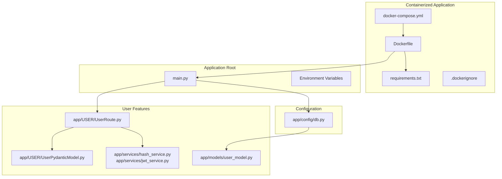
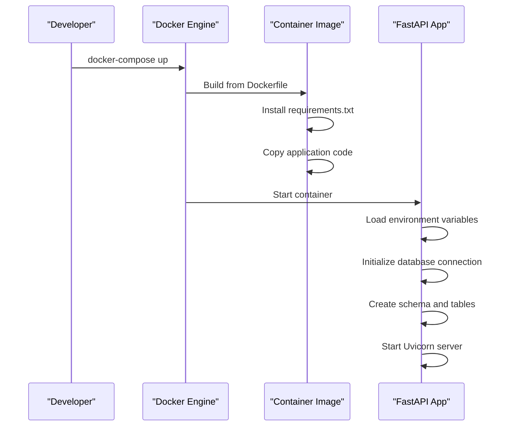
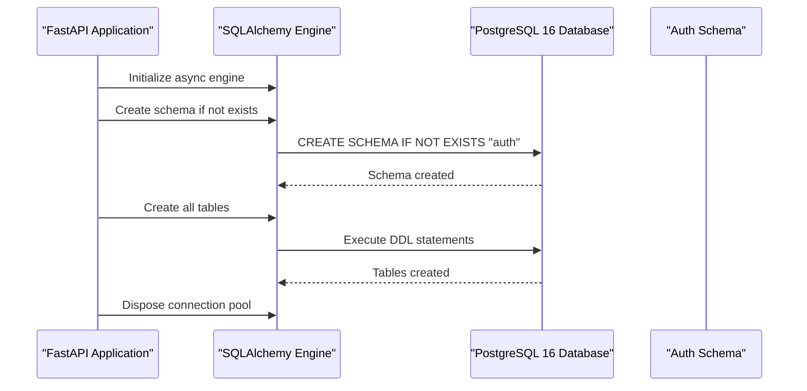
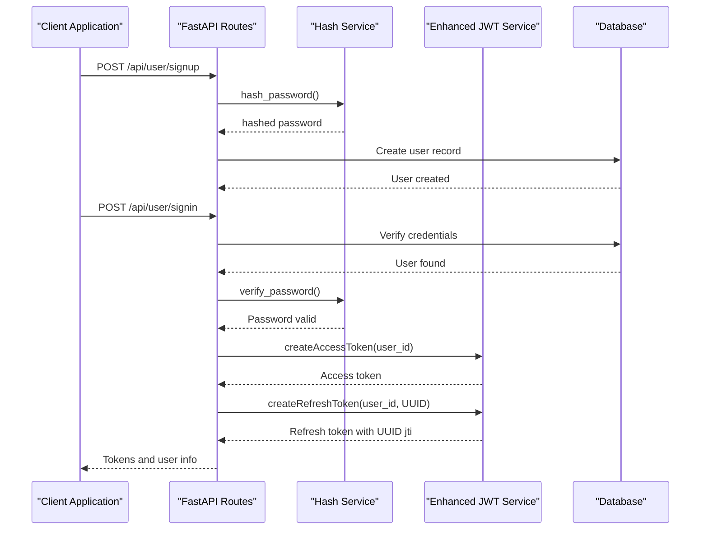
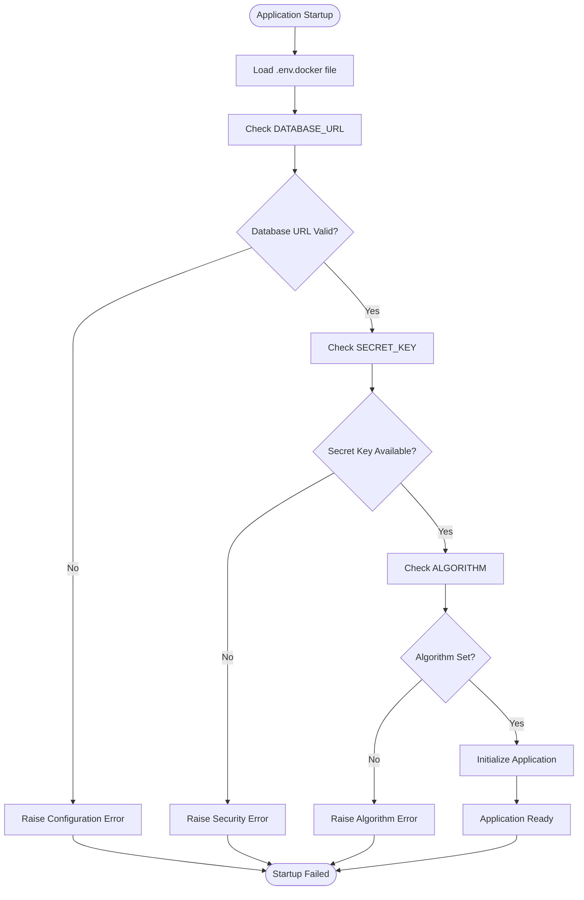

# Deployment and Containerization

<cite>
**Referenced Files in This Document**
- [docker-compose.yml](file://docker-compose.yml)
- [Dockerfile](file://Dockerfile)
- [.dockerignore](file://.dockerignore)
- [requirements.txt](file://requirements.txt)
- [main.py](file://main.py)
- [app/config/db.py](file://app/config/db.py)
- [app/services/jwt_service.py](file://app/services/jwt_service.py)
- [app/USER/UserRoute.py](file://app/USER/UserRoute.py)
- [app/USER/UserPydanticModel.py](file://app/USER/UserPydanticModel.py)
- [app/models/user_model.py](file://app/models/user_model.py)
</cite>

## Update Summary
**Changes Made**
- Updated containerization architecture from 3-service to 2-service setup (app and db only)
- Migrated from PostgreSQL 15 to PostgreSQL 16
- Added comprehensive Docker containerization framework with Dockerfile, .dockerignore, and requirements.txt
- Enhanced JWT service with improved UUID type handling for refresh tokens
- Removed pgadmin service and named volume configuration
- Updated environment variable management with .env.docker file

## Table of Contents
1. [Introduction](#introduction)
2. [Project Structure](#project-structure)
3. [Core Components](#core-components)
4. [Architecture Overview](#architecture-overview)
5. [Detailed Component Analysis](#detailed-component-analysis)
6. [Dependency Analysis](#dependency-analysis)
7. [Performance Considerations](#performance-considerations)
8. [Troubleshooting Guide](#troubleshooting-guide)
9. [Conclusion](#conclusion)

## Introduction
This document provides comprehensive guidance for deploying and containerizing the authentication service. The service now features a streamlined Docker-based deployment architecture with PostgreSQL 16, enhanced JWT token handling with UUID support, and simplified container orchestration. Built with FastAPI, SQLAlchemy, and PostgreSQL, the service includes JWT-based authentication, secure password hashing, and modern containerization practices.

## Project Structure
The project follows a modular Python package layout with clear separation of concerns and comprehensive containerization support:



**Diagram sources**
- [Dockerfile:1-10](file://Dockerfile#L1-L10)
- [requirements.txt:1-61](file://requirements.txt#L1-L61)
- [.dockerignore:1-38](file://.dockerignore#L1-L38)
- [docker-compose.yml:1-23](file://docker-compose.yml#L1-L23)
- [main.py:1-40](file://main.py#L1-L40)

**Section sources**
- [Dockerfile:1-10](file://Dockerfile#L1-L10)
- [requirements.txt:1-61](file://requirements.txt#L1-L61)
- [docker-compose.yml:1-23](file://docker-compose.yml#L1-L23)

## Core Components
This section outlines the essential components for deployment and containerization:

### Containerization Framework
- **Dockerfile**: Multi-stage container definition with Python 3.13 slim base image
- **Requirements Management**: Explicit dependency specification through requirements.txt
- **Build Optimization**: .dockerignore configuration for efficient builds
- **Service Orchestration**: Simplified 2-service architecture (app and db)

### Database Layer
- Asynchronous PostgreSQL 16 connection using SQLAlchemy
- Environment-driven configuration via DATABASE_URL
- Schema management with automatic creation during application startup
- Session management with proper exception handling

### Authentication Services
- Password hashing using Argon2 with passlib
- JWT token generation and verification with configurable expiration
- Enhanced UUID type handling for refresh tokens with improved type safety
- Secure secret key management through environment variables

### API Routes
- User registration and authentication endpoints
- Token refresh mechanism with cookie-based refresh tokens
- Pydantic models for request/response validation

**Section sources**
- [Dockerfile:1-10](file://Dockerfile#L1-L10)
- [requirements.txt:1-61](file://requirements.txt#L1-L61)
- [.dockerignore:1-38](file://.dockerignore#L1-L38)
- [app/config/db.py:1-27](file://app/config/db.py#L1-L27)
- [app/services/jwt_service.py:1-43](file://app/services/jwt_service.py#L1-L43)

## Architecture Overview
The system employs a streamlined containerized architecture with PostgreSQL 16 and simplified service orchestration:

```mermaid
graph TB
subgraph "Containerized Infrastructure"
subgraph "PostgreSQL Database"
DBCONTAINER["Postgres:16 Container"]
end
end
subgraph "Application Layer"
subgraph "FastAPI Service"
MAIN["main.py"]
ROUTER["User Routes"]
HASH["Hash Service"]
JWT["Enhanced JWT Service<br/>UUID Support"]
end
subgraph "Database Layer"
CONFIG["Database Config"]
MODELS["SQLAlchemy Models"]
end
end
subgraph "Container Management"
DOCKERFILE["Dockerfile"]
REQTXT["requirements.txt"]
COMPOSE["docker-compose.yml"]
DOCKERIGNORE[".dockerignore"]
END
DBCONTAINER --> COMPOSE
MAIN --> ROUTER
MAIN --> CONFIG
ROUTER --> HASH
ROUTER --> JWT
CONFIG --> MODELS
DOCKERFILE --> REQTXT
DOCKERFILE --> MAIN
COMPOSE --> DOCKERFILE
```

**Diagram sources**
- [docker-compose.yml:14-22](file://docker-compose.yml#L14-L22)
- [Dockerfile:1-10](file://Dockerfile#L1-L10)
- [requirements.txt:1-61](file://requirements.txt#L1-L61)
- [main.py:1-40](file://main.py#L1-L40)

## Detailed Component Analysis

### Containerization Implementation
The new containerization framework provides efficient deployment and development capabilities:



**Diagram sources**
- [Dockerfile:1-10](file://Dockerfile#L1-L10)
- [requirements.txt:1-61](file://requirements.txt#L1-L61)
- [docker-compose.yml:4-11](file://docker-compose.yml#L4-L11)

Key containerization aspects:
- Python 3.13 slim base image for minimal footprint
- Requirements-based dependency management
- Environment variable isolation with .env.docker
- Port mapping for local development (8000:8000)

**Section sources**
- [Dockerfile:1-10](file://Dockerfile#L1-L10)
- [requirements.txt:1-61](file://requirements.txt#L1-L61)
- [docker-compose.yml:1-23](file://docker-compose.yml#L1-L23)

### Database Configuration and Initialization
The database configuration establishes a robust connection pool and schema management system:



**Diagram sources**
- [main.py:11-24](file://main.py#L11-L24)
- [app/config/db.py:10-10](file://app/config/db.py#L10-L10)

Key configuration aspects:
- Asynchronous PostgreSQL 16 driver (asyncpg)
- Environment-based connection URL
- Automatic schema creation with explicit "auth" schema
- Session factory with proper transaction handling

**Section sources**
- [main.py:11-24](file://main.py#L11-L24)
- [app/config/db.py:1-27](file://app/config/db.py#L1-L27)

### Enhanced Authentication Flow
The authentication system implements a secure token-based workflow with improved UUID handling:



**Diagram sources**
- [app/USER/UserRoute.py:10-21](file://app/USER/UserRoute.py#L10-L21)
- [app/services/jwt_service.py:17-32](file://app/services/jwt_service.py#L17-L32)

**Section sources**
- [app/services/jwt_service.py:1-43](file://app/services/jwt_service.py#L1-L43)

### Environment Configuration Management
The system relies on environment variables for secure configuration with container-aware management:



**Diagram sources**
- [app/config/db.py:8-9](file://app/config/db.py#L8-L9)
- [app/services/jwt_service.py:9-12](file://app/services/jwt_service.py#L9-L12)

**Section sources**
- [app/config/db.py:1-27](file://app/config/db.py#L1-L27)
- [app/services/jwt_service.py:1-43](file://app/services/jwt_service.py#L1-L43)

## Dependency Analysis
The project maintains explicit dependencies through requirements.txt and containerized deployment:

```mermaid
graph TB
subgraph "Container Dependencies"
PYTHON["python:3.13-slim"]
PIP["pip install requirements.txt"]
END
subgraph "Runtime Dependencies"
FASTAPI["fastapi==0.135.2"]
SQLALCHEMY["sqlalchemy==2.0.48"]
ASYNCPOSTGRES["asyncpg==0.31.0"]
PASSLIB["passlib==1.7.4"]
ARGON2["argon2-cffi==25.1.0"]
JOSE["python-jose==3.5.0"]
DOTENV["python-dotenv==1.2.2"]
ALEMBIC["alembic==1.18.4"]
UVICORN["uvicorn==0.42.0"]
PSYCOPG2["psycopg2-binary==2.9.11"]
END
subgraph "Development Dependencies"
DOCKERFILE["Dockerfile"]
REQTXT["requirements.txt"]
COMPOSE["docker-compose.yml"]
DOCKERIGNORE[".dockerignore"]
END
DOCKERFILE --> PYTHON
REQTXT --> FASTAPI
REQTXT --> SQLALCHEMY
REQTXT --> ASYNCPOSTGRES
REQTXT --> PASSLIB
REQTXT --> ARGON2
REQTXT --> JOSE
REQTXT --> DOTENV
REQTXT --> ALEMBIC
REQTXT --> UVICORN
REQTXT --> PSYCOPG2
COMPOSE --> DOCKERFILE
DOCKERIGNORE --> DOCKERFILE
```

**Diagram sources**
- [requirements.txt:16-61](file://requirements.txt#L16-L61)
- [Dockerfile:1-10](file://Dockerfile#L1-L10)
- [docker-compose.yml:14-22](file://docker-compose.yml#L14-L22)

**Section sources**
- [requirements.txt:1-61](file://requirements.txt#L1-L61)
- [docker-compose.yml:1-23](file://docker-compose.yml#L1-L23)

## Performance Considerations
- **Container Efficiency**: Python 3.13 slim base image reduces container size and attack surface
- **Connection Pooling**: Asynchronous PostgreSQL 16 connections minimize latency and improve throughput
- **Schema Isolation**: Dedicated "auth" schema prevents namespace conflicts and improves maintenance
- **Token Expiration**: Configurable JWT expiration reduces token lifetime and enhances security
- **Password Hashing**: Argon2 provides strong password protection with tunable cost parameters
- **Build Optimization**: .dockerignore excludes unnecessary files from container layers

## Troubleshooting Guide

### Common Deployment Issues

**Container Build Failures**
- Verify Python 3.13 compatibility with all dependencies
- Check requirements.txt syntax and version constraints
- Ensure Dockerfile WORKDIR matches application structure

**Database Connection Failures**
- Verify DATABASE_URL format and accessibility
- Check PostgreSQL 16 container health and network connectivity
- Ensure schema permissions are properly configured
- Validate environment variable loading from .env.docker

**JWT Configuration Errors**
- Confirm SECRET environment variable is set and sufficiently random
- Validate ALGORITHM matches client expectations
- Check token expiration settings for appropriate values
- Verify UUID type handling for refresh tokens

**Authentication Problems**
- Verify password hashing compatibility
- Check Argon2 library installation
- Review token refresh mechanisms and cookie handling
- Ensure proper UUID generation for refresh tokens

**Section sources**
- [docker-compose.yml:14-22](file://docker-compose.yml#L14-L22)
- [app/services/jwt_service.py:17-32](file://app/services/jwt_service.py#L17-L32)

## Conclusion
The authentication service now provides a robust foundation for containerized deployment with comprehensive security features and modern containerization practices. The streamlined 2-service architecture with PostgreSQL 16 offers improved simplicity and performance, while the enhanced JWT service with UUID support provides better token management capabilities. The new Docker-based deployment framework enables efficient local development and production-ready containerization, supporting easy scaling and maintenance through the modular architecture.