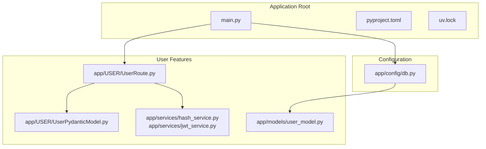
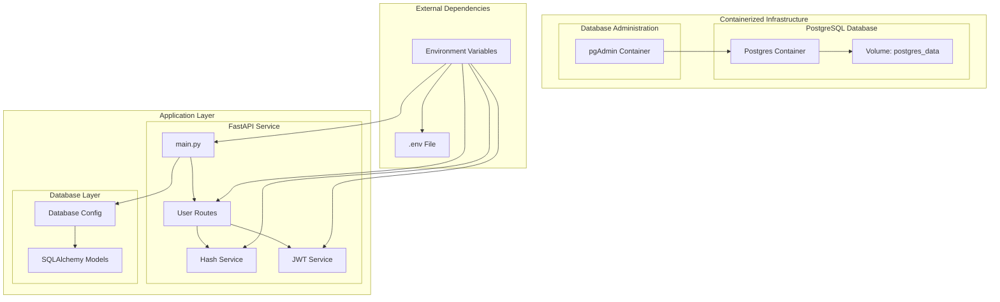
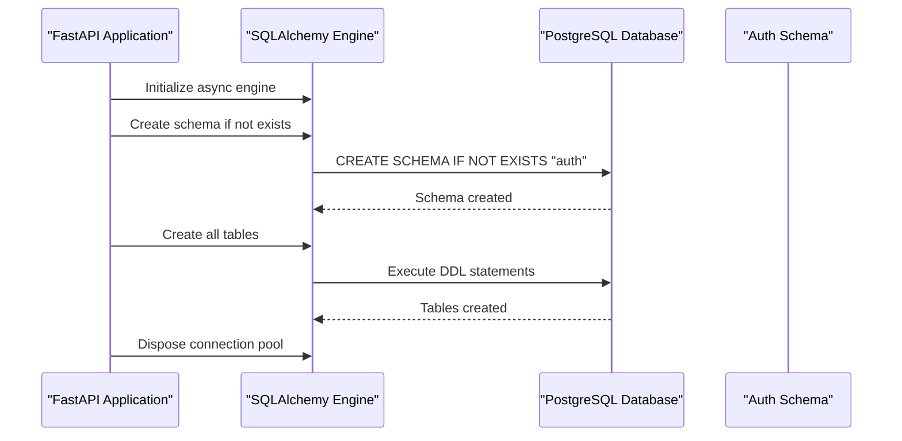
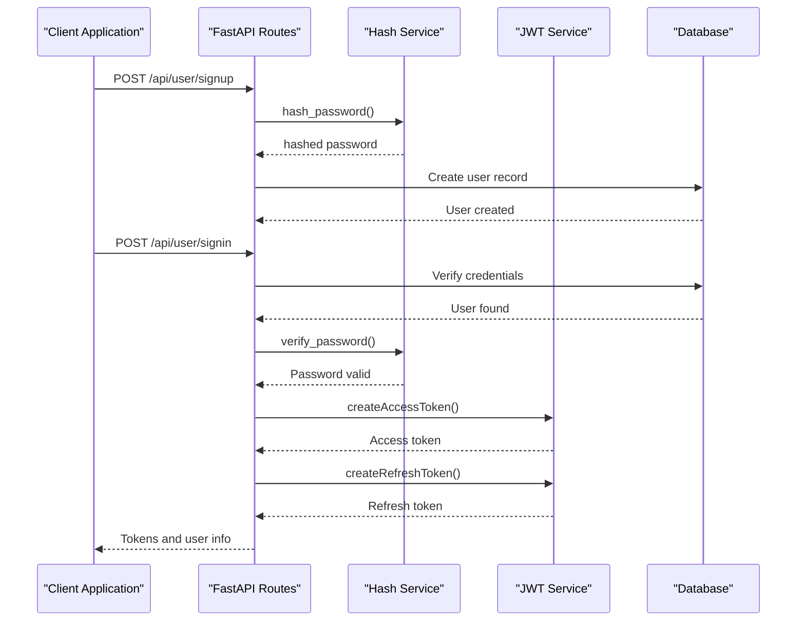
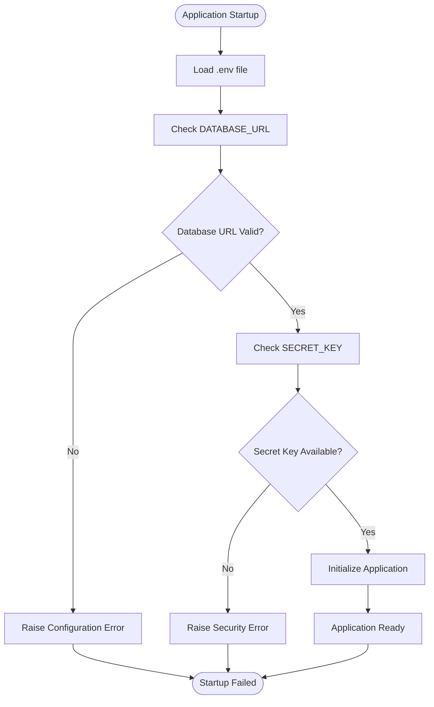
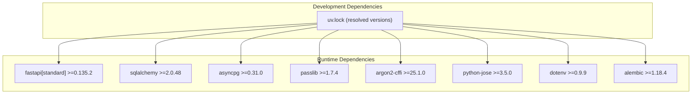

# Deployment and Containerization

<cite>
**Referenced Files in This Document**
- [docker-compose.yml](file://docker-compose.yml)
- [pyproject.toml](file://pyproject.toml)
- [main.py](file://main.py)
- [uv.lock](file://uv.lock)
- [app/config/db.py](file://app/config/db.py)
- [app/services/hash_service.py](file://app/services/hash_service.py)
- [app/services/jwt_service.py](file://app/services/jwt_service.py)
- [app/USER/UserRoute.py](file://app/USER/UserRoute.py)
- [app/USER/UserPydanticModel.py](file://app/USER/UserPydanticModel.py)
- [app/models/user_model.py](file://app/models/user_model.py)
</cite>

## Table of Contents
1. [Introduction](#introduction)
2. [Project Structure](#project-structure)
3. [Core Components](#core-components)
4. [Architecture Overview](#architecture-overview)
5. [Detailed Component Analysis](#detailed-component-analysis)
6. [Dependency Analysis](#dependency-analysis)
7. [Performance Considerations](#performance-considerations)
8. [Troubleshooting Guide](#troubleshooting-guide)
9. [Conclusion](#conclusion)

## Introduction
This document provides comprehensive guidance for deploying and containerizing the authentication service. It covers the current containerization setup using Docker Compose, environment configuration requirements, database initialization, and operational best practices. The service is built with FastAPI, SQLAlchemy, and PostgreSQL, and includes JWT-based authentication and secure password hashing.

## Project Structure
The project follows a modular Python package layout with clear separation of concerns:
- Application entry point and lifecycle management
- Configuration for database connections and environment variables
- Feature-specific modules (user management, authentication)
- Services for hashing and JWT operations
- Data models for persistence

**Diagram sources**
- [main.py:1-31](file://main.py#L1-L31)
- [app/config/db.py:1-27](file://app/config/db.py#L1-L27)
- [app/USER/UserRoute.py:1-23](file://app/USER/UserRoute.py#L1-L23)
- [app/USER/UserPydanticModel.py:1-47](file://app/USER/UserPydanticModel.py#L1-L47)
- [app/services/hash_service.py:1-20](file://app/services/hash_service.py#L1-L20)
- [app/services/jwt_service.py:1-38](file://app/services/jwt_service.py#L1-L38)
- [app/models/user_model.py:1-34](file://app/models/user_model.py#L1-L34)

**Section sources**
- [main.py:1-31](file://main.py#L1-L31)
- [pyproject.toml:1-17](file://pyproject.toml#L1-L17)

## Core Components
This section outlines the essential components for deployment and containerization:

### Database Layer
- Asynchronous PostgreSQL connection using SQLAlchemy
- Environment-driven configuration via DATABASE_URL
- Schema management with automatic creation during application startup
- Session management with proper exception handling

### Authentication Services
- Password hashing using Argon2 with passlib
- JWT token generation and verification with configurable expiration
- Secure secret key management through environment variables

### API Routes
- User registration and authentication endpoints
- Token refresh mechanism with cookie-based refresh tokens
- Pydantic models for request/response validation

**Section sources**
- [app/config/db.py:1-27](file://app/config/db.py#L1-L27)
- [app/services/hash_service.py:1-20](file://app/services/hash_service.py#L1-L20)
- [app/services/jwt_service.py:1-38](file://app/services/jwt_service.py#L1-L38)
- [app/USER/UserRoute.py:1-23](file://app/USER/UserRoute.py#L1-L23)

## Architecture Overview
The system employs a layered architecture with clear separation between presentation, business logic, and data persistence:

**Diagram sources**
- [docker-compose.yml:1-26](file://docker-compose.yml#L1-L26)
- [main.py:1-31](file://main.py#L1-L31)
- [app/config/db.py:1-27](file://app/config/db.py#L1-L27)
- [app/services/hash_service.py:1-20](file://app/services/hash_service.py#L1-L20)
- [app/services/jwt_service.py:1-38](file://app/services/jwt_service.py#L1-L38)

## Detailed Component Analysis

### Database Configuration and Initialization
The database configuration establishes a robust connection pool and schema management system:

**Diagram sources**
- [main.py:9-23](file://main.py#L9-L23)
- [app/config/db.py:17-19](file://app/config/db.py#L17-L19)

Key configuration aspects:
- Asynchronous PostgreSQL driver (asyncpg)
- Environment-based connection URL
- Automatic schema creation with explicit "auth" schema
- Session factory with proper transaction handling

**Section sources**
- [main.py:9-23](file://main.py#L9-L23)
- [app/config/db.py:1-27](file://app/config/db.py#L1-L27)

### Authentication Flow
The authentication system implements a secure token-based workflow:

**Diagram sources**
- [app/USER/UserRoute.py:10-21](file://app/USER/UserRoute.py#L10-L21)
- [app/services/hash_service.py:10-14](file://app/services/hash_service.py#L10-L14)
- [app/services/jwt_service.py:16-31](file://app/services/jwt_service.py#L16-L31)

### Environment Configuration Management
The system relies on environment variables for secure configuration:

**Diagram sources**
- [app/config/db.py:8-10](file://app/config/db.py#L8-L10)
- [app/services/jwt_service.py:13-14](file://app/services/jwt_service.py#L13-L14)

**Section sources**
- [app/config/db.py:1-27](file://app/config/db.py#L1-L27)
- [app/services/jwt_service.py:1-38](file://app/services/jwt_service.py#L1-L38)

## Dependency Analysis
The project maintains explicit dependencies through Poetry/Packaging:

**Diagram sources**
- [pyproject.toml:7-16](file://pyproject.toml#L7-L16)
- [uv.lock:116-129](file://uv.lock#L116-L129)

**Section sources**
- [pyproject.toml:1-17](file://pyproject.toml#L1-L17)
- [uv.lock:1-992](file://uv.lock#L1-L992)

## Performance Considerations
- **Connection Pooling**: Asynchronous PostgreSQL connections minimize latency and improve throughput
- **Schema Isolation**: Dedicated "auth" schema prevents namespace conflicts and improves maintenance
- **Token Expiration**: Configurable JWT expiration reduces token lifetime and enhances security
- **Password Hashing**: Argon2 provides strong password protection with tunable cost parameters

## Troubleshooting Guide

### Common Deployment Issues

**Database Connection Failures**
- Verify DATABASE_URL format and accessibility
- Check PostgreSQL container health and network connectivity
- Ensure schema permissions are properly configured

**JWT Configuration Errors**
- Confirm SECRET environment variable is set and sufficiently random
- Validate ALGORITHM matches client expectations
- Check token expiration settings for appropriate values

**Authentication Problems**
- Verify password hashing compatibility
- Check Argon2 library installation
- Review token refresh mechanisms and cookie handling

**Section sources**
- [main.py:16-18](file://main.py#L16-L18)
- [app/services/jwt_service.py:13-14](file://app/services/jwt_service.py#L13-L14)

## Conclusion
The authentication service provides a robust foundation for containerized deployment with comprehensive security features. The current Docker Compose setup enables rapid local development and testing, while the modular architecture supports easy scaling and maintenance. For production deployments, consider implementing secrets management, health checks, and monitoring infrastructure to complement the existing containerization framework.