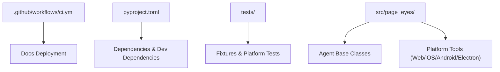
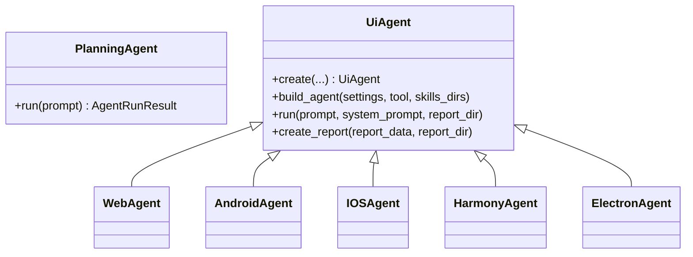
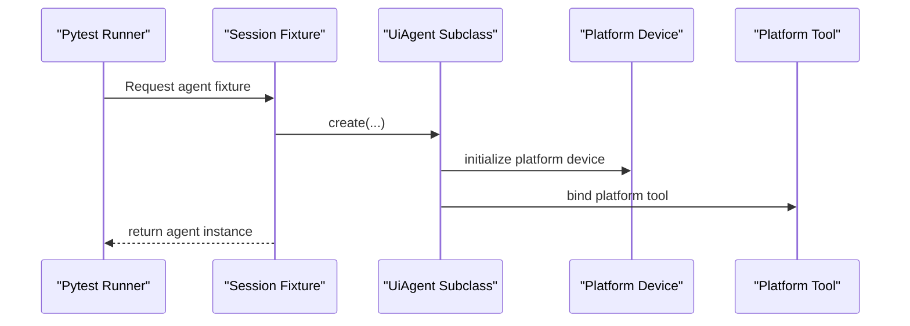
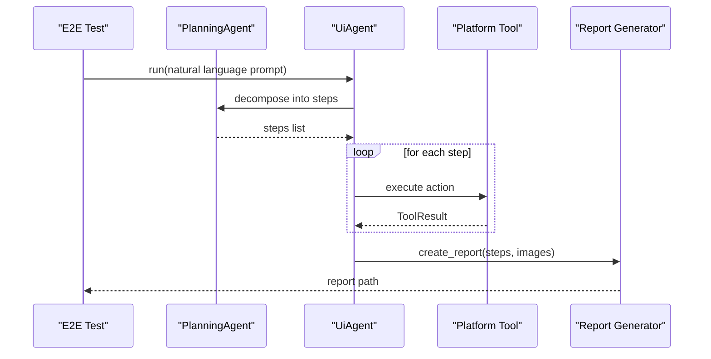
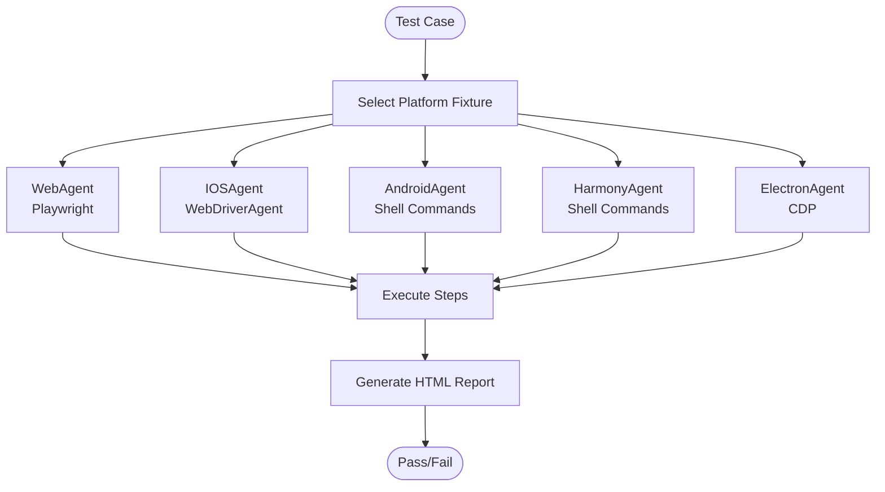
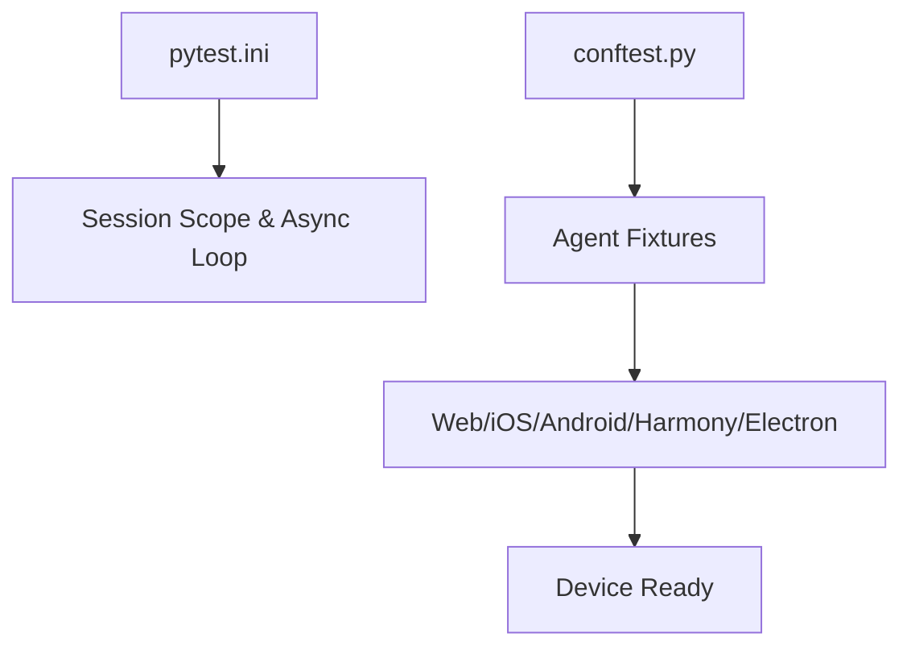
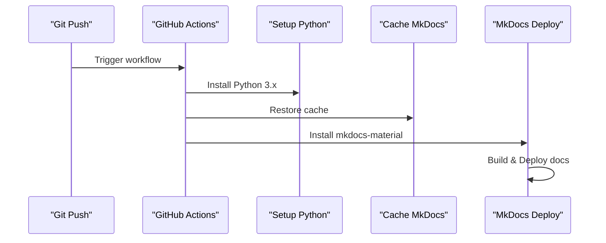
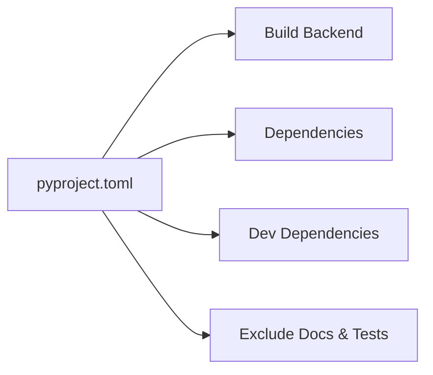
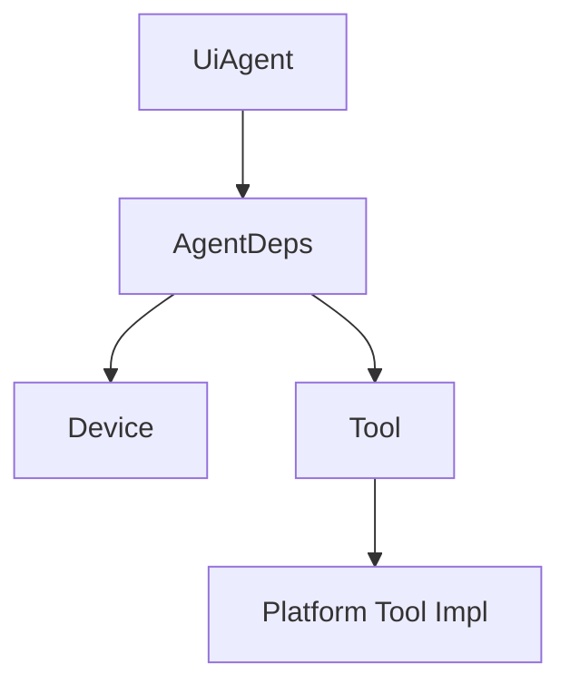

# Testing and Deployment

<cite>
**Referenced Files in This Document**
- [ci.yml](file://.github/workflows/ci.yml)
- [pyproject.toml](file://pyproject.toml)
- [conftest.py](file://tests/conftest.py)
- [pytest.ini](file://tests/pytest.ini)
- [main.py](file://tests/main.py)
- [test_web_agent.py](file://tests/test_web_agent.py)
- [test_android_agent.py](file://tests/test_android_agent.py)
- [test_electron_agent.py](file://tests/test_electron_agent.py)
- [test_ios_agent.py](file://tests/test_ios_agent.py)
- [test_harmony_agent.py](file://tests/test_harmony_agent.py)
- [agent.py](file://src/page_eyes/agent.py)
- [web.py](file://src/page_eyes/tools/web.py)
- [android.py](file://src/page_eyes/tools/android.py)
- [electron.py](file://src/page_eyes/tools/electron.py)
- [ios.py](file://src/page_eyes/tools/ios.py)
</cite>

## Table of Contents
1. [Introduction](#introduction)
2. [Project Structure](#project-structure)
3. [Core Components](#core-components)
4. [Architecture Overview](#architecture-overview)
5. [Detailed Component Analysis](#detailed-component-analysis)
6. [Dependency Analysis](#dependency-analysis)
7. [Performance Considerations](#performance-considerations)
8. [Troubleshooting Guide](#troubleshooting-guide)
9. [Conclusion](#conclusion)
10. [Appendices](#appendices)

## Introduction
This document provides a comprehensive guide to testing and deployment for PageEyes Agent, focusing on quality assurance and production deployment strategies. It covers test framework setup, platform-specific testing approaches, automated testing patterns, unit/integration/end-to-end testing procedures, CI/CD pipeline configuration, deployment automation, containerization strategies, infrastructure requirements, performance/load testing, monitoring and log analysis, incident response, and rollback strategies.

## Project Structure
The repository organizes testing under the tests directory and core automation logic under src/page_eyes. The CI/CD pipeline is defined via GitHub Actions, while project metadata and dependencies are managed by pyproject.toml.

**Diagram sources**
- [ci.yml:1-29](file://.github/workflows/ci.yml#L1-L29)
- [pyproject.toml:1-88](file://pyproject.toml#L1-L88)
- [conftest.py:1-116](file://tests/conftest.py#L1-L116)
- [agent.py:1-515](file://src/page_eyes/agent.py#L1-L515)
- [web.py:1-179](file://src/page_eyes/tools/web.py#L1-L179)
- [ios.py:1-293](file://src/page_eyes/tools/ios.py#L1-L293)
- [android.py:1-23](file://src/page_eyes/tools/android.py#L1-L23)
- [electron.py:1-134](file://src/page_eyes/tools/electron.py#L1-L134)

**Section sources**
- [ci.yml:1-29](file://.github/workflows/ci.yml#L1-L29)
- [pyproject.toml:1-88](file://pyproject.toml#L1-L88)
- [conftest.py:1-116](file://tests/conftest.py#L1-L116)

## Core Components
- Test framework: pytest with asyncio fixtures and per-session lifecycle for platform agents.
- Platform agents: WebAgent, AndroidAgent, IOSAgent, HarmonyAgent, ElectronAgent, and a PlanningAgent for task decomposition.
- Tools: Platform-specific tool implementations encapsulate device interactions (click, input, swipe, open_url, etc.) and integrate with Playwright or WebDriverAgent.

Key testing artifacts:
- Fixtures define reusable agent instances per platform with optional device configuration.
- End-to-end tests encode natural language instructions to drive UI interactions across platforms.
- A simple CLI entrypoint demonstrates programmatic usage.

**Section sources**
- [agent.py:74-515](file://src/page_eyes/agent.py#L74-L515)
- [web.py:24-179](file://src/page_eyes/tools/web.py#L24-L179)
- [ios.py:24-293](file://src/page_eyes/tools/ios.py#L24-L293)
- [android.py:18-23](file://src/page_eyes/tools/android.py#L18-L23)
- [electron.py:21-134](file://src/page_eyes/tools/electron.py#L21-L134)
- [conftest.py:38-116](file://tests/conftest.py#L38-L116)
- [pytest.ini:1-4](file://tests/pytest.ini#L1-L4)
- [main.py:1-27](file://tests/main.py#L1-L27)

## Architecture Overview
The testing architecture centers on UiAgent subclasses and platform-specific tools. The PlanningAgent decomposes natural language instructions into executable steps, which UiAgent executes sequentially, capturing screenshots and generating HTML reports.

**Diagram sources**
- [agent.py:74-515](file://src/page_eyes/agent.py#L74-L515)

## Detailed Component Analysis

### Test Framework Setup and Concurrency Control
- Async fixtures initialize platform agents once per session to reduce startup overhead.
- Concurrency control prevents parallel tool calls during a single step execution.
- Logging is configured globally for test output visibility.

**Diagram sources**
- [conftest.py:38-116](file://tests/conftest.py#L38-L116)
- [agent.py:316-515](file://src/page_eyes/agent.py#L316-L515)

**Section sources**
- [conftest.py:26-116](file://tests/conftest.py#L26-L116)
- [pytest.ini:1-4](file://tests/pytest.ini#L1-L4)

### Unit Testing Methodologies
- Unit tests focus on isolated tool behaviors (click, input, swipe, open_url, goback).
- Assertions validate success/failure outcomes and tool-specific side effects (e.g., window count changes in Electron).

Recommended patterns:
- Use small, deterministic prompts to exercise a single tool operation.
- Capture and assert ToolResult status and any observable side effects (e.g., new windows opened).
- Mock external dependencies at the device/tool boundary to avoid flakiness.

**Section sources**
- [web.py:46-92](file://src/page_eyes/tools/web.py#L46-L92)
- [electron.py:47-114](file://src/page_eyes/tools/electron.py#L47-L114)
- [ios.py:46-80](file://src/page_eyes/tools/ios.py#L46-L80)

### Integration Testing Strategies
- Integration tests validate cross-tool sequences (e.g., open_url followed by click/input).
- Platform fixtures ensure devices are ready and connected before tests execute.
- Use realistic URLs and UI states to mimic production conditions.

Best practices:
- Prefer stable staging endpoints for integration tests.
- Manage device state transitions (e.g., returning to home screen) between tests.
- Centralize device configuration (serial, WDA URL, CDP port) in fixtures.

**Section sources**
- [conftest.py:38-116](file://tests/conftest.py#L38-L116)
- [test_web_agent.py:11-22](file://tests/test_web_agent.py#L11-L22)
- [test_ios_agent.py:11-20](file://tests/test_ios_agent.py#L11-L20)
- [test_android_agent.py:11-20](file://tests/test_android_agent.py#L11-L20)
- [test_harmony_agent.py:11-20](file://tests/test_harmony_agent.py#L11-L20)

### End-to-End Testing Procedures
- E2E tests encode natural language instructions that invoke PlanningAgent and UiAgent step execution.
- Reports are generated after each run, capturing step-by-step outcomes and screenshots.

**Diagram sources**
- [agent.py:217-314](file://src/page_eyes/agent.py#L217-L314)
- [agent.py:172-190](file://src/page_eyes/agent.py#L172-L190)

**Section sources**
- [test_web_agent.py:11-209](file://tests/test_web_agent.py#L11-L209)
- [test_ios_agent.py:11-212](file://tests/test_ios_agent.py#L11-L212)
- [test_android_agent.py:11-70](file://tests/test_android_agent.py#L11-L70)
- [test_harmony_agent.py:11-49](file://tests/test_harmony_agent.py#L11-L49)
- [test_electron_agent.py:8-19](file://tests/test_electron_agent.py#L8-L19)

### Platform-Specific Testing Approaches
- Web: Uses Playwright to navigate, click, input, and swipe; supports headless mode and device emulation.
- iOS: Uses WebDriverAgent (WDA) for tapping, input, and app launching; includes fallback navigation gestures.
- Android: Uses shell commands to open URLs and integrates with device shell APIs.
- Harmony: Similar to Android but with Harmony-specific connection keys.
- Electron: Uses CDP to drive a local Electron app, with window management and screenshot scaling.

**Diagram sources**
- [web.py:24-179](file://src/page_eyes/tools/web.py#L24-L179)
- [ios.py:24-293](file://src/page_eyes/tools/ios.py#L24-L293)
- [android.py:18-23](file://src/page_eyes/tools/android.py#L18-L23)
- [electron.py:21-134](file://src/page_eyes/tools/electron.py#L21-L134)

**Section sources**
- [web.py:24-179](file://src/page_eyes/tools/web.py#L24-L179)
- [ios.py:24-293](file://src/page_eyes/tools/ios.py#L24-L293)
- [android.py:18-23](file://src/page_eyes/tools/android.py#L18-L23)
- [electron.py:21-134](file://src/page_eyes/tools/electron.py#L21-L134)

### Automated Testing Workflows
- Pytest configuration enables session-scoped fixtures and asyncio event loops.
- Fixtures manage device connectivity and process lifecycle (e.g., Electron app launch and teardown).

**Diagram sources**
- [pytest.ini:1-4](file://tests/pytest.ini#L1-L4)
- [conftest.py:38-116](file://tests/conftest.py#L38-L116)

**Section sources**
- [pytest.ini:1-4](file://tests/pytest.ini#L1-L4)
- [conftest.py:38-116](file://tests/conftest.py#L38-L116)

### CI/CD Pipeline Configuration
- The CI job deploys documentation to GitHub Pages using MkDocs Material on pushes to main/master.
- Python environment setup and caching improve build reliability and speed.

**Diagram sources**
- [ci.yml:1-29](file://.github/workflows/ci.yml#L1-L29)

**Section sources**
- [ci.yml:1-29](file://.github/workflows/ci.yml#L1-L29)

### Deployment Automation
- Project metadata and build backend are defined in pyproject.toml.
- Exclude docs and tests from built packages to keep artifacts minimal.

**Diagram sources**
- [pyproject.toml:58-67](file://pyproject.toml#L58-L67)

**Section sources**
- [pyproject.toml:1-88](file://pyproject.toml#L1-L88)

### Containerization Strategies
- Use a Python base image matching the required interpreter version.
- Install dependencies via the project’s dependency groups and build backend.
- Mount persistent volumes for logs and generated reports.

[No sources needed since this section provides general guidance]

### Infrastructure Requirements
- Web: Playwright browsers and drivers; headless mode support.
- iOS: WebDriverAgent server reachable at configured URL; XCUITest-compatible devices/emulators.
- Android: ADB/HDC utilities; device serial or emulator availability.
- Harmony: HDC utilities and connection keys.
- Electron: Local Electron app with remote debugging enabled.

**Section sources**
- [pyproject.toml:20-32](file://pyproject.toml#L20-L32)
- [conftest.py:31-35](file://tests/conftest.py#L31-L35)

### Testing Best Practices
- Use deterministic prompts and stable endpoints for reproducibility.
- Centralize configuration (device serials, WDA URLs, CDP ports) in fixtures.
- Prefer assertions on ToolResult status and report outputs.
- Keep tests independent; reset device state between runs.

**Section sources**
- [conftest.py:26-35](file://tests/conftest.py#L26-L35)
- [agent.py:172-190](file://src/page_eyes/agent.py#L172-L190)

### Mock Strategies for External Dependencies
- Mock device clients at the tool boundary to isolate UI logic.
- Use in-memory buffers for screenshots to avoid disk I/O variability.
- Stub network requests in web tests using Playwright’s expect_page/file_chooser expectations.

**Section sources**
- [web.py:27-44](file://src/page_eyes/tools/web.py#L27-L44)
- [electron.py:25-45](file://src/page_eyes/tools/electron.py#L25-L45)

### Test Data Management
- Use stable staging URLs and pre-defined UI states.
- Store test assets (images, files) under version control or CI-managed caches.
- Generate and archive HTML reports for historical traceability.

**Section sources**
- [agent.py:172-190](file://src/page_eyes/agent.py#L172-L190)

### Performance Testing, Load Testing, and Scalability Validation
- Profile agent execution time per step and aggregate usage metrics.
- Run concurrent sessions against a single device to validate tool concurrency limits.
- Measure screenshot generation latency and optimize tool delays.

[No sources needed since this section provides general guidance]

### Monitoring, Log Analysis, and Incident Response
- Enable structured logging via loguru; configure retention policies for logs.
- Correlate test failures with screenshots and HTML reports.
- Establish runbooks for common device connectivity issues and remediation steps.

**Section sources**
- [agent.py:192-223](file://src/page_eyes/agent.py#L192-L223)

### Troubleshooting Deployment Issues and Rollback Strategies
- Verify Python version compatibility and dependency resolution.
- Rebuild with cached dependency indices to mitigate transient failures.
- For CI docs deployment, confirm MkDocs installation and force deployment flags.

**Section sources**
- [pyproject.toml:19](file://pyproject.toml#L19)
- [ci.yml:18-29](file://.github/workflows/ci.yml#L18-L29)

## Dependency Analysis
The agent architecture composes platform tools with device abstractions. Tools encapsulate device-specific operations and return standardized results.

**Diagram sources**
- [agent.py:147-169](file://src/page_eyes/agent.py#L147-L169)

**Section sources**
- [agent.py:147-169](file://src/page_eyes/agent.py#L147-L169)

## Performance Considerations
- Minimize tool delays where possible; rely on explicit waits for stability.
- Optimize screenshot frequency; capture only when needed.
- Use device emulation judiciously to balance accuracy and speed.

[No sources needed since this section provides general guidance]

## Troubleshooting Guide
Common issues and resolutions:
- Device connectivity timeouts: validate serial/WDA/CDP endpoints and retry initialization.
- Tool failures due to missing elements: add conditional checks and keyword-based scrolling.
- Electron window management: ensure latest window detection and proper cleanup.

**Section sources**
- [conftest.py:81-116](file://tests/conftest.py#L81-L116)
- [web.py:143-168](file://src/page_eyes/tools/web.py#L143-L168)
- [electron.py:79-88](file://src/page_eyes/tools/electron.py#L79-L88)

## Conclusion
This guide outlines a robust testing and deployment strategy for PageEyes Agent, emphasizing platform-specific testing, automated workflows, and production readiness. By leveraging the existing fixtures, tools, and CI pipeline, teams can maintain high-quality releases with reliable reporting and traceability.

## Appendices
- Example CLI usage for manual verification: [main.py:11-26](file://tests/main.py#L11-L26)